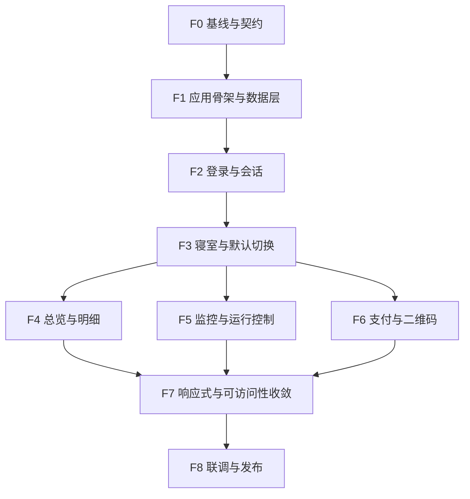

# 寝室电费系统前端实施计划

0.20.0按R6分离本地会话与学校profile：本地成功即可打开缓存页面，profile失败显示暂不可用并限制学校操作，真正401退出；404一次兼容、广播/epoch/账号隔离及协议记忆保持。实现和最终门禁见[R6验收](acceptance/审计修复/R6本地会话与资料解耦.md)。

0.19.2登录页增加未阅读点击勾选时的下一行红字提示，以及成功登录后的浏览器协议版本/摘要记忆；再次登录仍需明确勾选，版本/内容变化重新阅读。详情见[登录协议规则](decisions/界面状态与登录授权.md)。无接口/数据库变更，存储不含凭据，原布局保持。

2026-10-05追加规则：支付和解绑在页面可见时每2秒持续自动更新，隐藏暂停、终态停止；其他操作保留120秒暂停后的恢复入口。各类手动查询进度按钮仍移除，实际学校查询入口保留，详见[支付与解绑自动更新](decisions/支付与解绑自动更新.md)。

刷新反馈使用旋转图标，去掉重复的受理/读取/完成及同步范围文案；错误、未知、取消与无障碍状态保留，详见[刷新反馈](decisions/后台认证与刷新反馈.md)。

2026-10-04规则调整：后台授权并入登录协议，登录/重认证统一授权；账户不再提供撤回按钮，只显示升级前已受理的凭据操作进度。监控开关统一保存生效。下文历史F2/F5撤回入口与独立关闭按钮要求以[0.18.1界面规则](decisions/界面状态与登录授权.md)为准，相关13项问题与验证见[本轮记录](acceptance/frontend/0.18.1界面问题修复.md)。

版本：1.2；更新日期：2026-10-02；状态：F0–F6实现已交付，F7/F8集中回归增量完成，人工/发布事项待验。

依据：[example 参考说明](../example/README.md)、`example/src/` 参考实现、[后端架构详细设计](后端架构详细设计.md)和[后端实施计划](后端实施计划.md)。总体交付顺序见[总实施计划](总实施计划.md)，目录约定见[文档索引](README.md)。

`example/` 仅用于界面和交互参考。正式前端在 `frontend/` 独立建设，后端在 `backend/`，项目文档统一放在 `docs/`；正文代码路径均相对仓库根目录。前端参考 nature 浅蓝方案，完成真实 API 接入、状态处理和上线验收。项目从空业务状态开始，用户、绑定、监控和订单由新后端创建或从学校同步。F0/F1、F2 登录/重认证/账户和 F3 只读已验收；T3 账户撤回完成增量验证，F3 默认/绑定及 F4–F8 继续按阶段推进。

最终使用 Docker Compose 部署全部组件。前端依赖安装和生产编译在 Docker 的 Node 构建阶段完成，静态产物由 Nginx 运行阶段提供；宿主机只需 Docker Engine/Compose，无需安装 Node/npm、Python/uv 或数据库。域名、PEM 证书链与私钥路径通过 deploy/.env 配置，详见 [Docker 部署配置说明](Docker部署配置说明.md)。

## 1. 界面基线与交付范围

### 1.1 参考代码与新工程落点

| 参考文件/模块 | 参考内容 | 在 frontend/ 中的实施工作 |
| --- | --- | --- |
| `example/package.json`、`example/package-lock.json`、`example/vite.config.js` | React 19、Vite 6、ECharts、lucide-react；参考项目使用双 HTML 入口 | 创建独立 package.json/锁文件、单 index.html 入口，补路由、请求与验证工具 |
| `example/src/nature.jsx` | 渲染 `StudentApp`，加载基础 CSS 和浅蓝主题 | 创建 `frontend/src/main.jsx`，挂载路由、查询缓存、会话及错误边界 |
| `example/src/StudentApp.jsx` | 登录、协议、布局、四页、绑定/支付弹窗、监控表单 | 在正式工程按页面和业务模块实现，保留参考的信息结构与主要视觉 |
| `example/src/DetailsHistory.jsx` | 共用日期范围、消费趋势、采集明细、每页 10 条 | 使用后端聚合和分页，补加载、部分数据、快照及失败状态 |
| `example/src/DateRangePicker.jsx` | 双日期选择、月份切换、方向键移动、Esc 关闭 | 建立独立日期工具，使用上海当前日期，补范围限制与跨月焦点处理 |
| `example/src/historyData.js` | 固定日期、180 天模拟消费、按余额反推模拟采集数据 | 正式业务使用 API；合成数据只放在 frontend 的开发/测试夹具 |
| `example/src/Trend.jsx` | 趋势折线、浅蓝主题变量；未传 points 时显示固定数据 | 明确必传数据，区分 null/0/部分桶，无模拟数据回退 |
| `example/src/Chart.jsx` | ECharts 初始化、ResizeObserver、卸载清理 | 图表实例挂载时创建，数据更新时 setOption，避免每次 option 变化重建实例 |
| `example/src/student.css`、`example/src/blue.css` | 桌面侧栏、手机横向导航、卡片和表单；1100/760px 断点 | 在 frontend 提取样式变量，按业务语义定义状态样式，补移动端账户入口 |
| `example/src/history.css`、`example/src/date-picker.css` | 明细、分页和日历样式 | 按浅蓝参考还原日期双字段、内联日历和列表；检查窄屏、键盘焦点、触控区域和长文案 |

参考实现中有两个需要在正式工程中处理的细节：`blue.css` 使用通用选择器隐藏 `.field-hint`、`.empty > p`、部分 `.muted` 等内容；`student.css` 在手机宽度隐藏包含退出按钮的 `.sidebar-bottom`。正式样式按具体装饰元素限定隐藏规则，让业务状态、表单错误和账户操作始终可达。

### 1.2 页面与一期范围

| 页面/入口 | 交付内容 |
| --- | --- |
| 登录 | 学校验证码、真实协议、明确授权、登录错误及会话恢复 |
| 总览 | 默认或当前查看寝室、余额、用户资料、消费摘要、近 14 天趋势、监控摘要 |
| 电费明细 | 最近 7/30/90 天、自定义范围、天/周/月趋势、学校历史同步、监控采集明细 |
| 选择与绑定 | 本人绑定分页/搜索、候选搜索、新增绑定、默认切换、查看其他绑定 |
| 监控与预警 | 邮箱、阈值、间隔、提醒总次数、运行状态、立即采集、取消本次、关闭监控 |
| 缴费弹窗 | 支付能力、金额输入、幂等建单、二维码、订单状态和不确定结果 |
| 账户与授权入口 | 退出应用、修复学校认证、撤回后台授权；桌面和手机均可使用 |

延续四个主导航，不新增管理端、订单中心、学校解绑、退款、批量操作或主题切换。账户与授权通过个人菜单/弹窗提供；订单状态在缴费弹窗与可恢复的页面状态中呈现。

### 1.3 产品规则

- 登录、默认寝室、绑定和监控状态以服务端为准；UI 草稿与已保存状态分别管理。
- 浏览器只请求同源 `/api/v1`，不访问学校 CAS、SDGL 或支付站点，不持有学校 token/Cookie。
- 只有绑定同步成功且结果为空才展示首次绑定引导；加载中、失败、部分不可用都有独立状态。
- 查看其他绑定不改变默认寝室；监控始终跟随已确认的默认寝室。
- 监控默认间隔 60 分钟、提醒总次数 2、阈值 20.00 元；间隔整数 `60..1440`、次数 `1..5` 且包含第一次。
- 金额与读数保留十进制字符串，null 显示 `—`；不造消费、采集、余额、用电量或支付成功状态。
- 日期按 `Asia/Shanghai`，详情默认今天减 29 天至今天，趋势和采集明细使用同一已应用范围。
- 异步写入收到 202 表示已受理，完成文案必须等待服务端终态。关闭弹窗、离开页面或中止 fetch 不等于取消后台操作。
- 退出应用与关闭监控、撤回授权分别提供语义明确的操作；已授权后台监控不依赖页面打开。

## 2. 工程组织与状态约定

### 2.1 技术与目录

正式工程采用 React、Vite、ECharts、lucide-react 和 npm。依赖在 F0/F1 写入 `frontend/package.json` 并锁定：React Router 管理页面位置，TanStack Query 管理服务端读取与缓存，原生 fetch 统一传输，decimal.js 处理金额校验与比较。源码使用 JavaScript/JSX + JSDoc，根据 `docs/contracts/openapi.yaml` 生成 `frontend/src/api/generated.d.ts` 并提交；常规生产镜像构建只读取 frontend 构建上下文。

测试工具采用 Vitest、React Testing Library、MSW 和 Playwright，分别验证规则、用户交互、API 场景及浏览器关键旅程。它们属于待创建的 frontend 工程的开发依赖，测试入口与依赖安装也提供容器方式。

在 `frontend/` 新建以下结构，参考目录不作为正式源码、依赖或镜像构建输入。各功能按阶段在新工程内实现：

```text
frontend/
  package.json
  package-lock.json
  vite.config.js
  Dockerfile                  # Node 构建阶段 → Nginx 运行阶段
  .dockerignore
  index.html
  src/
    main.jsx
    app/
      App.jsx
      router.jsx
      providers.jsx
      queryKeys.js
    api/
      client.js
      auth.js
      rooms.js
      overview.js
      monitoring.js
      payments.js
      operations.js
      generated.d.ts
    features/
      auth/                   # 登录、会话初始化、协议、账户与授权
      overview/               # 总览、余额卡、消费摘要
      rooms/                  # 已绑定列表、候选、新绑定、默认切换
      history/                # 范围、消费趋势、采集明细
      monitoring/             # 设置草稿、运行状态、取消与关闭
      payments/               # 金额表单、订单进度、二维码
    components/
      layout/                 # AppShell、侧栏、手机导航、个人菜单
      feedback/               # Loading、Empty、Error、Stale、OperationStatus
      Modal.jsx
      ConfirmDialog.jsx
      DateRangePicker.jsx
      Chart.jsx
      Trend.jsx
    hooks/
      useOperation.js
      useRequestIntent.js
    lib/
      money.js
      dates.js
      errors.js
    styles/                   # 参考浅蓝方案建立正式样式
    mocks/                    # 开发/测试专用 handlers 与合成场景
  tests/
    unit/
    components/
    e2e/
docs/
  contracts/openapi.yaml
  acceptance/frontend/        # 位于项目根 docs/ 下，记录联调与发布验收
deploy/
  compose.yaml
  compose.test.yaml
  nginx/default.conf.template
```

### 2.2 路由与状态归属

建议路由为 `/login`、`/overview`、`/details`、`/rooms`、`/monitor`；根路径进入会话初始化后导航。正式入口统一为 `frontend/index.html` 和 `frontend/src/main.jsx`，Nginx 的 SPA 回退使用 `/index.html`。

| 状态 | 存放位置 | 更新规则 |
| --- | --- | --- |
| 当前用户、绑定、默认、余额、监控、历史、订单 | 按用户隔离的 Query 内存缓存 | 由 GET 返回；写成功或操作终态后按资源失效并刷新 |
| 当前查看 binding、已应用日期范围、粒度、页码 | 路由 query + 经校验的页面状态 | 支持刷新/前进/后退；非法参数归一化，不承担对象授权 |
| 密码、验证码答案、CSRF token、表单草稿 | 组件或会话内存 | 登录完成/卸载清理密码；CSRF 随会话恢复；未保存草稿不覆盖服务端 |
| snapshot_token | 当前用户/绑定/范围对应的内存查询会话 | 首页取得，翻页复用；换房、换范围或主动刷新时清空 |
| operation_id、run_id、order_id、Idempotency-Key | 操作控制器；必要时用按 user_id 隔离的 sessionStorage 保存最少恢复信息 | 只作为查询/重试定位；再次向服务端验证，退出时清理 |
| 导航收起等纯展示偏好 | 可选本地偏好 | 不存认证材料、完整接口响应或业务权威状态 |

查询键至少包含资源类型、user_id、binding_id、范围、粒度和分页中相关的部分；采集分页还要区分快照批次，不能混用不同快照的缓存页。会话结束或更换用户时，先取消请求、清空查询缓存和二维码对象 URL，再展示下一会话，防止上一个账户的数据闪现。

详情中的 `viewing_binding_id` 与服务端 `default_binding_id` 分开。顶部明确当前查看对象；监控页始终显示服务端默认对象，缴费表单提交后固定订单原始寝室与金额。

### 2.3 请求、重试与异步操作

1. `frontend/src/api/client.js` 统一处理成功/错误信封、204 无响应体、带 Cookie 的同源请求、内存 CSRF、request_id、AbortSignal 与超时。登录超时预算初值 75 秒，普通读取 40 秒，与后端总预算/Nginx 超时一起校准。
2. 创建逻辑操作时生成一次 Idempotency-Key，网络失败后的同一次重试保留该键和原请求内容；真正修改请求内容才创建新逻辑操作。绑定/订单进入未知态时先查询已有操作，不把重新点击变成另一笔提交。
3. 绑定、建单和其他写操作关闭库级自动重试。安全读取仅对已分类的瞬态错误有限重试；401/403/404/版本冲突不盲重试，429 遵守 Retry-After。
4. 使用版本校验的配置 PATCH 和默认寝室 PUT 在响应丢失后先 GET 对账；不得以自动重试覆盖并发更新。`expected_version` 始终来自该资源最近一次成功读取。
5. `useOperation` 区分通用 operation、monitor run、payment order 的查询接口和终态。前台初始每 2 秒查询，逐步放缓至 5–10 秒；持续约 2 分钟未完成时切为手动查询/低频更新，不能自行改成业务失败或过期。
6. 页面隐藏/离开时暂停非必要轮询，返回时先读取状态；轮询只查询本应用状态，不反复触发学校同步、余额刷新或建单。订单状态查询的上游回查频率由后端控制。
7. 后端未返回操作 ID 而请求可能已受理时，用原幂等键重试受理接口；sessionStorage 最多保留必要 ID、键和非敏感原请求字段，不能保存密码、验证码、token 或支付票据。浏览器缓存丢失后，恢复依赖服务端当前操作摘要。
8. 验证码、候选、日期查询使用 AbortController 和请求序号处理乱序；被取消请求的迟到响应不得覆盖最新选择。取消 fetch 只停止页面等待，运行取消必须调用取消 API。

### 2.4 F0 需要与后端落实的契约字段

下列补充需求已在 F0/P0 固化到 OpenAPI、后端 DTO、响应场景与生成类型，行为细节见 [契约说明](contracts/README.md)；实际接口按 P2/P5a/P7 等阶段实现，不能把契约字段当已上线功能。

| 场景 | 必须明确的字段/行为 | 缺失时的处理 |
| --- | --- | --- |
| 默认寝室切换 | 绑定列表返回 `preference_version`，以及当前 `default_switch_operation_id` 或等价摘要 | 无版本时禁用切换并刷新，不把 monitor.version 当偏好版本 |
| 撤回学校授权 | `/auth/me` 返回 `credential_version` 及正在进行的撤回操作标识 | 无版本不提交撤回，禁止用会话版本替代凭据版本 |
| 刷新后恢复绑定/同步操作 | `/room-bindings` 返回本人待完成 operation 的有限摘要 | 提供继续查看进度；不声称跨设备恢复只靠内存就能实现 |
| 绑定列表每行余额 | item 明确包含可选最近余额、fetched_at、stale；未提供时显示 `—` | 不对搜索结果每行自动触发学校余额刷新 |
| 取消本次运行 | run 状态返回 id/version；`GET /monitor` 能定位当前有效运行 | expected_version 对应 run.version，符合后端计划 P5a |
| 邮件失败/不确定与采集健康 | monitor 响应定义 notification 状态摘要、最近错误/重试信息 | 只显示实际返回的事实，不根据 enabled 推断邮件已发送 |
| 订单恢复与二维码有效期 | 能力接口提供本人该绑定的未解决订单引用；订单状态返回绑定/金额/currency、qr_status，可选已知 expires_at | 恢复已有订单；expires_at 未知不显示虚构倒计时 |
| 重新学校认证 | 定义应用会话仍有效时复用登录接口、保持当前 user_id 的行为；账号不一致应明确返回冲突 | 保留历史页可读，重认证表单不静默切换应用账户 |

快照失效的错误码、分页 total 的含义、阈值应用上限、日期范围上限也在 F0 固化。建议范围上限 366 天，具体值与后端一致；邮箱验证只有后端正式提供完整契约时才接入。

## 3. 页面与 API 对应

下表全部 API 使用 `/api/v1` 前缀，完整字段以架构设计第 7 节和双方确认后的 OpenAPI 为准。

| 页面/行为 | API | 前端负责的交互 | 阶段 |
| --- | --- | --- | --- |
| 用户协议/验证码 | `GET /auth/agreement`、`POST /auth/captcha` | 协议加载、阅读状态、同意、刷新和过期状态 | F2 |
| 登录与会话恢复 | `POST /auth/login`、`GET /auth/me` | 登录提交、首屏初始化、用户和 CSRF 恢复 | F2 |
| 退出与撤回授权 | `POST /auth/logout`、`DELETE /auth/school-credential` | 区别操作后果，显示持久撤回进度 | F2/F5 |
| 本人绑定/同步 | `GET /room-bindings`、`POST /room-bindings/sync` | 分页、搜索、同步状态与首次引导 | F3 |
| 搜索并绑定 | `GET /room-candidates`、`POST /room-bindings` | 防抖、候选过期、重复提交与绑定状态 | F3 |
| 设置默认 | `PUT /room-preferences/default` | 携带版本，等待切换完成再刷新相关页 | F3 |
| 异步操作 | `GET /operations/{id}` | 按操作类型显示状态、终态、错误与恢复入口 | F1/F3–F6 |
| 总览/余额 | `GET /overview`、`GET /room-bindings/{id}/balance`、`POST /room-bindings/{id}/balance-refresh` | 组件独立状态、最后成功时间、手动刷新进度 | F4 |
| 消费历史/同步 | `GET /room-bindings/{id}/consumption`、`POST /room-bindings/{id}/history-sync` | 统一范围、日周月粒度、覆盖度与已知合计 | F4 |
| 采集明细 | `GET /room-bindings/{id}/monitor-samples` | 快照分页、真实采集时间、余额差与电表来源 | F4 |
| 监控配置/状态 | `GET /monitor`、`PATCH /monitor` | 草稿、字段校验、版本冲突、取消中状态 | F5 |
| 运行控制 | `POST /monitor/runs`、`GET /monitor/runs/{id}`、`POST /monitor/runs/{id}/cancel` | 立即采集、当前运行进度、取消本次 | F5 |
| 支付能力/订单 | `GET /payments/capabilities`、`POST /payment-orders`、`GET /payment-orders/{id}` | 金额规则、建单状态、原订单恢复 | F6 |
| 二维码 | `GET /payment-orders/{id}/qr`、`POST /payment-orders/{id}/qr-refresh` | 本人图片加载、生成中、刷新与失败状态 | F6 |

同一资源写入完成后定向刷新：默认切换影响绑定、总览、详情和监控；监控保存影响配置与总览摘要；历史同步影响该绑定/范围的趋势；支付确认触发服务端余额刷新后再读取余额。普通余额刷新不添加采集明细。

## 4. 阶段依赖、排期与任务

### 4.1 执行顺序



F4/F5/F6 可按领域并行实施；公共 UI、移动端与可访问性从 F0 起随功能建设，F7 做集中回归。后端未就绪时使用明确的 MSW 场景开发，接口失败不能自动回退模拟成功数据。

| 阶段 | 粗估前端人日 | 真实联调依赖 | 可验收增量 |
| --- | --- | --- | --- |
| F0 | 2–3 | 后端 P0 契约协作 | 页面基线、字段和状态清单、依赖/脚本确定 |
| F1 | 3–5 | 后端 P1 网关/同源环境 | 路由、请求、缓存、操作轮询及基础 UI |
| F2 | 3–4 | 后端 P2；撤回依赖 P5a | 真实登录、会话、协议和账户入口 |
| F3 | 3–5 | 后端 P3a/P3b/P5a | 搜索绑定、默认切换和状态恢复 |
| F4 | 4–6 | 后端 P4；采集明细依赖 P5b | 总览、统一日期范围、真实图表/明细 |
| F5 | 3–5 | 后端 P5a/P5b/P6 | 监控保存、运行、关闭与投递状态 |
| F6 | 3–5 | 后端 P7 | 金额能力、订单、二维码和未知态 |
| F7 | 2–3 | 本轮拟开放功能已完成 | 桌面/手机、键盘、样式和图表性能回归 |
| F8 | 3–5 | 后端 P8、HTTPS 部署环境 | 端到端验收、构建、发布记录 |
| 合计 | 26–41 | 不含真实学校验收等待 | 根据 F0/F1 的实际工作量复估 |

以上估算与后端实施计划中的“前端参与”工作重叠，项目总工期需合并重估，不能直接相加。另预留 20% 的联调修复缓冲；人日不是上线日期承诺。

### F0：界面基线与契约准备

**依赖：** 无。

- [x] **F0-01 建立独立前端工程。** 在 frontend 创建 package.json、package-lock、Vite 配置、index.html 和 src/main.jsx；用固定版本 Node.js 22/npm 容器安装依赖并生成锁文件，后续容器安装执行 npm ci；定义 lint/typecheck/test/test:e2e 等脚本。
- [x] **F0-02 记录参考界面基线。** 在 375、768、1440px 下查看 example 的登录、四页、绑定/缴费弹窗和日历，截图存入 docs/acceptance/frontend；记录参考断点和交互，正式实现落在 frontend。
- [x] **F0-03 固化字段与状态。** 将第 3 节所有接口、金额/null、日期、错误码、202、版本与幂等规则整理为前端 DTO；落实第 2.4 节契约补充。
- [x] **F0-04 设计请求场景夹具。** 定义空账户、有绑定、学校失败、部分历史、待切换、运行取消、未知订单等合成场景，纳入 MSW；真实账号/票据不写入仓库。
- [x] **F0-05 确定路由与组件边界。** 依据参考 StudentApp 的 Login、Modal、Monitor 和各页，制定 frontend 的模块清单；明确样式、业务状态组件和完成标准。

**产物：** 前端环境/脚本、DTO 和接口样例、基线截图、组件清单。**通过条件：** 页面字段、按钮动作、异常状态和所需 API 均能对应；契约补充项有确定实现阶段与负责人。

**实际验收：** 2026-10-01 独立锁文件与入口构建通过，contract:check/lint/typecheck/test/build 通过，3 项 MSW 测试通过。10 个场景按 OpenAPI 校验；375/768/1440px 共 27 张[参考截图](acceptance/frontend/参考界面基线.md)，[模块与按钮追踪](T0需求追踪表.md)已记录。F1 路由/客户端/组件及正式业务 E2E 尚待实现。

### F1：应用骨架、公共数据层与基础组件

**依赖：** F0。

- [x] **F1-01 建立应用入口与路由。** 在 frontend/src/main.jsx 挂载 Router/Query Provider/会话状态；实现 AppShell 与四个页面，支持刷新、前进后退和认证守卫；首屏会话未确定前显示初始化状态。
- [x] **F1-02 实现 API 客户端。** 统一同源 Cookie、CSRF、错误信封、204、AbortSignal、超时和 request_id；按错误 code 区分应用过期与学校认证异常。
- [x] **F1-03 建立查询缓存。** 按用户/房间/范围生成 query key，设置明确的缓存/重新读取策略；防止切换页面或浏览器聚焦反复触发学校写操作。
- [x] **F1-04 实现操作控制器。** 幂等键生命周期、202 轮询、未解决操作恢复、页面隐藏暂停；配置版本冲突保留草稿，等待用户查看当前状态后再提交。
- [x] **F1-05 抽取公共 UI 与工具。** Modal、状态块、错误提示、Toast、金额/date 工具；为关键失败保留页面内持久提示，不能只显示四秒 Toast。
- [x] **F1-06 建立开发/测试隔离。** OpenAPI 类型生成及契约检查；MSW 仅在显式开发/测试配置启动，生产入口不注册 mock service worker；完成最小请求和路由测试。

**产物：** `frontend/src/app/`、`frontend/src/api/client.js`、`frontend/src/hooks/`、`frontend/src/lib/`、公共组件。**通过条件：** 401/429/503/204/202 可分别处理；切换账号清缓存；普通请求取消与真实业务取消互不混淆。

### F2：登录、协议与账户授权

**依赖：** F1；真实登录依赖后端 P2，撤回闭环依赖 P5a。

- [x] **F2-01 接入学校验证码。** 展示 image_data_url、expires_at、刷新/加载失败；提交 challenge_id 与用户答案；取图乱序不能覆盖当前 challenge，过期/错误后取新图。
- [x] **F2-02 接入真实协议。** 获取协议版本/内容摘要，保留阅读到底交互；内容不足一屏时也可正常完成阅读确认，协议换版本重置勾选。将应用使用同意与后台凭据使用授权含义清晰呈现，不默认代勾选。
- [x] **F2-03 接入登录。** 使用服务器认可的学号格式规则，不仅依赖示例正则；密码不 trim/改写，验证码不在前端计算验证。提交去重，成功立即清理密码，寝室加载失败不重新提交登录。
- [x] **F2-04 实现会话和初始化。** 刷新先调 me，再恢复绑定/默认和当前路由；rooms_state=loading/failed 与成功空列表分开；无房间用户仍可访问账户、退出和修复授权。
- [x] **F2-05 实现账户与退出。** 手机/桌面均有账户入口；调用 logout 收到确认后清理会话数据。请求失败显示退出未完成，不能仅清页面变量就声称服务端会话已注销。
- [x] **F2-06 实现学校重认证/撤回。** 学校 requires_reauth 保留应用会话和历史页面，提供明确重新认证入口；撤回说明停止后台采集与待授权提醒，携带 credential_version 并显示操作进度，完成后刷新 monitor 与 me。T3 支持确认/去重、202、刷新与响应丢失恢复，同账户刷新保留弹窗。

**产物：** `frontend/src/features/auth/`、LoginPage、AgreementDialog、AccountMenu/授权弹窗。**通过条件：** 无随机验证码/模拟登录；协议与后台授权可理解；失败恢复路径完整；logout、关闭监控、撤回授权三者行为一致于后端。

**2026-10-01 增量验收：** F2-06 见 [T3 凭据与许可](acceptance/T3凭据与许可验收记录.md)：账户撤回三项组件测试，1440/375px 两项浏览器验证；正式后端的合成学校/实际数据库撤回与操作恢复通过，未执行真实邮件或学校绑定。

### F3：寝室列表、绑定与默认切换

**依赖：** F2；真实写入依赖后端 P3b/P5a。

- [x] **F3-01 接入本人列表。** q/page/page_size 使用后端搜索和分页；展示 total、default_binding_id、sync_status、last_synced_at，成功空列表才进入首次绑定；显式同步按钮追踪 operation。
- [x] **F3-02 接入候选搜索。** 初始建议 400ms 防抖并遵守限流，单次一页；使用 candidate_id、expires_at、already_bound/search_quality；空结果、失败、过期与已绑定区分显示。
- [x] **F3-03 实现绑定流程。** 点击绑定冻结所选目标，提交一次逻辑请求；202 后显示持久进度；绑定已成功但默认尚未完成时分别显示状态，不再次提交绑定。
- [x] **F3-04 实现默认切换。** 携带 preference_version，切换中显示目标与进度；收到完成后刷新绑定/监控/当前查看页。409 保留现状并读取当前偏好，不能直接本地 setDefaultId 宣告成功。
- [x] **F3-05 支持独立查看与操作恢复。** 从房间行查看详情只改变 viewing_binding_id；刷新页面恢复本人待完成 operation；目标被取消授权或返回 404 时清理该对象缓存并回到有效选择。

- [x] **F3-06 用户补充：删除绑定。** 冻结本人目标、明确学校解绑确认、持久进度/unknown/刷新恢复，完成后清理独立查看缓存。

**产物：** `frontend/src/features/rooms/`、RoomsPage、CandidateSearch、BindingDialog、RemoveBindingDialog、RoomOperationStatus 与 RoomView。**通过条件：** 重复点击、慢响应、刷新、默认切换与关闭监控并发都有确定界面；暂时查不到数据不显示“绑定成功”或“没有寝室”。

**2026-10-01 实际验收：** T2 完成 F2-01..05/重认证与 F3-01..02；20 项组件/单元、6 项浏览器与生产前端真实学校操作通过，见 [T2 记录](acceptance/T2验收记录.md)。F2-06 撤回及 F3 写入/默认/详情恢复依赖 T3，未将整个 F2/F3 宣告完成。

### F4：总览、消费趋势与采集明细

**依赖：** F3；历史依赖后端 P4，真实样本依赖 P5b。

- [x] **F4-01 接入总览。** profile、balance、summary、daily_consumption、monitor 独立渲染；余额以 amount/fetched_at/stale 展示。删除固定昨日金额、合计和未经接口提供的同比说明；余额偏低使用已知金额严格 `< threshold`。
- [x] **F4-02 接入余额刷新。** 读取最近成功缓存，手动刷新追踪 operation 和冷却；失败保留成功时间与过期标识，页面加载时间不能充当学校更新时间。
- [x] **F4-03 统一日期工具和范围。** 在 frontend 实现独立的 DateRangePicker 与日期工具；依据 server_time 校准上海日期，区分 draft/applied range；7/30/90 天与自定义含首尾，范围上限与后端一致，未来日期不选。
- [x] **F4-04 接入历史聚合与同步。** consumption 直接返回 buckets/summary/coverage，月/周/天只修改 granularity；同步历史单独提交并查询进度。部分记录显示已知合计，不在浏览器把余额差转换为消费。
- [x] **F4-05 改造图表。** Trend 必须显式接收数据；null 保持断点、零值保留，tooltip 展示范围/金额/覆盖度；空与失败不绘制模拟折线。仅绘图坐标可将十进制字符串转为 Number，展示金额和统计仍使用原字符串/后端合计。Chart 实例与 option 更新分离，窗口变化 resize，卸载 dispose。
- [x] **F4-06 接入采集分页。** 首页接收 snapshot_token/total/has_monitor_history，后续复用快照；换范围/房间归一到第一页。余额差不取绝对值，首条为 `—`，电表字段展示源记录日、质量和重复读数信息。

**产物：** `frontend/src/features/overview/`、`frontend/src/features/history/`、日期工具、Trend/Chart/DateRangePicker 改造。**通过条件：** 图表与明细范围一致；无未知补零/余额反推电表；监控关闭后仍可读历史；快照翻页不会因新采集而漏行、重复行。

### F5：监控设置、运行与预警状态

**依赖：** F3；保存/控制依赖后端 P5a，运行/提醒依赖 P5b/P6。

- [x] **F5-01 建立设置草稿。** GET 初始化 savedConfig 与 draft，使用 interval_minutes/repeat_limit/threshold/email/enabled；数字输入编辑时保留字符串，提交时校验整数/金额/邮箱与 expected_version。
- [x] **F5-02 保存并处理冲突。** 提交期间保持当前已保存状态；成功后更新 version、generation、next_run_at；409 显示当前服务端值并保留草稿，后台轮询不得覆盖正在编辑的字段。
- [x] **F5-03 保证关闭可用。** 提供只提交 `{enabled:false,expected_version}` 的关闭动作，不受其他未保存无效字段、学校离线或邮箱异常阻挡；显示 cancel_pending/in_flight_count 的真实边界。
- [x] **F5-04 展示控制/健康/投递状态。** 区分 active、disabled、requires_reauth、blocked_room、retargeting 与健康程度；显示最近成功、下一次执行、最近错误及邮件失败/结果未知，不将 enabled 当成“正在正常工作”。
- [x] **F5-05 实现立即采集与单次取消。** 创建/复用 run 后查询状态，取消使用 run.version；取消本次不改变后续开关，完成的运行不允许伪装成已取消；操作成功后定向刷新余额、样本和监控摘要。
- [x] **F5-06 对齐提醒文案与草稿保护。** “提醒总次数（包含第一次）”及后台运行说明可见；默认切换、路由离开或重新读取时处理未保存草稿，不在新的寝室上静默套用未确认编辑。

**产物：** `frontend/src/features/monitoring/`、MonitorPage、MonitorForm、RunStatus、NotificationStatus。**通过条件：** 60/75/1440 分钟原样保存，小数/越界拒绝；关闭在异常情况下可提交；保存意图、运行健康和发信结果没有混淆。

### F6：支付能力、订单与二维码

**依赖：** F3；真实闭环依赖后端 P7。

- [x] **F6-01 接入能力规则。** 打开缴费入口先获取当前绑定的 capabilities；enabled=false 展示原因并禁用建单，min/max/step/currency 驱动校验和金额快捷项，不沿用示例固定 0.01 步长。
- [x] **F6-02 实现幂等建单。** amount 使用十进制字符串；提交后固定房间/金额/幂等键，禁用重复提交；202 order_id 进入状态查询，响应丢失保留原逻辑请求，未知订单不以换键再次创建。
- [x] **F6-03 实现订单状态界面。** created/submitting/awaiting_payment/paid_confirmed 及 submit_unknown/status_unknown/rejected/expired_confirmed/closed_confirmed 分别展示；“查询支付结果”只读取状态，不前端标记成功。
- [x] **F6-04 接入二维码。** GET qr 检查 HTTP 与 Content-Type：200 图片读取 Blob/Object URL，202 JSON 保持生成中，错误展示原因；更新、关闭弹窗或退出时 revokeObjectURL，不把完整上游 URL 暴露给浏览器。
- [x] **F6-05 实现刷新与恢复。** qr-refresh 复用原订单，接收后继续查询该订单/二维码状态；页面恢复先找已有未解决订单；expires_at 未知不编倒计时，关闭弹窗不表示订单取消。
- [x] **F6-06 处理付款后的数据更新。** 只有 paid_confirmed 展示学校已确认支付；依据后端刷新状态更新余额，到账未确认继续提示；离开页面/切换默认不改变该订单原本的目标。

**产物：** `frontend/src/features/payments/`、PaymentDialog、OrderStatus、PaymentQr。**通过条件：** 双击、超时、图片失败、刷新和重新打开不会导致前端新建重复订单；未知结果不报成功；支付能力关闭时真实建单入口不可用。

### F7：响应式、可访问性与性能回归

**依赖：** 本轮拟开放功能已完成；相关规则在前面各阶段同步落实。

- [x] **F7-01 整理样式规则。** 保留浅蓝配色、卡片、侧栏、日历与间距关系；将装饰文案和业务提示分开命名，消除通用 display:none 对错误、覆盖度、数据来源和授权说明的误隐藏。
- [x] **F7-02 验证手机和桌面。** 375/390/768/1280/1440px 检查登录、四页与弹窗；账户/退出始终可达，页面不整体横向溢出，明细表仅在自身区域横向滚动。
- [ ] **F7-03 完成键盘操作。** dialog 关联标题、焦点进入/返回、Tab/Esc 行为正确；日历方向键跨月可达、日期禁用规则正确；表单 label、aria-invalid、错误关联和状态播报完整。
- [ ] **F7-04 检查可读性。** 测量文本/控件对比度，状态同时有文字；关键触控目标约 44px，200% 缩放仍可操作；图表提供可读摘要/数据替代，减少动效偏好作用于图表与控件。
- [x] **F7-05 检查性能与资源释放。** 按需加载 ECharts 模块/页面，使用生产构建分析包体；检查重复初始化、订阅、轮询、ResizeObserver、定时器和对象 URL 清理，不以隐藏页面继续高频轮询。

**产物：** 样式整理、响应式截图、键盘与性能记录。**通过条件：** 关键状态可见、操作可达；图表多次更新不持续增加实例，频繁切页/开关弹窗没有泄漏或跨页面请求污染。

### F8：前后端联调与发布

**依赖：** 本轮功能阶段及 F7，通过后端对应阶段验收。

- [ ] **F8-01 执行关键旅程。** 全新用户首次登录/绑定/默认设置、已有学校绑定同步、浏览历史、保存/关闭监控、订单查询等在真实后端联调；学校写入和实际通知使用指定验收场景。
- [ ] **F8-02 执行异常旅程。** 验证应用过期、学校失联、429、操作未知、版本冲突、双标签页、请求乱序和移动端操作；保留脱敏证据。
- [x] **F8-03 检查生产数据路径。** frontend 的生产入口不导入 example 或模拟业务，不显示演示标签/虚构余额；登录页装饰使用无账户含义的视觉元素，构建上下文仅限 frontend。
- [ ] **F8-04 完成 Docker 全栈联调。** 在容器中完成 npm ci、静态/类型检查、定向测试、build 和浏览器测试；frontend/Dockerfile 的 Node 阶段构建 dist，Nginx 阶段提供静态文件，通过同一 Compose 对接 backend 和基础服务；验证自定义域名、证书挂载/替换及同源 Cookie/CSRF。
- [x] **F8-05 交付说明与发布记录。** 编写 docs/前端开发与部署.md，说明公开配置、容器构建/测试、支持浏览器和已开放能力；记录前端镜像版本/后端契约版本、验收结果及部署产物。

**产物：** frontend Dockerfile、包含 dist 静态产物的 Nginx 镜像、docs 下的运行说明与验收记录。**通过条件：** 仅安装 Docker Engine/Compose 的目标机能够构建并启动全栈；所有拟开放功能有真实后端证据，支付按后端验收状态开放。

## 5. 页面必须覆盖的状态

| 场景 | 界面行为 | 恢复动作 |
| --- | --- | --- |
| 初始化未完成 | 首屏加载，不闪现绑定引导或上一会话数据 | 等待 me/绑定结果；失败时明确重试 |
| 登录已成功但寝室获取失败 | 保留应用会话，显示寝室加载失败 | 重试绑定同步，不要求再次提交密码 |
| 成功同步且无绑定 | 首次绑定引导 | 搜索候选并绑定 |
| 候选搜索失败/过期 | 区别“没有结果”与“查询失败/候选已过期” | 重新搜索，不能提交失效候选 |
| 绑定成功、默认处理中 | 分别显示学校绑定和默认设置进度 | 查询原 operation，避免重复绑定 |
| 默认切换中 | 显示当前已确认默认、目标和进度 | 查询操作；监控关闭仍可用 |
| 余额缓存过期 | 数字附“上次成功”时间和过期状态；无值为 `—` | 手动刷新并追踪状态 |
| 历史不完整 | 已知合计、覆盖天数/部分数据，未知图表点断开 | 同步该范围，不以空响应填零 |
| 从未启用/暂无样本/范围内为空 | 根据 has_monitor_history 与返回数据分别显示 | 设置监控或调整日期范围 |
| 配置有未保存修改 | 草稿标识与保存按钮；服务端状态单独展示 | 保存、放弃或查看冲突后的当前版本 |
| 学校需重新认证 | 历史可读、monitor 状态明确 | 重新学校认证，恢复当前配置 |
| 监控已关闭但有在途工作 | “已关闭，正在结束当前请求”等明确提示 | 查询状态，不承诺撤回已进入 SMTP 的邮件 |
| 网络或后端暂不可用 | 保留已取得数据并标明失败；显示 request_id 便于定位 | 仅执行安全读取/原幂等操作的规定恢复 |
| 支付能力关闭 | 说明 unavailable_reason，禁用确认建单 | 能力恢复后重新获取规则 |
| 支付结果未知 | 订单 ID、目标、金额和“结果待确认” | 查询原订单，不自动补单 |
| 二维码生成失败/有效期未知 | 图片区明确状态，订单信息保持 | 原订单刷新；不编造有效期 |

前端文案只表达用户需要理解的结果，如“切换处理中”“上次成功更新”“请重新登录学校账号”。generation、execution_epoch、Outbox 等内部实现概念不进入产品操作流程。

## 6. 定向验证与验收矩阵

| 编号 | 验证场景 | 必须观察的结果 | 建议层级 |
| --- | --- | --- | --- |
| FE01 | me 慢响应、401、学校 reauth | 初始化不闪错误页面；应用失效与学校认证异常分别处理 | 组件/E2E |
| FE02 | 两次验证码刷新乱序、过期、重复提交 | 只展示有效 challenge；登录只发一次逻辑提交 | MSW/组件 |
| FE03 | 协议短于一屏、长文滚动、换版本 | 可正确完成阅读交互；换版本重置明确同意 | 组件 |
| FE04 | 绑定成功空列表与失败/加载 | 只有成功空列表进入首次绑定 | 组件/E2E |
| FE05 | 绑定/默认 202、刷新恢复、409、部分成功 | 持续使用原操作、未完成不宣称成功、不重复绑定 | E2E |
| FE06 | 查看另一绑定/切默认/账号更换时迟到请求 | 查看不改默认；不串用户/房间；最新目标不被过期响应覆盖 | 组件/E2E |
| FE07 | 金额 null/0/负值/字符串、小数精度 | null 为 `—`，0 正常显示，符号和精度保留 | 单元/组件 |
| FE08 | 上海午夜、设备不同时区、7/30/90 天、跨周/月、闰日 | 日期范围一致，首尾正确，无固定演示日期 | 单元/组件 |
| FE09 | 历史部分/全未知、不同粒度、读取失败 | 已知合计标识正确，null 不补零，无模拟趋势回退 | 组件 |
| FE10 | 新增样本期间翻页、换房/范围、快照失效 | 快照集合/total 稳定，重置逻辑明确 | 组件/联调 |
| FE11 | 从未监控、正在等待首条、关闭后有历史 | 空态文案准确，关闭不隐藏已有历史 | 组件/E2E |
| FE12 | 60/75/1440 与 59/1441/60.5、次数边界、版本冲突 | 校验一致、草稿保留、已保存值不提前改变 | 单元/组件 |
| FE13 | 无效邮箱草稿/学校离线时关闭；运行取消竞态 | 关闭只提交开关与版本；在途和取消边界准确 | 组件/联调 |
| FE14 | 付款双击/超时、二维码 202/图片/错误、未知状态 | 幂等键稳定，不重复建单、不伪造成功或有效期 | 组件/E2E |
| FE15 | 退出失败、成功退出后切账号、撤回授权 | 退出结果真实，缓存/QR 清理，不串账号，撤回进度可见 | E2E |
| FE16 | 375/768/1440px、键盘、200% 缩放、长错误文案 | 账户入口可达，状态未被 CSS 隐藏，无页面级溢出 | 浏览器验收 |
| FE17 | 连续切页、图表更新、弹窗开关与隐藏标签页 | 实例/监听及时释放，轮询停止/恢复符合规则 | 浏览器验收 |
| FE18 | 生产构建直达路由、HTTPS 登录、跨站写请求、mock 隔离 | 路由回退正确；会话/CSRF 生效；真实 API 失败不出现演示成功 | 部署联调 |
| FE19 | 仅安装 Docker 的机器配置域名/证书，随后更换域名或证书 | 无宿主机前端编译步骤；域名不写死在 JS 中，HTTPS 与后端可信 Origin 一致，入口正确加载新证书 | 部署联调 |

单元测试聚焦金额/日期等规则，组件测试聚焦真正的交互分支，E2E 覆盖关键旅程和并发响应；不为纯静态样式复制实现编写机械测试。新增功能的相关验证通过后进入下一阶段，F7/F8 统一验证跨页体验与真实部署。

实际学校绑定、建单、付款和真实邮件由与后端约定的验收账号、寝室、金额和邮箱完成。日常前端测试使用模拟响应，不能让重试/压力场景反复调用真实外部写接口。

## 7. 构建、交付与完成定义

### 7.1 构建与配置

- frontend 使用独立 package-lock；Docker 的 Node 构建/测试阶段执行 npm ci、lint、typecheck、相关 test、build，F8 用浏览器测试容器执行关键 test:e2e。部署机器无需 Node/npm，也无需预先在宿主机生成 dist。
- Vite 的 `VITE_*` 变量会进入浏览器产物，只放 API 相对前缀、公开环境标记等公开配置。SMTP、学校凭据、服务密钥及 Cookie token 均不属于前端配置。
- frontend/Dockerfile 使用 Node 构建阶段和 Nginx 运行阶段；Compose 的 nginx 服务从 `../frontend` 构建，挂载 deploy/nginx/default.conf.template 和 TLS Secret。ELECT_DOMAIN 生成站点域名与 HTTP→HTTPS 跳转，ELECT_TLS_CERT_FILE/ELECT_TLS_KEY_FILE 指定证书链和私钥路径。前端统一使用相对 `/api/v1`，更换域名或证书无需重新编译前端。
- Nginx 模板只替换 ELECT_DOMAIN，保留 `$uri/$host` 等 Nginx 变量；后端由同一配置派生 ELECT_PUBLIC_ORIGIN，确保 Origin/CSRF 校验、邮件站内链接与实际域名一致。开发真实会话联调也使用同源 HTTPS，保持 `__Host-`/Secure Cookie 规则有效。
- 正式工程按站点根路径部署，设置 `base:'/'`，Nginx 使用 `index index.html` 与 `/index.html` SPA 回退；刷新 `/details`、其他直接路由及带 query 的 URL 均须验证。
- HTML 不长期强缓存，带 hash 的静态资源可长期缓存；个人 API、验证码和二维码遵守 no-store，浏览器代码不自行持久缓存完整敏感响应。
- 开发、测试、Docker 构建/部署与环境说明统一写入 docs；example 仅保留参考作用，不参与生产镜像构建。

T1 已建立 Dockerfile、Compose、Secret 与证书配置，从仓库根执行当前阶段部署流程：

```sh
docker compose --env-file deploy/.env -f deploy/compose.yaml config --quiet
docker compose --env-file deploy/.env -f deploy/compose.yaml up -d --build
```

Compose 负责数据库健康等待、一次性建表/结构升级作业、TLS 证书预检及各服务依赖顺序。Nginx、所有 Python API、Scheduler/Worker/Relay/恢复器、MySQL、Redis、RabbitMQ 全部在容器中运行，仅 Nginx 发布 80/443。证书更换按部署文档先检查再重建 Nginx，读取新的只读挂载文件。T1 已通过容器与公共层验收，记录见 [F1 验收](acceptance/frontend/T1公共层验收.md)；真实业务与 F8 完整联调仍待后续阶段。

### 7.2 完成条件

1. 登录、总览、电费明细、寝室、监控、支付及账户入口均按真实契约运行，全部公开 API 有归属模块。
2. 四页结构和浅蓝视觉得到保留，新增状态与操作在桌面、手机和键盘上均可使用。
3. 前端不生成业务事实；图表、明细、提醒状态、默认切换和支付成功均来自服务端确认。
4. 幂等键、版本号、202 操作、快照分页、会话隔离及请求乱序都有定向验证证据。
5. 拟开放能力完成真实后端联调；支付等尚未开放的能力有明确关闭状态，页面不承诺尚未验证的结果。
6. 全栈 Docker Compose 构建/启动、直达路由、HTTPS Cookie/CSRF 和真实环境资源加载通过，交付镜像版本与 docs 中的验收记录对应。

首批执行顺序为 F0 的环境/契约基线 → F1 的路由和 API 客户端 → F2 的真实登录 → F3 的寝室闭环，再分别推进 F4/F5/F6。每阶段在 `docs/acceptance/frontend/` 记录版本、场景、预期和实际结果，阶段完成后再勾选任务。

**2026-10-01 T3 增量：** F3-03..05、F5-01..04/06 的单元/组件和 1440/375px 回归通过；指定目标生产前端真实新增通过。F3-06 删除增量继续实施，F5-05 仍依赖 T4，不提前标为完整 F5 结束。

**2026-10-01 F3 完成：** 指定目标生产前端真实新增/删除，筛选/列表内搜索、默认/删除确认与 unknown/刷新/独立查看恢复均通过；31 项单元/组件与14项桌面/手机浏览器回归通过。F5 控制已完成，F5-05 立即采集/取消仍依赖 T4。

**2026-10-01 F4/F5运行完成：** [界面验收](acceptance/frontend/T4界面验收.md)记录范围/粒度/页码URL恢复、固定快照、真实总览/学校历史与一次持久采集、33项单元组件与20项浏览器；实际邮件依赖T5，不提前标M2。

**2026-10-02 F5完成：** 采集周期故障、SMTP接受、失败/重试、未知占名额、关闭在途界面与定向组件检查通过；真实指定收件人确认收到邮件。见 [T5验收](acceptance/T5验收记录.md)，下一步F6支付。

**2026-10-02 T7本轮：** [验收与矩阵](acceptance/T7验收记录.md)记录已完成范围；Docker/同源入口与本地隔离恢复已通过，证书部署/更换按用户要求跳过。未勾选项保留真实支付映射、人工日历/200%/屏幕阅读器、生产异机/PITR和发布条件，不将集中合成回归当作全部真实验收。

**2026-10-03 视觉纠偏（0.13.2）：** 按用户要求重写正式展示层，使侧栏/手机顶部导航、双栏登录、总览卡片、日期日历、绑定弹窗、监控双列表单与 `example/nature.html` 对齐。删除参考中已去掉的装饰性文案和常驻技术说明，运行详情默认折叠；异常、数据覆盖不足、学校验证码/授权与独立关闭监控保留。验证与可接受差异见 [视觉验收](acceptance/frontend/0.13.2界面还原.md)。
