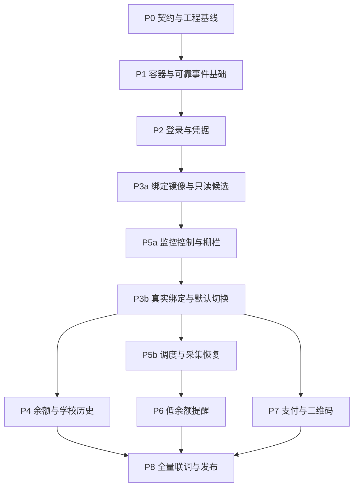

# 寝室电费系统后端实施计划

2026-10-04增量：协议2026-10-04.1将后台授权并入登录/重认证，LoginRequest要求credential_use_allowed=true；Bindings新增binding_write_enabled展示当前开关。旧凭据不自动授权、旧撤回Saga继续恢复，无数据库迁移；见[界面规则](decisions/界面状态与登录授权.md)。

版本：1.2；更新日期：2026-10-04；状态：P0–P6已完成，P7状态映射待验，P8集中验收/恢复增量已交付。

依据：[后端架构详细设计](后端架构详细设计.md) v1.2、[学校对接 API 文档](学校对接API文档.md)，以及 `example/` 学生端参考。总体交付顺序见[总实施计划](总实施计划.md)，目录约定见[文档索引](README.md)。

0.15.0按[Docker低资源优化](Docker低资源部署优化方案.md)推广七域生命周期，形成第二步13容器组合，邮件发送独立并适配原卷升级/恢复及集成入口；0.16.0实施第三步共享池与基础参数/探针/OCR，见[资源决策](decisions/Docker低资源资源参数.md)。0.17.0完成第四步成功提交后Outbox提示/空闲退避、有界basic.consume和监控双槽，见[执行效率决策](decisions/Docker低资源执行效率.md)；镜像发布/长期运行与2核2GB目标机验收按第五至六步推进。该增量不改变P7真实状态映射、生产灾备及T8未完成边界，运行和恢复约束见[生命周期决策](decisions/Docker低资源后台生命周期.md)。

0.18.0继续第五步镜像部分：CI在完整验证后发布实际受测runtime及摘要，目标机仅deploy包串行首次/原卷升级，见[发布手册](runbooks/固定镜像发布与启动.md)。页面请求/数据清理及第六步目标机容量保持未完成。

本计划按全新项目、MySQL 空库初始化编排：正式前端位于 frontend/，后端位于 backend/，文档位于 docs/，example/ 仅供参考。正文代码路径均相对仓库根目录。最终通过 Docker Compose 构建并启动全栈，域名及证书路径可配置。P0/P1、P2/P3a 已完成 T0/T1/T2 验收；P5a 控制、凭据协调和发送许可已完成增量验证，P3b–P8 的剩余业务继续实施，不将控制接口当作已经运行采集或邮件。

## 1. 实施基线与交付范围

### 1.1 当前工作区的实际情况

| 项目 | 当前情况 | 实施处理 |
| --- | --- | --- |
| 设计与协议 | 架构、API 与实施计划统一保存在 `docs/` | 作为需求、接口和来源语义的基线 |
| 学生端 | `example/` 提供 React + Vite 的页面与交互参考 | 在 `frontend/` 建立独立工程并接入真实 API |
| Python 后端 | `backend/` 已有独立工程、DTO/状态/测试与迁移，业务代码待实现 | P1 入口/镜像/公共运行基础已验收，业务进入 P2 |
| 数据库 | 七域初始迁移已通过临时 MySQL 8.4.8 空库/重复升级/隔离验证 | P1 provisioning、统一迁移锁与 Compose 已验收 |
| 版本管理 | Git/GitHub 已建立，当前开发分支直接提交推送，仅合入 main 使用 PR | 遵循 AGENTS：可验证小步提交并推送，合入 main 前确保 PR 最新提交的 Actions 全部成功且严格必需检查通过 |
| 学校对接证据 | 本轮 auth.txt 参考烟测 A01–A04/B01/B02 通过 | 使用合成夹具开发；只读参考证据不等于正式 Adapter 已联调 |

前端入口为 frontend/src/main.jsx，前后端镜像分别以 frontend/、backend/ 为构建上下文。全部学生端接口统一使用 `/api/v1`，数据库通过 Alembic 进行建表和表结构版本管理；依赖安装、前端编译、建表和运行均提供容器入口。

### 1.2 一期必须交付

1. frontend 的 Node 构建/Nginx 运行镜像，backend 的 Python 3.12.10/FastAPI 镜像，以及 MySQL 8.4、Redis、RabbitMQ 的整套 Docker Compose 部署；支持配置域名与 TLS 证书。
2. 学校验证码代理、人工登录、加密凭据、应用会话、后台重认证和授权撤回。
3. 多寝室绑定镜像、候选搜索、真实绑定操作、默认寝室切换及持久操作查询。
4. 余额缓存、总览、学校消费历史、日期聚合和监控采集明细。
5. 持久监控计划、重试、恢复、配置修改、取消、代次与执行栅栏。
6. 低余额事件、总次数限制、发送前授权、邮件投递和不确定结果处理。
7. 支付能力、幂等建单、二维码、订单查询；真实支付开放依赖相应验收通过。
8. 前端真实数据接入、审计、指标、备份恢复、发布与回滚说明。

学校解绑、自动扣款、退款、多学校平台、Kubernetes、多节点高可用不纳入本期。单机 Compose 的恢复能力必须验证，但不标为节点级高可用。

### 1.3 不可在实施中简化的约束

- MySQL 是配置、计划、运行和外部写操作的事实来源；Redis 与 RabbitMQ 丢失不丢监控意图。
- 每用户最多一个默认寝室、一个监控配置；学校绑定累计上限未知，不增加本地“只能绑定一间”的限制。
- 监控间隔为整数 `60..1440` 分钟；提醒 `1..5` 次包含第一次，默认 `60 / 2 / 20.00`。
- 金额用 Decimal、API 返回字符串；未知值为 `null`，历史缺口不补零，演示数据不进入生产。
- 学校写请求先落操作台账，再发请求；发送后结果未知只能回查，不自动重新绑定、建单或重复支付表单。
- 关闭监控、取消运行、切换默认、更新凭据或撤回授权后，失效执行不能越过栅栏提交。
- 普通退出只结束应用会话；撤回后台授权必须阻断后续采集和新邮件发送授权。
- 各领域独立 database、账号和表结构版本；通过接口、Outbox/Inbox 与持久 Saga 协作，不跨库 SELECT 或共用 ORM 模型。

## 2. 阶段依赖、里程碑与工作量

保留架构设计第 15 节的 P0–P8 编号。执行顺序作两处拆分：P3 先完成绑定查询；P5 先完成监控控制与栅栏，再让 P3 开放默认切换。不能等到全部监控完成后才给已上线的切换接口补取消能力。



前端契约接入从 P2 开始随各阶段推进，P8 负责完整用户旅程验收；不把所有前端工作留到最后。P4 与 P5b 可独立开发，P5b 先完成余额采集，C02 读数增强随后接入。P7 可与历史、监控并行，但上线仍受支付验收条件约束。

| 阶段 | 建议主责 | 粗估人日 | 可验收的增量 |
| --- | --- | --- | --- |
| P0 | 后端主责，前端参与 | 3–4 | 契约、状态机、建表计划和开发入口确定 |
| P1 | 后端基础设施/运维 | 5–7 | 空库启动、服务认证、事件与健康检查基础可运行 |
| P2 | Identity/Adapter 后端，前端参与 | 6–9 | 学校验证码登录、密文保存、应用会话可用 |
| P3a | Room 后端 | 3–4 | 本人绑定、候选及同步状态可查询 |
| P5a | Monitoring 后端 | 4–6 | 配置和取消屏障、切换接口、授权撤回协调可用 |
| P3b | Room/Adapter 后端 | 4–6 | 绑定及默认切换的持久操作闭环 |
| P4 | Room 后端，前端参与 | 5–7 | 真实余额、历史与统一日期范围 |
| P5b | Monitoring 后端 | 8–11 | 可恢复、可取消的持久监控和明细 |
| P6 | Notification/Monitoring 后端 | 5–7 | 有次数限制且可阻断失效配置的邮件提醒 |
| P7 | Payment/Adapter 后端，前端参与 | 6–9 | 支付能力、订单、二维码和未知结果流程 |
| P8 | 前后端与运维共同负责 | 8–12 | 端到端验收、恢复演练与分批发布 |
| 合计 | 按实际人员认领 | 57–82 | 不含学校规则调查和真实验收等待时间 |

以上是工作量，不是日历承诺；另预留 20%–30% 的接口变化和故障修复缓冲。P0/P1 完成后，用实际集成成本重估。一个人实施时按依赖串行推进；多人实施时依据领域分工，数据库所有权与契约仍保持单一责任人。

| 里程碑 | 必须完成 | 通过后可开放 |
| --- | --- | --- |
| M0 工程基础 | P0、P1 | 内部开发环境和离线协议验证 |
| M1 登录与寝室闭环 | P2、P3a、P5a、P3b | 指定账号的登录、绑定、默认切换灰度 |
| M2 可持续监控 | P4、P5b、P6 | 余额/历史查询、后台监控和已验收邮箱提醒 |
| M3 完整一期 | P7、P8 | 满足验收条件的支付与全量学生端 |

支付验收尚未通过时，可发布明确不含支付开放的 M2 版本，`payments/capabilities.enabled=false`；此时 M3 保持未完成，不能把支付静默删出交付范围。

## 3. 工程组织与先行决策

### 3.1 拟创建的目录

以下是统一目标目录；frontend/、backend/ 为正式工程，example/ 为独立参考。应用代码、Dockerfile 与 Compose 仍需按任务实现。

```text
.gitignore
backend/
  pyproject.toml
  uv.lock
  .python-version
  Dockerfile
  .dockerignore
  services/
    common/                   # 错误信封、事件协议、时钟、认证、可观测性
    gateway/                  # /api/v1 路由、会话验证、聚合、操作查询
    identity/
    school_adapter/
    room/
    monitoring/
    notification/
    payment/
    audit/
    migrate_all_mysql.py      # 持锁执行各域建表/结构升级
  tests/
    unit/
    integration/
    contract/
    fixtures/school/          # 脱敏/合成协议夹具
frontend/
  package.json
  package-lock.json
  Dockerfile                  # Node 构建 → Nginx 运行
  .dockerignore
  index.html
  src/
  tests/
deploy/
  compose.yaml
  compose.test.yaml
  nginx/default.conf.template
  redis.conf
  mysql/conf.d/
  mysql/init/
  .env.example
  scripts/
    provision.py
    backup_mysql.sh
    restore_mysql.sh
docs/
  README.md
  后端架构详细设计.md
  后端实施计划.md
  前端实施计划.md
  学校对接API文档.md
  Docker部署配置说明.md
  contracts/
    openapi.yaml
    internal/
    events/
  decisions/
  acceptance/
  runbooks/
example/                      # 仅供参考，不是构建上下文
```

各领域位于 backend/services/，内部采用 `app.py + api/ + application/ + domain/ + infrastructure/ + migrations/ + workers/`。Scheduler、Worker、Relay、恢复器应有明确进程入口，按所属域部署；common 不放领域仓储、ORM 模型或学校凭据解密器。backend 镜像将 backend/ 内容复制到容器工作目录 /app，Python 模块入口保持 `services.*`。

### 3.2 P0 需要固化的实施补充

这些是让设计能够编码的补充，不改动已经确定的产品规则。用短 ADR 记录结论，并同步到契约与表结构；无需等学校在线才开始。

| 事项 | 本计划采用的处理 | 固化产物 |
| --- | --- | --- |
| Python 3.12 的 UUIDv7 | 选定支持该版本的 UUIDv7 实现并锁依赖；不假设标准库已有 `uuid.uuid7` | 依赖锁与 ID 编解码约定 |
| 监控计划锚点 | 显式保存 `schedule_anchor_at`，使跳过时间槽和修改间隔后的计划可重建 | Monitoring DDL/状态机 |
| 取消运行的版本 | `expected_version` 对应 `monitor_runs.version`，运行查询返回 version；租约心跳不无故改变客户端版本 | 运行 DTO 与表结构 |
| 首次默认设置时尚无 monitor | 幂等建立 disabled 控制记录，未绑定时允许 binding 引用为空；prepare/commit 不自动开启监控 | `prepare-retarget/commit-retarget` 契约 |
| 操作查询的分派 | Gateway 使用固定领域白名单查找，领域再次校验本人归属；run/order 继续使用各自查询接口 | `/operations/{id}` 与内部查询契约 |
| 学校网络出口 | Payment Worker 编排 E01–E04，学校 HTTP 与支付 CookieJar 实际由 Adapter 管理，避免重复客户端和 token 误传 | Adapter 内部支付接口及网络配置 |
| 分段历史同步 | 持久保存窗口、尝试次数、游标和取消状态，不能只有内存任务列表 | `history_sync_windows` 等域内表结构 |
| 外部副作用开关 | 独立控制学校绑定写入、支付建单、支付表单、真实 SMTP；测试和备份恢复默认关闭 | 配置规范与 Worker 启动检查 |
| 域名与证书 | deploy/.env 配置 ELECT_DOMAIN、ELECT_TLS_CERT_FILE、ELECT_TLS_KEY_FILE；Nginx 模板与后端可信 Origin 使用同一域名，证书经只读 Secret 挂载 | 部署配置规范、模板和预检 |
| 邮箱归属 | 基线落实格式/头部校验、次数限制和指定邮箱验收；是否加入邮箱验证在 P0 冻结，启用时补齐发送/确认/过期契约与工作量 | 邮箱策略 ADR，不把格式校验写成归属验证 |

保留时长初值采用设计建议：样本 12 个月、详细尝试 90 天、操作/幂等台账至少 180 天；未知写入、未解决订单不进入普通清理。按实际部署规模复核磁盘预算后才能启用清理任务。

## 4. 分阶段执行任务

每个任务应有对应实现、相关验证结果和验收记录；勾选完成表示产物可检查，不仅是“代码已提交”。表中的文件名是建议落点，开发时可按模块规模细分。

### P0：契约、需求矩阵与工程基线

**依赖：** 无。**设计依据：** 第 1、3、6、7、15、16 节。

- [x] **P0-01 记录仓库基线。** 固定 frontend/、backend/、docs/ 和参考 example/ 的职责；创建根 .gitignore 及前后端各自 .dockerignore，排除凭据、Secret、数据库文件、日志和环境目录。
- [x] **P0-02 固化公开契约。** 将设计第 7 节全部接口整理为 OpenAPI，明确 DTO、金额字符串、nullable 字段、分页、202 操作状态、错误码、Cookie/CSRF、幂等键和版本要求。
- [x] **P0-03 固化内部协议。** 定义登录激活、retarget、发送授权、凭据撤回、学校操作查询及事件信封；为每个事件标注生产者、消费者、schema_version、聚合版本与去重键。
- [x] **P0-04 设计数据库初始化。** 七个领域库分别建立 Alembic 版本链与初始建表脚本；梳理唯一键、外键、CHECK、查询索引及 staging/lease/unknown 的清理条件，纳入第 3.2 节补充字段。
- [x] **P0-05 建立可测试状态模型。** 写清 login attempt、room operation、monitor/run、episode/slot、notification job、payment order 的状态转移与恢复入口；建立学校夹具目录和真实验收记录模板。

**主要交付：** backend/ 下的 pyproject.toml、.python-version、uv.lock；docs/contracts/、各域建表计划、docs/decisions/ 和需求追踪表。

**退出条件：** 每个页面字段都有来源或明确的 null 状态；所有公开路径均有负责领域和阶段；所有 202 接口均有持久记录及结果查询方式；设计第 16.2 节未知项进入第 8 节验收清单。

**实际验收：** 2026-10-01 完成 [T0 记录](acceptance/T0验收记录.md)，38 项离线测试和单独启用的临时 MySQL 集成检查通过。后端 DTO/状态、内部命令/事件、七域初始 revision、[实施决策](decisions/T0实施决策.md)与[需求追踪](T0需求追踪表.md)已交付。

### P1：容器、MySQL 与可靠事件基础

**依赖：** P0。**设计依据：** 第 2、6、9.3、13、14 节。

- [x] **P1-01 创建统一工程与服务入口。** 在 backend/services/ 建立 FastAPI 应用工厂、Secret 加载、脱敏日志、request_id、统一错误和 live/ready；backend/Dockerfile 使用 backend/ 内的锁文件安装依赖。
- [x] **P1-02 完成 MySQL provisioning。** 首次空卷创建 probe、各领域库、运行账号和独立 DDL 账号；Alembic 只管理本库表结构，统一执行器持锁且重复执行安全。先建 probe 再做健康检查，避免启动依赖循环。
- [x] **P1-03 实现 Outbox/Inbox 设施。** 持久消息、publisher confirm、手动 ACK、发布租约、到期扫描、去重和退避；先用无副作用事件验证，后续接入各域。共享传输代码，不共享业务事务。
- [x] **P1-04 建立服务认证。** 内部短期 JWT 或 mTLS；校验服务权限及 JWT 的 `iss/aud/exp/jti`，传播经验证的 user_id；测试伪造头部不能绕过对象授权。
- [x] **P1-05 落地 Compose 与镜像。** frontend/Dockerfile 构建 Nginx 静态站点镜像，backend/Dockerfile 构建非 root Python 镜像；统一编排所有 API、后台进程、建表作业、MySQL 8.4、Redis 和 RabbitMQ。构建上下文分别为 frontend/、backend/，只有 Nginx 发布 80/443。
- [x] **P1-06 建立验证入口。** 在 backend/tests/ 提供单元/契约检查和容器集成测试，frontend 提供独立构建验证；CI 在容器中运行，不依赖真实学校、SMTP 或宿主机语言运行时。
- [x] **P1-07 建立审计接收。** Audit 消费各域脱敏事件并按 event_id 去重；记录操作主体、对象、结果和 request_id，不接收完整学校响应、凭据或支付票据。后续每个业务阶段补齐对应审计事件。
- [x] **P1-08 实现域名与证书配置。** deploy/.env 提供域名和 PEM 证书链/私钥文件路径；模板只替换 ELECT_DOMAIN，保留 Nginx 自身变量；Secret 只读挂载，校验域名格式、证书有效期/SAN、私钥匹配和 nginx -t。缺失或不匹配时部署预检失败，提供证书更换与容器重新加载流程。

**主要交付：** backend/services/common/、各服务骨架、backend/services/migrate_all_mysql.py、前后端 Dockerfile、deploy/、基础集成测试和 docs 下的容器启动说明。

**退出条件：** 仅安装 Docker Engine/Compose 的空环境可以构建并启动已实现服务，建表/版本更新重复执行安全；域名、证书与 HTTPS 可配置；重建容器后数据保留，跨库/DDL 被拒绝，重复事件不重复产生业务结果。尚未实现的 Worker 不以空循环通过业务健康验收。

### P2：学校登录、密文凭据与应用会话

**依赖：** P1。**设计依据：** 第 4、7.1–7.3、11、14 节及 A01–A04/B01。

- [x] **P2-01 抽取学校协议。** 从 API 文档参考代码提取 RSA、CAS、SDGL 解析逻辑，改为 httpx；落实分阶段超时、总 deadline、重定向白名单、错误分类、每账号单飞与全局限流。不要直接照搬参考代码的 OCR 重试次数。
- [x] **P2-02 实现验证码代理。** Redis 加密保存 CAS 会话，challenge 绑定匿名 nonce；校验图片 MIME/大小；刷新原子作废前一次 challenge，提交只能消费一次，Redis 故障明确失败。
- [x] **P2-03 实现凭据仓储。** 学号与密码一起 AES-256-GCM 加密；DEK/KEK 包装、AAD、staging、lookup HMAC 及密钥版本完整落库；只有 Adapter 可解密。
- [x] **P2-04 实现登录 Saga。** A03/A04/B01 成功后暂存、创建/查找用户、幂等激活、记录协议，再签发应用会话；各阶段崩溃可恢复，失败尝试不覆盖已验证凭据。
- [x] **P2-05 实现会话与登录前端。** `__Host-elect_session`、服务端吊销、CSRF/Origin、`agreement/me/logout`、登录限流；正式 `LoginPage/LoginForm` 接入学校验证码及真实协议，登录成功立即清理密码状态。
- [x] **P2-06 实现后台认证恢复。** 按凭据版本缓存加密 token、账号单飞重认证、失效广播；人工验证码由用户填写，后台 OCR 最多两次取图和一次有效提交，持续失败进入 requires_reauth。

**主要交付：** `backend/services/identity/application/login.py`、`backend/services/school_adapter/application/authentication.py`、`backend/services/school_adapter/infrastructure/crypto.py`、身份相关建表脚本、前端登录 API 接入。

**退出条件：** 两个浏览器/账号不会串 challenge、Cookie 或 token；密文保存/激活未完成绝不返回登录成功；已验证凭据仍能在失败更新后使用；日志和响应没有学校 token/密码；普通 logout 不触发监控关闭。授权撤回的完整闭环在 P5a 验收，不能提前返回假成功。

### P3a：寝室镜像与只读查询

**依赖：** P2。**设计依据：** 第 5.1–5.2、6.3、7 节及 B02/B03。

- [x] **P3a-01 同步本人绑定。** 建立 Room 表和 B02 适配，保留 school ID 为字符串；成功才更新镜像，失败保留 stale；首次成功空列表与查询失败使用不同初始化状态。
- [x] **P3a-02 实现候选搜索。** 对接 B03 分页，按实际筛选能力返回 search_quality；候选只输出必要字段，完整候选加密缓存并绑定用户、查询会话和过期时间。
- [x] **P3a-03 落实对象权限。** 绑定、余额、历史、候选与操作均从认证上下文确定所有者；另一个用户的有效 UUID 返回不可枚举的 404。
- [x] **P3a-04 接入前端加载状态。** 展示 ready/loading/failed/stale，候选搜索防抖、丢弃乱序响应；不将临时空列表自动变成首次绑定，也不直接改 localStorage 的默认寝室。

**主要交付：** `backend/services/room/application/sync_bindings.py`、`backend/services/room/application/search_candidates.py`、Room 初始建表脚本、绑定列表与候选 DTO。

**退出条件：** 已有绑定可读，候选不泄露住户资料；学校短暂空列表不会立即删除历史或默认；默认初始化和新增绑定入口等待 P5a/P3b 的持久切换闭环。

**2026-10-01 实际验收：** P2/P3a 见 [T2 记录](acceptance/T2验收记录.md)。82 项后端检查、实际 MySQL/Redis 边界与真实学校链路/后台恢复通过，默认/撤回/写绑定未开放。

### P5a：监控控制、执行栅栏与撤回授权

**依赖：** P3a。**设计依据：** 第 5.3、6.4、9.1/9.4、10.2 节。

- [x] **P5a-01 创建控制模型。** 建立 monitors/runs/attempts/samples/episodes/slots 及必要索引；实现统一锁顺序 `monitor → run → episode/slot`，提交验证 generation、binding、enabled、execution_epoch 和有效租约。
- [x] **P5a-02 实现配置命令。** `GET/PATCH /monitor` 校验参数与 expected_version；保存配置、代次变化、取消意图和 Outbox 同事务；相同配置重放不无意义改代，学校离线仍允许修改和关闭。
- [x] **P5a-03 实现 retarget 屏障。** 持久 `prepare-retarget/commit-retarget`；按 operation_id 幂等，支持首次 disabled monitor；切换中关闭写入 desired_enabled=false，后续提交必须尊重它。
- [x] **P5a-04 实现取消与凭据协调。** 单次取消提升 execution_epoch；凭据更新使变更前版本的执行失效；Identity 撤回授权以持久操作先阻断监控和新发信许可，再撤销 Adapter 密文/token，支持崩溃续作。
- [x] **P5a-05 建立发送授权协议。** 定义许可过期、generation/email_version/ordinal 校验与取消边界；P6 在此协议上接入实际 slot/job，不另建绕过监控的发送入口。

**主要交付：** `backend/services/monitoring/application/control.py`、`backend/services/monitoring/application/retarget.py`、`backend/services/monitoring/application/execution_fence.py`、`backend/services/identity/application/revoke_credential.py`、内部控制契约及数据库竞态测试。

**退出条件：** 在真实 MySQL 中预置并发运行，关闭、单次取消、切换或撤回后失效代次的结果提交全部失败；关闭不依赖学校/MQ/SMTP；缺失版本返回 428，冲突返回 409；状态包含真实的 cancel_pending/in_flight_count。此阶段不宣称 Scheduler 或邮件已运行。

**2026-10-01 增量验收：** P5a-01/02/03 已交付，真实 MySQL 控制/提交/并发检查见 [T3 控制基础](acceptance/T3控制基础验收记录.md)。P5a-04 仅有取消/凭据本域原语，Identity/Adapter 协调和 P5a-05 仍未完成；P5a 不提前整体验收。

**2026-10-01 第二批验收：** P5a-04/05 完成，三域更新/撤回、每用户槽、故障/补偿/迟到认证与 token、发送许可/取消竞态见 [T3 凭据与许可](acceptance/T3凭据与许可验收记录.md)。P5a 控制范围完成；公开 run/Scheduler 和实际 SMTP 留待 P5b/P6，默认/绑定仍依赖 P3b。

### P3b：真实绑定与默认寝室 Saga

**依赖：** P3a、P5a。**设计依据：** 第 5、7.2、11 节及 B04。

- [x] **P3b-01 建立操作受理。** `room_operations` 保存请求摘要和幂等键；同键不同内容返回 409；候选过期、归属不符或未核实目标明确拒绝。
- [x] **P3b-02 实现一次 dispatch。** Adapter `upstream_operations` 先登记；查 B02 已绑定则直接同步，否则以服务器候选构造 batchAdd 并覆盖当前 school userId；不接受浏览器传入学校完整记录。
- [x] **P3b-03 实现回查与未知态。** POST 后查 B02，确认目标出现才激活本地绑定；响应丢失进入 reconciling，超过预算进入 unknown；重启、换幂等键或暂时空列表都不能再次 dispatch。
- [x] **P3b-04 完成默认切换。** Room prepare → Monitoring 屏障 → Room 提交偏好 → Monitoring commit；保存每一步、恢复/补偿和 Outbox。首次绑定自动默认、已有默认不被新增覆盖、多绑定初始同步按稳定顺序选取并解释。
- [x] **P3b-05 接入操作 UI。** `202 → /operations/{id}` 轮询，有终态/退避/超时状态；区分 binding_status 与 default_status，刷新页面后继续查询，不因默认失败再次绑定。

- [x] **P3b-06 用户补充：删除绑定。** 单次 roomUserremove、连续 B02 缺席确认、默认移除屏障与未知恢复；指定枫苑5号-402 真实验收。

**实际交付：** `backend/services/room/{bindings,binding_saga,defaults,default_saga,removals,removal_saga,worker}.py`、`backend/services/school_adapter/application/{binding_writes,removal_writes,removal_checks}.py` 和两域台账迁移。

**退出条件：** 离线模拟“学校已写入但响应丢失”只产生一次 POST；Saga 每个崩溃点能继续或明确补偿；两个并发默认切换不会同时成功。真实 batchAdd 另用明确选定的账号/寝室验收并记录 B02 结果，未通过前保持真实绑定开关关闭。

**2026-10-01 默认增量：** P3b-04 的默认切换/首次同步部分已通过实际 MySQL 恢复、响应丢失、补偿及关闭竞态验证；首次绑定子流程与 P3b-01..03/05 继续实施，不提前勾选整个 P3b。

### P4：余额、总览与学校历史

**依赖：** P3b；监控明细的最终有数据验收依赖 P5b。**设计依据：** 第 7.4–7.5、8、11 节及 C02。

- [x] **P4-01 实现余额缓存与刷新。** GET 返回最后成功值和真实 fetched_at；POST 持久受理、同账号合并与冷却。缓存更新不自动生成 monitor sample，未知余额不变成 0。
- [x] **P4-02 实现历史同步任务。** C02 使用授权请求 roomId 和 yyyyMMdd；按约 7 天窗口、单账号并发 1 持久推进，保存覆盖度、来源和错误。C01/C03 不静默兜底。
- [x] **P4-03 处理修订与去重。** 稳定来源 ID 优先；无可靠 ID 时按范围快照和内容比对，保留批次与重复信息；同日多条不能覆盖，源记录 buildId 不改变请求归属。
- [x] **P4-04 实现日期聚合。** 上海首尾包含日期转 UTC 半开范围；day/week/month 只改粒度，边缘桶只含选中范围；部分桶返回已知合计及 coverage，全部未知为 null。
- [x] **P4-05 实现总览与前端数据替换。** 总览 14 天、详情默认最近 30 天，支持 7/30/90/自定义；图表与明细共用范围；金额/null/stale/partial 有对应展示，日期不再使用 DEMO_TODAY。
- [x] **P4-06 对齐采集明细读契约。** Gateway 转发至 Monitoring 的样本读取，设计 snapshot_token、排序和稳定 total；P5b 产生样本前如实返回空数据与持久历史标记。

**主要交付：** `backend/services/room/application/balance.py`、`backend/services/room/application/history_sync.py`、`backend/services/room/application/consumption.py`、`backend/services/gateway/application/overview.py`、`frontend/src/features/history/` 与图表 API 接入。

**退出条件：** 跨周/月和边界日计算一致；缺失数据不补零；余额差不当消费；重复同步不扩大合计；学校失败时已有历史仍可读，总览可部分成功。

### P5b：持久调度、采集与故障恢复

**依赖：** P5a、P3b。**设计依据：** 第 8.3、9、11、14 节。

- [x] **P5b-01 实现 Scheduler。** 每 5 秒、每批最多 100 条，通过 MySQL 时间和 `FOR UPDATE SKIP LOCKED` 领取到期计划；唯一逻辑槽防重，首次启用立即采集，停机错过多个槽只补一条。
- [x] **P5b-02 实现 Worker。** 短事务领取后再发学校请求，租约初值 45 秒、10 秒续租，单 attempt 总预算 90 秒；遵守每账号并发和全局限流，不在数据库锁内等待学校。
- [x] **P5b-03 原子提交成功结果。** 重新检查全部栅栏，保存唯一 sample、run 终态、上条成功基线和告警事件；失败不插入 0、不移动基线，切换默认重置比较起点。
- [x] **P5b-04 持久重试与恢复。** 最多 3 次 attempt，后两次初始延迟 30 秒/2 分钟并加抖动；每 15 秒扫描过期租约并提升 epoch，重新唤醒使用新 event_id；队列丢失可从 MySQL 重建合法唤醒。
- [x] **P5b-05 接入运行接口和明细。** 立即采集合并有效运行、单次取消不关后续计划；明细固定快照分页；C02 辅助读数失败仍保存 balance_only，重复来源读数不重复汇总。
- [x] **P5b-06 增加运行指标。** 调度延迟、最老任务、租约接管、栅栏拒绝、学校错误、重试和积压可观察；设置连接池/Worker 并发，限流不能被增加副本绕过。

**主要交付：** `backend/services/monitoring/scheduler.py`、`backend/services/monitoring/worker.py`、`backend/services/monitoring/workers/recovery.py`、运行/样本 API、监控仪表与故障演练记录。

**退出条件：** 双 Scheduler、双 Worker、重复消息下每个 run 最多一个成功 sample；强杀后可接管；失去租约的 Worker 恢复后不能提交；停机恢复不伪造过去样本；Redis/MQ 故障不丢计划，MySQL 断开禁止领取和提交。

### P6：低余额事件与邮件通知

**依赖：** P5b。**设计依据：** 第 10、11.4、14 节。

- [x] **P6-01 实现 episode/slot。** 仅新鲜有效样本且 `balance < threshold` 触发；`>= threshold` 停止提醒，达到 `threshold + 1.00` 才重新武装；每次成功样本最多新占一个序号，包含首封的总次数不超过配置。
- [x] **P6-02 实现变更语义。** 阈值/邮箱/默认寝室/重新开启结束变更前事件；仅改间隔或次数保留已发计数，降低上限取消超出的未授权 slot；每用户统一冷却防止反复保存刷邮件。
- [x] **P6-03 实现 Notification Worker。** alert_slot_id 去重建 job，收件地址使用本域密钥加密；唯一投递租约、固定 Message-ID，每次发信前从 Monitoring 获取有效许可，失联即停止发送。
- [x] **P6-04 完成投递结果。** SMTP 明确接受后落库并经 Outbox 回报；明确临时失败按 1/5/15 分钟最多重试 3 次；正文可能已接收或发送后崩溃进入 delivery_unknown，占名额且不盲重发。
- [x] **P6-05 接入状态与故障事件。** 展示 email_failed/unknown/取消中；连续超过 3 个周期失败的服务故障事件单独计数和去重，恢复后关闭，不能消耗低余额提醒额度。

**主要交付：** `backend/services/monitoring/domain/alerts.py`、`backend/services/notification/application/delivery.py`、邮件模板、Notification Relay/恢复器、SMTP 接收模拟器与验收记录。

**退出条件：** 重复消息和多 Worker 不突破提醒上限；发送前取消使授权失败；已获得许可的在途邮件按边界报告；SMTP 未知不宣称已投递或自动补发。真实投递先使用明确指定的验收邮箱，不对现存用户批量试发。

### P7：支付订单、二维码与状态确认

**依赖：** P3b，以及 P1/P2 的事件、认证和 Adapter 基础。**设计依据：** 第 12 节及 D01/D02/D04、E01–E04。

- [x] **P7-01 实现能力接口。** 输出 enabled、金额范围、step、currency、unavailable_reason；初始采用应用政策 1–500 元整数，标明不是学校已验证上限，前端金额控件由响应驱动。
- [x] **P7-02 实现幂等建单。** 本地订单与 Outbox 先提交；Adapter 持久记录一次 D01 dispatch；不同的本地 order_id、学校订单标识与 prePayId 分别保存，URL/票据加密。
- [x] **P7-03 实现未知订单阻断。** 发送后超时/崩溃进入 submit_unknown，持久回查D04并核对原票据；同用户/寝室换键不能绕过未解决订单，不启用D03备用下单。0.18.2移除误用的水费D02，规则及指定1元真实确认见[电表与支付确认](decisions/电表读数与缴费结果确认.md)。
- [x] **P7-04 实现二维码操作。** Adapter 隔离支付 Session 和 SDGL token，按 E01–E04 携带最新隐藏字段；图片通过本人鉴权接口输出并 no-store。二维码失败/刷新复用现有订单。
- [x] **P7-05 保护支付表单。** E02/E03 也可能产生外部副作用，按操作阶段记录发送与未知态；超时不能在恢复或 qr-refresh 中自动重发确认表单，以免产生重复支付流水。
- [ ] **P7-06 实现状态与前端。** 未识别学校状态保持 status_unknown；只有已验证映射可置 paid_confirmed/expired_confirmed/closed_confirmed。支付确认后触发余额刷新，到账余额以学校最新查询结果为准。

**主要交付：** `backend/services/payment/application/orders.py`、`backend/services/payment/application/reconciliation.py`、`backend/services/school_adapter/application/payment_flow.py`、Payment Worker/恢复器、缴费弹窗接入。

**退出条件：** 重放/超时/重启不二次建单；二维码只属于本人；未知状态不报成功；金额规则前后端一致。真实建单、支付成功样本和到账核对未验收时保持支付关闭，离线测试不能代替完整支付验收。

### P8：整体联调、首次上线与发布

**依赖：** 对应版本的全部阶段；M3 要求 P0–P7 全部完成。**设计依据：** 第 13–16 节。

- [x] **P8-01 完成真实前端。** 清除生产路径对随机验证码、演示房间、localStorage 业务事实、固定日期及 `monitorHistory()` 的依赖；合成数据只用于 frontend 的测试夹具，更新正式页面协议和 docs 中的开发说明。
- [x] **P8-02 完成部署清单。** 显式列出各域 API、领域 Worker、Scheduler、Outbox Relay 和恢复器的容器入口、权限与健康指标；在仅有 Docker 的目标机用 Compose 构建全栈，验证配置域名、证书挂载/更换、Nginx POST 不重试和同源 HTTPS Cookie。
- [ ] **P8-03 验收首次初始化。** 在全新空库完成部署，确认仅包含必要配置，业务表没有演示记录；依次验证首个用户登录、学校绑定同步、首次默认设置、首次启用监控与首条真实采集。
- [ ] **P8-04 完成备份恢复演练。** 一致性备份与 binlog、异机加密备份、密钥独立保管；隔离环境默认关闭学校写入和 SMTP，恢复租约、核对未知操作再恢复执行。测量 RPO 15 分钟/RTO 2 小时目标，保留实际结果。
- [x] **P8-05 完成定向容量验证。** 用模拟学校测本地调度/数据库/队列吞吐，学校只做受控频率验收；核对连接数、磁盘增长、OCR 内存、备份空间和请求量，输出容量范围与限流设置。
- [ ] **P8-06 执行分批发布。** 先内部账号，再小批已授权账号；观察完整监控周期、低余额模拟与恢复指标，逐项开启绑定/SMTP/支付能力，最后扩大范围。
- [ ] **P8-07 交付运维与故障处理。** 启停、升级、回滚、恢复、密钥轮换、requires_reauth、未知绑定/订单/邮件的处理步骤，以及账号撤权和数据保留说明。

**主要交付：** 前端生产构建、完整 Compose、初始化/备份脚本、`docs/runbooks/`、`docs/acceptance/`、发布记录。

**退出条件：** 第 6 节场景具有实际证据；所有公开 API 与阶段对应；无演示数据进入生产；指定学校场景有结果或明确关闭的能力，发布版本与开放范围一致。

## 5. 公开 API 与阶段覆盖

下表路径均以 `/api/v1` 为前缀；详细字段以 `docs/contracts/openapi.yaml` 和架构设计第 7 节为准。此表用于验收时查漏。

| 功能 | 接口 | 完成阶段 |
| --- | --- | --- |
| 协议与验证码 | `GET /auth/agreement`、`POST /auth/captcha` | P2 |
| 登录、当前用户、退出 | `POST /auth/login`、`GET /auth/me`、`POST /auth/logout` | P2 |
| 撤回学校授权 | `DELETE /auth/school-credential` | P5a，P6 补完整发送竞态验证 |
| 绑定列表/同步/候选 | `GET /room-bindings`、`POST /room-bindings/sync`、`GET /room-candidates` | P3a；默认初始化在 P3b |
| 新绑定/默认切换 | `POST /room-bindings`、`PUT /room-preferences/default` | P3b |
| 操作查询 | `GET /operations/{id}` | P0/P1 定协议，P3a 起随持久操作实现 |
| 总览/余额 | `GET /overview`、`GET /room-bindings/{id}/balance`、`POST /room-bindings/{id}/balance-refresh` | P4 |
| 消费历史/同步 | `GET /room-bindings/{id}/consumption`、`POST /room-bindings/{id}/history-sync` | P4 |
| 监控设置 | `GET /monitor`、`PATCH /monitor` | P5a；P5b 接通执行 |
| 运行/取消/明细 | `POST /monitor/runs`、`GET /monitor/runs/{id}`、`POST /monitor/runs/{id}/cancel`、`GET /room-bindings/{id}/monitor-samples` | P5b |
| 支付能力/建单/状态 | `GET /payments/capabilities`、`POST /payment-orders`、`GET /payment-orders/{id}` | P7 |
| 二维码/刷新 | `GET /payment-orders/{id}/qr`、`POST /payment-orders/{id}/qr-refresh` | P7 |

前端公共客户端统一处理 Cookie、内存 CSRF、request_id、错误展示和日期序列化。新的一次逻辑操作生成新的 Idempotency-Key，同一次网络失败重试保留原键；401 后不自动重放写请求；409 先读取当前版本；202 查询终态，不在 UI 提前宣称完成。

## 6. 验证策略与验收矩阵

使用与修改相关的最小有效验证集合：纯规则用单元测试，数据库竞争与恢复用真实 MySQL 容器，学校协议用合成/脱敏夹具，页面只覆盖关键旅程。MySQL 的锁、CHECK 和 SKIP LOCKED 必须在目标数据库版本上验证。

| 编号 | 场景与注入条件 | 必须观察的结果 | 阶段 |
| --- | --- | --- | --- |
| V01 | 空卷启动、重复建表/版本更新、重建 MySQL 容器 | 启动无依赖死锁，结构更新幂等，持久数据仍在 | P1 |
| V02 | 两个用户刷新/并发提交验证码；Redis 故障 | 失效 challenge 拒绝，不串会话，不回退本地字典 | P2 |
| V03 | 登录在暂存/激活/签发前崩溃；错误密码 | 未落密文不签会话，恢复幂等，已验证凭据不受失败覆盖 | P2 |
| V04 | 凭据解密 AAD 被改、KEK 缺失、密钥轮换 | 拒绝错误解密，明确状态，轮换所需密钥版本仍可受控恢复 | P2/P8 |
| V05 | 其他用户的 binding/run/sample/order/operation；伪造 userId | 拒绝越权，不返回对象数据；无跨用户学校缓存 | 各接口阶段 |
| V06 | 绑定写已到学校、响应丢失，随后 Worker 重启 | 台账留存，只回查，POST 次数为 1，换键不绕过 | P3b |
| V07 | 默认切换每一步崩溃；同时关闭监控 | 持久 Saga 继续/补偿；新默认和监控一致，desired_enabled=false 被保留 | P3b/P5b |
| V08 | `60/75/1440` 与 `59/1441/60.5`；提醒 `1/5/0/6` | 合法值原样保存，非法拒绝；缺失/冲突版本正确响应 | P5a |
| V09 | 两 Scheduler/Worker、重复唤醒、confirm 后 Relay 崩溃 | 唯一计划、单 run 最多一个样本；事件可重发但业务不重复 | P1/P5b |
| V10 | Worker 失联后接管，失效 Worker 迟到；请求中关闭/取消 | epoch/generation 拒绝失效提交，后续计划符合单次取消/关闭语义 | P5b |
| V11 | API 重启、错过多个周期、MQ 清空、Redis 丢失 | 配置保留，错过周期合并，唤醒可重建，不造过去余额 | P5b |
| V12 | MySQL 断连、学校 429/超时/登录页替代 JSON | 无非法提交或外部新写入；有限预算、持久延期、正确 requires_reauth/stale | P2/P5b |
| V13 | 跨月/周、上海午夜、同日多条、重复同步和修订 | 范围与合计正确，未知不补零，归属不变，来源不混算 | P4 |
| V14 | 第一条样本、失败后成功、跨寝室、重复 C02 读数 | 基线/差额正确，无跨房间差额，读数缺失可 balance_only | P5b |
| V15 | 查询明细期间持续新增样本，翻页与切换范围 | 同 snapshot 的 total/集合稳定，换范围重置分页与 token | P5b |
| V16 | 阈值附近波动、改次数/邮箱、重复事件 | 回差、冷却和总次数正确，变更前邮箱的未授权 slot 失效 | P6 |
| V17 | 发送前取消、许可后在途、SMTP 正文后断连 | 新许可被阻断，在途如实报告，delivery_unknown 不重发且占名额 | P6 |
| V18 | D01 响应丢失、二维码失败、E02/E03 超时、未知学校状态 | 不二次建单/盲重发表单，保留未知，不错误确认支付 | P7 |
| V19 | 退出、撤回授权、凭据更新、重新登录 | 退出保留授权监控，撤权阻断新工作，恢复只运行当前代次 | P2/P5/P6 |
| V20 | 恢复备份到隔离环境并检查外部副作用 | 默认无真实外发，先对账后恢复；记录实际 RPO/RTO | P8 |
| V21 | 完整前端旅程与源码检查 | 无随机业务事实，loading/empty/stale/unknown 可区分，金额/null 正确 | P8 |
| V22 | 仅安装 Docker 的空环境，配置自定义域名/证书并更换证书 | 前后端与基础服务全部容器部署；域名跳转/可信 Origin 一致，证书正确加载；无宿主机 npm/Python 步骤 | P1/P8 |

每条记录包含：代码/镜像版本、前置条件、输入类别、注入故障、预期、实际结果、脱敏日志或状态截图、执行日期。指标可以证明租约接管和栅栏拒绝发生，不能只以“没有看到报错”判通过。

真实学校、真实绑定、真实建单/付款与真实邮件验收使用明确选定的账号、寝室、金额、邮箱和操作范围。普通 CI、负载测试与备份恢复不得默认访问这些外部写入口；本次文档编写不执行这些操作。

## 7. 发布、恢复与回滚步骤

### 7.1 首次部署

1. 在安装 Docker Engine/Compose 的目标机准备受控 Secret，deploy/.env 配置 ELECT_DOMAIN、ELECT_TLS_CERT_FILE、ELECT_TLS_KEY_FILE 及镜像版本；证书链和私钥采用可读取的 PEM 文件路径。
2. 运行配置/TLS 预检，检查证书覆盖域名、有效期和私钥匹配；通过 Compose 在容器中构建前后端，空卷 provisioning 与一次性建表作业按依赖完成。
3. Compose 启动 Nginx、所有 API、领域 Worker、Scheduler、Relay、恢复器与基础服务，检查心跳；学校故障显示降级，历史读取和关闭监控仍可用。
4. 在外部副作用关闭状态完成公开入口、Cookie/CSRF、对象权限、静态资源及模拟链路验收。
5. 依次对指定账号开放学校登录/读取、已验收绑定、后台监控和邮件；支付需独立完成第 8 节条件。
6. 至少覆盖一个完整监控周期，并按故障用例验证租约接管；根据延迟/积压/学校错误与容量结果扩大发布范围。

完成 P1/P8 的配置与入口后，从仓库根采用以下统一部署命令；TLS 预检、证书更换及镜像变量见 [Docker 部署配置说明](Docker部署配置说明.md)：

```sh
docker compose --env-file deploy/.env -f deploy/compose.yaml config --quiet
docker compose --env-file deploy/.env -f deploy/compose.yaml up -d --build
```

Compose 通过健康检查和 migrate 的 service_completed_successfully 组织首次启动。npm ci/build、uv 依赖安装及 Alembic 均在容器内执行；宿主机不安装 Node/npm、Python/uv、MySQL、Redis、RabbitMQ 或 Nginx。T1 已通过空库与可靠事件容器验收，完整业务部署仍待 P2–P8。常规重启或回滚不删除命名卷，不执行 `down -v`。

### 7.2 回滚与恢复

- **服务发布故障：** 暂停相关新写入与 Worker，保留数据库及操作台账；仅在 schema 向后兼容时回退镜像，仍维持唯一有效调度者和当前代次。
- **表结构升级故障：** 优先向前修复；expand/contract 分版本完成，不能默认 Alembic downgrade 可安全恢复业务数据。回退需预先验证的备份或专门数据方案。
- **数据库时间点恢复：** 先在隔离环境恢复数据与所需密钥版本，全部外部副作用关闭；将可能已发生的绑定、订单、支付表单、邮件逐项对账，不能直接重放恢复后的全部 Outbox。
- **学校故障：** 保存用户意图、延迟安全读、展示最后成功数据；保持关闭/取消和历史读取可用，不以部署回滚代替上游恢复。

恢复验收必须覆盖“备份之后已经发出邮件/创建订单，但恢复库里没有最终结果”的窗口；对无法证明未执行的操作保持 unknown，必要时人工核实。

## 8. 未确认事项与能力开放条件

这些事项允许本地实现继续推进，但必须在对应能力开放前得到结论或采用明确的关闭/降级状态。新证据回写 API 文档与验收记录，不将历史验证自动视作本次验收。

| 事项 | 开发期做法 | 开放条件/未确认时处理 | 负责阶段 |
| --- | --- | --- | --- |
| B03 筛选精度、房间可见范围 | 使用已知分页协议，返回 search_quality | 指定搜索场景验证；必要时采用已核实的选房层级，不扫全校 | P3a |
| B04 最小字段、重复行为、累计上限 | 保留服务器候选形状，一次 dispatch、B02 回查 | 指定寝室完成真实绑定；未通过不开放真实绑定写入 | P3b |
| 绑定消失的一致性 | stale/复核状态，历史保留 | 连续确认策略经样本验证，再将关系标 inactive | P3a/P3b |
| token/验证码 TTL、MFA、OCR | 应用 TTL 与有限重认证 | 不保证永不掉线；不支持的挑战进入 requires_reauth | P2 |
| C02 范围、唯一性、扣费枚举 | 保留来源、批次、原状态和 coverage | 没有覆盖证据就返回 partial/unknown，不承诺财务对账 | P4 |
| 实时电表数据 | 仅使用有日期的 C02 记录 | 无可靠来源为 null，不反推电表读数 | P4/P5b |
| 金额边界与订单 ID 对应关系 | 能力接口约束应用政策，分开保存标识 | 明确指定金额验收后开放；规则不确定不放宽范围 | P7 |
| 支付状态枚举与到账 | 模拟全部状态、保存原码与 unknown | 已支付/待支付等真实样本及映射通过，才启用自动确认；完整支付验收前支付能力关闭 | P7/P8 |
| E02/E03 恢复与表单副作用 | 单独记录发送阶段和不确定结果 | 不能确认安全重入时阻断自动表单重发 | P7 |
| SMTP 配置、邮箱与实际投递 | SMTP 模拟器，固定 Message-ID | 指定邮箱投递验收；仅服务器接受不等于用户收件/阅读 | P6/P8 |
| 学校频率、部署容量、备份恢复 | 初始并发与资源预算，模拟负载 | 定向测量后给出可支持规模和真实 RPO/RTO | P8 |

容量评估至少用设计中的“1 万用户、每小时采集”场景核算：约 24 万次运行/天、2160 万条样本/90 天，全年约 8760 万条样本，尚未包含 attempts、索引、事件与备份。全局学校并发 5 只是初始保护值，需要结合实际请求耗时、重认证和历史同步开销判断是否能在一个周期内完成，不能靠扩大本地 Worker 数绕过学校限制。

## 9. 完成定义与首批执行清单

阶段完成同时满足：实现与契约一致、建表与结构升级可重复、错误和恢复路径可检查、相关定向验证通过、文档记录准确。测试通过不自动等于真实学校验收通过。

完整一期完成还必须满足：学生端不再依赖演示数据；每个服务和后台进程都有启动/恢复入口；关闭与撤权在竞态下有效；备份能恢复；学校绑定与支付按实际开放范围通过验收；未解决操作能够定位和处理。

下一轮编码从以下工作开始，按顺序执行：

- [ ] 建立版本管理、敏感文件排除规则，以及 backend/ 的 Python 锁文件和 frontend/ 的 npm 锁文件。
- [ ] 创建公开 OpenAPI、内部命令和事件清单，落实第 3.2 节决策。
- [ ] 创建领域目录、FastAPI 工厂、错误信封、Secret 配置及健康检查。
- [ ] 完成 MySQL provisioning、独立表结构版本链和空库/重复初始化验证。
- [ ] 跑通 Compose、服务认证和无副作用 Outbox/Inbox 示例，达到 M0。
- [ ] 开始 P2 的 A01/A02 验证码与加密仓储，再实现完整登录 Saga。

后续按阶段勾选并在 `docs/acceptance/` 保存证据；新发现的学校限制只调整对应任务与开放条件，不能以删除幂等、栅栏、未知状态或恢复流程缩短实施。

**2026-10-01 P3b 完成：** 新增与删除指定枫苑5号-402 的生产前端/B02/台账验收通过，未启用采集/SMTP/支付；下一步 P4-01/05 的本人余额/总览缓存读取和 C02 持久窗口查询。

**2026-10-01 T4首批：** P4-01..04及总览后端通过 [查询增量验收](acceptance/T4查询验收记录.md)。C02成功不等于完整覆盖，未知日不补零；P4-05/06与P5b/F4继续实施。

**2026-10-01 T4采集后端：** P5b/P4-06实现通过 [引擎增量验收](acceptance/T4采集引擎验收记录.md)，仅balance_only；F4/F5-05与整个T4故障/真实验收继续。

**2026-10-01 P4/P5b完成：** [T4完整验收](acceptance/T4验收记录.md)，下一步P6-01低余额episode/slot，不生成或投递当前未实现的SMTP工作。

**2026-10-02 P6完成：** 事件次数/回差、持久投递/许可、正文边界与恢复、结果镜像和独立故障计数通过 [T5验收](acceptance/T5验收记录.md)；真实本人B02到指定邮箱一次发送/用户收件确认通过。按用户要求仅跑必要定向检查；下一步P7-01能力政策/幂等台账。

**2026-10-02 T7本轮：** [验收与矩阵](acceptance/T7验收记录.md)记录已完成范围；Docker/同源入口与本地隔离恢复已通过，证书部署/更换按用户要求跳过。未勾选项保留真实支付映射、人工日历/200%/屏幕阅读器、生产异机/PITR和发布条件，不将集中合成回归当作全部真实验收。
