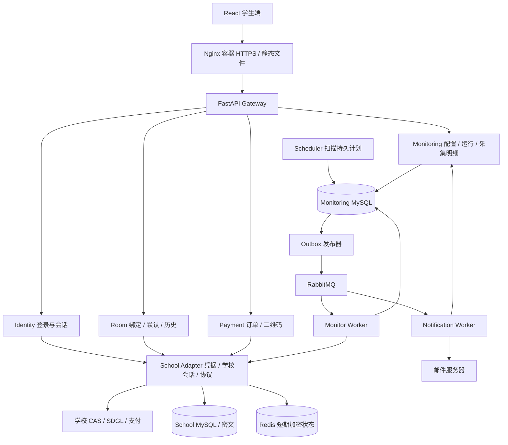
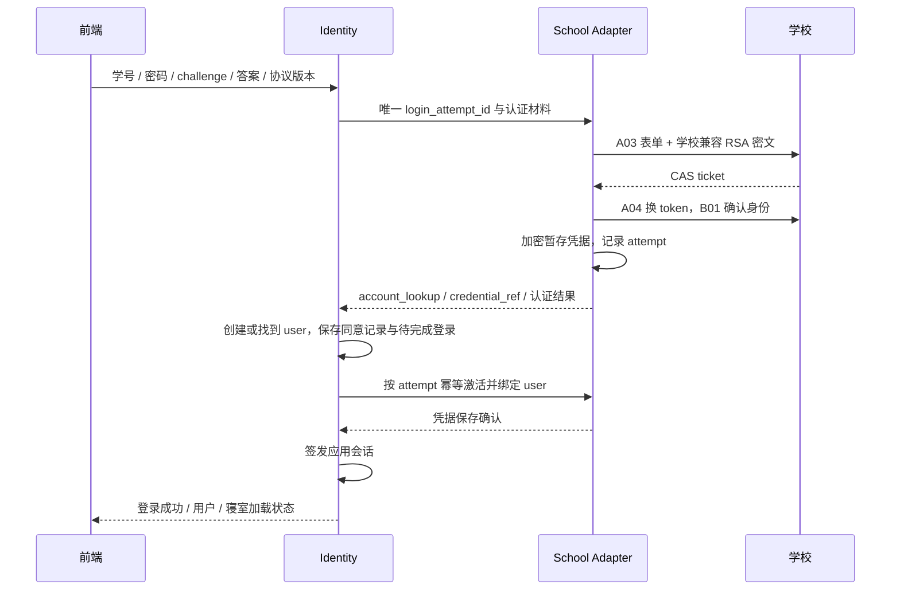
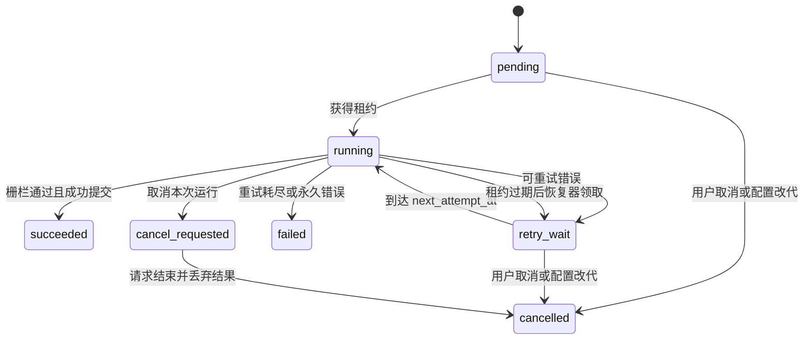

# 寝室电费系统 Python 后端架构详细设计

版本：1.2；更新日期：2026-10-01；状态：T0 契约/工程基线已实现，T1 运行基础已实现，业务目标待 T2–T8。

本文依据 example/src/ 的学生端参考和[学校对接 API 文档](学校对接API文档.md)，定义全新系统的架构、数据库、接口与实施约束。正式前端位于 frontend/，后端位于 backend/，文档位于 docs/；example/ 仅供参考，不作为生产源码或构建输入。正文代码路径相对仓库根目录，统一约定见[文档索引](README.md)。

本系统从空库开始建设，使用 **MySQL 8.4** 和 `/api/v1` 契约。最终通过 Docker Compose 构建并运行前端、后端及全部基础服务，域名和 TLS 证书路径可配置。T0 已交付工程、DTO/状态与七域初始迁移；T1 Docker/Compose、服务基础、TLS、可靠事件与 Audit 已验收；学校业务继续实施。实际记录见 [T0 验收](acceptance/T0验收记录.md)。

## 1. 目标、范围与固定规则

### 1.1 本次需求落点

| 需求 | 设计落点 |
| --- | --- |
| Docker 全栈部署 | frontend 的 Node 构建/Nginx 运行镜像、backend 的 Python 镜像及全部数据库/队列由 Compose 编排；Nginx 唯一发布 80/443 |
| 自定义域名和证书 | deploy/.env 配置 ELECT_DOMAIN 与 PEM 证书链/私钥路径；Nginx 模板、可信 Origin、站内链接统一使用配置域名 |
| MySQL | MySQL 8.4 LTS、InnoDB、utf8mb4；每个领域独立 database、独立数据库账号、独立 Alembic 迁移 |
| 登录成功保存学号、密码 | School Adapter 使用 AES-256-GCM 加密保存两者，Identity 只保存用户 ID 和凭据引用；失败登录不更新有效凭据 |
| 学校验证码由后端取得 | 后端创建学校 CAS 会话并取图，前端展示图片及输入答案；不生成替代验证码，不将学校 Cookie 交给浏览器 |
| 监控持久化、恢复、取消、修改 | MySQL 保存配置、计划、运行、租约、重试和取消状态；RabbitMQ 负责唤醒；代次和执行栅栏阻止旧任务提交 |
| 学校访问失败 | 统一超时预算、分类重试、限流、熔断、重新认证、最后成功数据回显及不确定写入对账 |
| 绑定寝室写接口 | 使用学校当前页面的 `POST /api/base/roomUser/batchAdd`；候选查询、幂等操作、结果回查、本地绑定与默认寝室分别建模 |

### 1.2 产品规则

1. 一个学校账号对应一个应用用户；一个用户可以有多条绑定。学校页面“每次只能绑定一个房间”仅约束单次操作，账号累计上限没有证据，遇到学校限制时按实际错误处理。
2. 一个用户最多有一个默认寝室、一个学生端监控配置。监控跟随默认寝室；其他绑定用于切换查看，不自动新增监控任务。
3. 首次登录只有在成功取得学校绑定列表且列表为空时，才进入绑定引导。查询失败应显示“暂时无法获取寝室”，不能误判为空。
4. 首次绑定成功自动设为默认；已有默认寝室时新增绑定不切换默认。成功同步按学校返回列表覆盖当前绑定；默认仍在列表中则保留，否则选择学校返回的第一条，空列表清空默认，用户可随后更改。
5. 监控间隔是整数分钟，范围 `60..1440`；不是 cron 文本，不允许小数分钟。
6. 重复提醒次数定义为一次低余额事件的**总提醒次数，包含第一次**，范围 `1..5`。默认间隔 60 分钟、次数 2、阈值 20.00 元，与当前展示一致。
7. 关闭监控保留历史；退出网页登录默认只注销应用会话，已授权的后台监控继续。移除学校凭据或撤回后台采集授权则阻断监控和待发送提醒。
8. 电费明细默认最近 30 天，支持 7/30/90 天和自定义范围；趋势与采集明细使用同一范围，月/周/天只改变聚合粒度。
9. 本地日期采用 `Asia/Shanghai`，时间戳返回带时区的 RFC 3339；数据库运行时间保存 UTC `DATETIME(6)`。金额使用 Decimal，API 以字符串返回，不能以 float 入库。
10. 学校未返回的数据保留 `null` 和质量标记，不造历史、不将未知余额补成 0，也不将未确认支付标记为成功。

### 1.3 技术选型

| 层 | 选型 | 原因 |
| --- | --- | --- |
| Python | 3.12.10，uv 管理，提交 backend/uv.lock | 在 backend/.python-version 固定解释器，锁定依赖解析结果 |
| API | FastAPI、Pydantic v2、Uvicorn | 明确请求校验、响应 DTO 和 OpenAPI |
| MySQL 访问 | SQLAlchemy 2.x + asyncmy，Alembic | 明确事务、连接池、版本迁移与锁操作 |
| 外部 HTTP | httpx.AsyncClient | 连接复用、分阶段超时、取消和请求总预算；支付 HTML 可沿用已审阅解析逻辑 |
| 密文 | cryptography AESGCM + 外部 KEK | 同时保护学号和密码，支持密钥版本和轮换 |
| 消息 | RabbitMQ + aio-pika | 持久消息、确认发布、手动 ACK；不依赖 Celery result backend 作为任务事实来源 |
| 缓存 | Redis 7.x | 验证码短期会话、加密学校 token、短期候选、分布式限流；丢失可重建 |
| 监控调度 | 独立 Python Scheduler + 领域 Worker | MySQL 为权威，API 重启不影响持久计划 |
| 邮件 | SMTP 客户端 + Notification Worker | 投递结果、重试、取消及重复抑制独立于采集 |
| 部署 | Docker Compose + Nginx 容器 | 单机起步，后续可横向扩展业务 Worker |

`uv.lock` 锁定直接和间接依赖及校验信息，使开发和 Docker 构建使用相同依赖；它不保存账号密码，也不替代 Python 版本管理。上线镜像另行固定基础镜像摘要，定期通过受控升级修补安全问题。

## 2. 总体架构与领域职责



图中只展开监控和学校域存储。Identity、Room、Payment、Notification、Audit 各自也有独立 MySQL database。可以同处一台 MySQL 实例，但不互相 SELECT，不建跨库外键，不用同一高权限账号。

| 服务/进程 | 所属数据 | 对外/内部职责 |
| --- | --- | --- |
| Gateway | 无业务表 | 应用认证校验、请求聚合、统一错误、请求 ID、限流；聚合失败按组件返回状态 |
| Identity | users、app_sessions、consents、login_attempts | 应用用户生命周期、学校登录结果确认、协议记录、会话吊销 |
| School Adapter | credentials、account_lookup、upstream_operations | 唯一解密学校凭据的服务，处理 CAS、token、学校 HTTP、绑定/支付写入台账 |
| Room | rooms、bindings、room_preferences、room_operations、school_history、history_syncs | 学校绑定同步、候选查询编排、默认切换、学校历史归一化、查询授权 |
| Monitoring | monitors、runs、attempts、samples、alert_episodes、alert_slots | 配置和任务权威；采集成功提交、差额、低余额事件、发送授权 |
| Payment | payment_orders、payment_operations | 本地订单幂等、建单结果、二维码流程、状态核对 |
| Notification | notification_jobs、notification_attempts | 邮件内容、投递、有限重试、结果回报 |
| Audit | audit_events | 接收脱敏审计事件，按权限查询；不接收完整学校响应 |
| Scheduler | 只使用 Monitoring 仓储 | 扫描到期计划、创建运行和唤醒 Outbox、恢复失效租约 |
| 各域 Worker/Relay | 只使用所属领域仓储 | 执行领域任务、发布本域 Outbox、消费幂等 Inbox |

内部 HTTP 使用独立服务身份与短期 JWT/mTLS，JWT 校验 `iss/aud/exp/jti` 和服务权限；用户操作携带经验证的应用 `user_id`。不能以一个所有服务通用的静态字符串加任意 `X-User-Id` 作为授权。消费者同样验证消息类型、版本、对象归属。

所有服务内事务只覆盖本库。跨域通过有状态操作、Outbox、幂等消费与补偿推进，不承诺分布式 ACID。接口返回 `202 + operation_id` 时表示持久受理，前端必须查询操作结果。

## 3. 正式项目目录与领域落点

| 目录 | 职责 | 建设内容 |
| --- | --- | --- |
| frontend/ | 正式学生端 | 参考 example 的浅蓝布局和交互，在独立工程接入真实 API、路由与状态管理 |
| backend/services/gateway/ | 网关 | `/api/v1` 聚合、认证、超时预算、统一错误与对象访问 |
| backend/services/identity/ | 身份 | 学校登录结果确认、应用会话、协议授权、凭据激活 Saga |
| backend/services/school_adapter/ | 学校适配 | 从协议文档实现 RSA/CAS、验证码、加密凭据、独立学校会话和写入台账 |
| backend/services/room/ | 寝室 | 绑定镜像、候选、真实绑定、默认切换、余额和学校历史 |
| backend/services/monitoring/ | 监控 | 配置、计划、租约、代次栅栏、样本、低余额事件与发送授权 |
| backend/services/payment/、backend/services/notification/、backend/services/audit/ | 支付、通知与审计 | 本域 MySQL、Outbox/Inbox、对象授权、未知结果及脱敏事件 |
| backend/tests/、frontend/tests/ | 验证 | 各工程的规则、契约、集成与浏览器检查 |
| docs/ | 项目文档与契约 | 设计、计划、学校协议、contracts、验收及运维说明 |
| deploy/ | Docker 部署配置 | Compose、Nginx 模板、数据库配置、Secret 路径和容器运维入口 |
| example/ | 参考材料 | 查看页面和交互，不作为正式工程或镜像构建上下文 |

backend/ 包含 pyproject.toml、uv.lock、.python-version 与 Dockerfile；frontend/ 包含 package.json、package-lock.json、index.html、src/main.jsx 与 Dockerfile。前端镜像使用 Node 编译后复制产物到 Nginx，后端镜像将 backend/ 内容复制到 /app，模块入口保持 `services.*`。

各领域位于 backend/services/，域内组织为 `api/`、`application/`、`domain/`、`infrastructure/`、`migrations/`、`workers/`。common 只包含错误码、事件信封、时钟、可观测性和服务认证，不共享 ORM 模型与业务表。

## 4. 登录、验证码和凭据加密

### 4.1 学校验证码代理

1. 登录页面读取 `GET /api/v1/auth/agreement`，并调用 `POST /api/v1/auth/captcha`。
2. Adapter 建立新的 CAS CookieJar，访问 A01，再在同一会话调用 A02。网络或协议失败时返回明确错误，不能生成本地替代验证码。
3. Redis 保存加密的 CAS CookieJar、学校验证码 `uid`、生成时间和状态；键使用随机 256 位 `challenge_id`，绑定匿名浏览器 nonce。该 nonce 使用 HttpOnly、Secure、SameSite=Lax Cookie。
4. 浏览器只收到 `challenge_id`、学校图片的安全 Data URL、应用 TTL（建议 120 秒）和 `expires_at`。TTL 是本应用上限，不是学校有效期承诺。图片校验 MIME、Base64 和最大 256 KiB，响应 `Cache-Control: no-store`。
5. 刷新验证码创建新 challenge，并原子失效同一浏览器的旧 challenge；必要时以旧 `uid` 向学校刷新。乱序响应由前端请求序号丢弃。
6. 登录提交原子将状态 `fresh → submitting`。一个 challenge 仅允许一个提交；过期、并发提交、任何认证结束后都不能复用。学校返回验证码错误时前端重新取图。
7. Redis 故障时暂停新验证码与登录，返回可重试错误；不能回退进程内字典造成多副本串会话。

应用登录不识别或替用户回答验证码，学校实际校验用户输入的算式答案。后台会话恢复的验证码处理见 4.4。

### 4.2 登录成功的事务边界



- 只有 A03/A04/B01 完成，并且加密凭据已持久保存，才对外返回登录成功。应用不得在明文落盘或密文保存失败时“先登录再补存”。
- 学校 RSA 是 A03 的传输协议，与数据库 AES-GCM 存储加密独立。兼容小端分块算法、公开模数和 Latin-1 限制，不能替换为默认 RSA-OAEP；不能编码的密码返回兼容性错误。
- 学校认证成功后暂存密文的有效期建议 10 分钟；登录 Saga 用 `attempt_id` 幂等恢复，过期未激活密文清理。Identity 未完成时不对外发会话。
- 对旧用户更新凭据采用新版本暂存再激活；失败尝试不覆盖已验证版本。激活后发送 `credential.updated`，使旧 token 和旧凭据租约失效。
- 寝室同步在登录完成后单独进行。已有本地绑定但学校暂时失败时可进入带“未同步”状态的主界面；无本地数据且同步失败时进入重试状态，不宣称没有寝室。
- 用户协议记录版本、内容摘要、同意时间和后台凭据使用授权。前端“阅读到底”是交互约束，服务端能证明的是提交的版本和明确同意，不能证明真实阅读行为。

### 4.3 密文与密钥管理

`school_credentials` 保存一个加密负载：`{"student_id":"…","password":"…"}`。AES-256-GCM 使用每次加密独立随机 96 位 nonce，AAD 包含 `school_id + credential_id + owner_user_id + credential_version`；认证标签随密文存储。成功登录激活时按最终 user_id 重新封装，暂存态使用 attempt_id 作为 AAD。

- 每条凭据生成独立数据密钥 DEK，DEK 由外部 KEK 包装；库内保存 `ciphertext/nonce/wrapped_dek/kek_version/algorithm/version`，不保存可解密它们的 KEK。
- KEK 通过 Docker Secret 或外部密钥服务注入，只允许 Adapter 读取。应用镜像、Git、普通 `.env`、数据库和日志不包含 KEK 明文。
- 学号用于登录匹配时使用独立 lookup key 计算 `HMAC-SHA256(school_id || normalized_student_id)`；不能用普通 SHA256，因为学号可枚举。原始学号仍只在加密负载里。
- HMAC 轮换采用同一 credential 的多版本别名表，唯一键 `(school_id,key_version,lookup_hash)`；过渡期同时查询旧、新别名，迁移完成后退役旧 key，避免生成两个本地用户。
- 所有配置检查只输出是否设置、版本、过期时间、解密成功与否；不显示密钥、原始学校账号、Cookie、token、支付票据或密码密文。异常不拼接完整 URL/body。
- 登录与解密操作的内存对象缩短生命周期；Python 字符串不能保证可验证的内存擦除，不宣称“立即完全清零”。生产禁用请求体调试和 core dump，限制进程读取权限。
- KEK 轮换先发布新版本，重包装 DEK，再抽样验证后退役旧版本；备份需要保留对应密钥版本的受控恢复能力。密钥丢失不可通过数据库恢复密码，用户需重新登录授权。
- GET 用户信息只向本人返回展示用学号；日志、审计与运维界面仅显示应用用户 ID 或脱敏值。没有任何读取密码的公共 API。

### 4.4 学校会话恢复

Adapter 按 `(credential_id,credential_version)` 缓存加密学校 token 和状态；建议缓存上限 15 分钟，但学校真实有效期未知，以学校响应判断。CAS CookieJar 按 challenge/认证过程隔离，不混用学生会话。

后台采集先复用 token；确认失效后，以该用户凭据恢复认证。每账号使用共享锁和版本 CAS，最多一个重认证流程，其他任务短期等待同一结果；不得拿管理员或其他用户的学校账号代查。

后台恢复可在独立 Adapter Worker 中采用 `ddddocr` 算式处理，限定最多 2 次取图识别、一次有效提交，除零/不支持算式直接失败；主登录始终让用户填写学校验证码。持续识别失败、密码失效、新增 MFA 或学校要求人工校验时进入 `requires_reauth`，停止自动登录重试，通知前端重新登录。

应用会话与学校 token 独立：学校掉线不立刻注销应用用户，用户仍能查看已有历史和修复授权。学校凭据更新恢复任务时执行当前配置代次，不复活过期任务。

## 5. 绑定寝室与默认寝室

### 5.1 学校实际协议与验证状态

2026-10-01 已使用提供的 `auth.txt` 在内存中完成 CAS 登录，并取得当前学校用户及 1 条绑定记录。B03 只读请求返回 HTTP 200、业务 code 200 和分页容器；未输出账号、密码、token 或真实寝室标识。

学校移动端 `pages-bindingAccount-accountbind.80ce137c.js` 的保存按钮调用：

```text
POST https://sdgl.hbue.edu.cn/api/base/roomUser/batchAdd
Authorization: Bearer <CURRENT_USER_SCHOOL_TOKEN>
Content-Type: application/json

{ "roomUsers": [ <B03 选中记录，并将 userId 替换为 B01 当前用户 ID> ] }
```

当前页面限制单次选 1 条；成功分支检查 `code == 200`。最小必填字段、重复写入行为、累计绑定上限、完整成功响应尚未验证，因此 Adapter 初版保持学校页面的服务端候选记录形状，而不能擅自认定只需要两个 ID。主包的 `/base/roomUser/add` 使用查询参数，但不是当前页面的主路径。完整参数与脚本 SHA-256 见学校文档 B04。

本次没有指定要新增的真实寝室，未执行改变账号绑定关系的 POST/DELETE。此项明确属于“调用链已核对、真实写入待验收”，不能报告新增绑定成功。

### 5.2 查询候选与写入流程

1. 先调用 `GET /api/v1/room-candidates/buildings`、`/floors?building_id=...`、`/rooms?building_id=...&floor=...`，按学校 B05/B06/B07 三级筛选取得列表，关键词只在当前列表内过滤。选定后 `GET /api/v1/room-candidates?room_id=...&page=1&page_size=10`，Room 调用 Adapter 的 B03 核对精确 ID。学校页面使用 `roomId/searchValue/size/current/pageTotal`，后端校验实际返回的记录，不能假定搜索参数一定生效。
2. 返回精简候选 `{candidate_id,room_id,building,number,display_name,already_bound}`。完整学校记录留在 Adapter 加密短期缓存，TTL 建议 5 分钟，按 user_id 与搜索会话隔离；不把其他住户信息返回前端。
3. 前端提交 `POST /api/v1/room-bindings`，仅带 `candidate_id` 和 `Idempotency-Key`。Room 事务创建 `room_operation`，相同用户/幂等键/同一请求返回原操作，不同内容返回 409。
4. Worker 检查候选归属、有效期与目标房间，必要时用 B03 定向重新查询，验证目标 ID；无法核验则要求刷新候选。即便学校返回更多房间，也不擅自扩大授权范围。
5. 先以 B02 查询当前绑定，已存在则幂等完成本地同步，不重复 POST。
6. 调用 Adapter。Adapter 在 `upstream_operations` 持久登记唯一 `operation_id` 与 `prepared → dispatched`，随后以服务器保管的候选记录构造 `roomUsers`，覆盖 `userId` 后只发送一次 POST。
7. POST 明确成功后再查 B02，目标出现才将本地 binding 标记 `active`。超时/断连/未知 5xx 进入 `reconciling`，只重试 B02，不自动重发写请求。
8. 回查期间返回 202 和持久操作状态；超过 10 分钟仍无法确认，标记 `unknown` 并允许稍后人工触发回查。同一用户/寝室未解决操作阻止新绑定写入，换幂等键也不能绕过。
9. 首次激活 binding 后推进默认寝室流程；操作响应把 `binding_status` 与 `default_status` 分开，防止学校绑定成功但默认设置失败时再次绑定。

学校列表短期为空不能证明先前 POST 未执行。未知写入只能根据确证结果或经过人工核实解除，不以“重启 Worker”清空台账。学校明确拒绝的业务错误可终结操作，记录经过脱敏的分类。

### 5.3 本地同步与默认切换

绑定列表为学校关系镜像，默认寝室为本应用偏好。B02 同步成功才更新镜像；失败保持原关系并标记 stale。按用户2026-10-02明确规则，成功且结构有效的B02列表完整覆盖当前绑定，缺席关系立即标记 `inactive`，保留历史；默认仍在就保留，否则走默认/监控Saga选择学校第一项，成功空列表走同一屏障清空默认/监控目标。失败或无效响应不视为空列表。未知学校写操作台账仍保持原规则，不因同步空列表清除未知写入证据。

默认切换涉及 Room 与 Monitoring，使用持久 Saga，不跨库修改两张表：

1. Room 在事务内锁定 `room_preferences`，确认目标是本人 active binding，校验 `expected_version`，创建 `switch_default` 操作并标记 `switching`。
2. 调用 Monitoring `prepare-retarget(operation_id,target_binding)`：锁 monitor，提升 generation，撤销旧代次待执行任务与提醒授权，置 `retargeting`，返回持久屏障结果。重复调用同一操作不再次提升代次。
3. Room 提交新 default binding 和偏好版本，保存 Saga 阶段及 Outbox。
4. 调用 Monitoring `commit-retarget`：核对 Room 已提交的偏好版本，以新目标恢复当前 `desired_enabled`，开启新代次；启用时安排一次新目标采集，重置跨寝室余额比较基线。
5. Room 操作完成，前端收到成功后刷新总览、详情与监控。处理中 UI 展示切换状态，不能显示“监控已同步切换”。

若步骤 2 成功、步骤 3 尚未完成即崩溃，恢复器按 Saga 状态继续或明确补偿；补偿也采用新代次恢复旧目标，不复活旧任务。步骤 3 成功后优先向前完成步骤 4。并发默认切换返回 409；切换中关闭监控允许写入 `desired_enabled=false`，后续提交必须尊重它。

关系移除/凭据撤销也先通过 Monitoring 使旧任务失效；旧任务一旦获得的学校响应不得因迟到而覆盖新默认寝室。配置变化的取消边界详见第 9 节。

## 6. MySQL 数据模型

### 6.1 通用约定

以下是逻辑库名和业务摘要，实际数据库名称为 elect_identity/elect_school/elect_room/elect_monitoring/elect_payment/elect_notification/elect_audit；T0 可执行表结构、补充字段及约束见 [数据库基线](database/README.md)和[表目录](database/schema-catalog.json)。

- 业务 ID 使用 UUIDv7（应用生成）并以 `BINARY(16)` 存储，API 返回标准 UUID 字符串；学校 ID 使用 `VARCHAR(128)`，不转成整数、不作为本应用主键。
- 时间为 UTC `DATETIME(6)`；学校日记录用 `DATE` 并保存来源时区。金额 `DECIMAL(14,2)`、电表和用量 `DECIMAL(18,4)`；拒绝 NaN/Infinity。
- 状态用受约束的 `VARCHAR`，通过 Pydantic、领域层和 MySQL CHECK 三层约束；`version/generation` 使用正整数。
- 本库内主外键正常建立；跨库仅保存稳定 UUID，并由领域接口验证归属。`owner_user_id` 不可从浏览器任意指定。
- 所有写表含 `created_at/updated_at`；以下列举业务必需字段，不重复通用字段。审计、任务历史不级联删除。

### 6.2 Identity / School Adapter

| 库.表 | 关键字段 | 约束/索引 |
| --- | --- | --- |
| identity.users | id、school_id、credential_ref、status、session_version | credential_ref 唯一；无明文学号/密码列 |
| identity.app_sessions | id、user_id、token_hash、csrf_hash、expires_at、last_seen_at、revoked_at、session_version | token_hash 唯一；(user_id,revoked_at)、expires_at |
| identity.consents | id、user_id、agreement_version、content_hash、accepted_at、credential_use_allowed、revoked_at | (user_id,agreement_version,accepted_at) |
| identity.login_attempts | id、browser_nonce_hash、credential_ref、user_id、state、error_code、expires_at | id 幂等；state/expires_at 恢复扫描；不保存密码 |
| school.school_credentials | id、owner_user_id、school_id、school_user_id、ciphertext、nonce、wrapped_dek、kek_version、version、status、verified_at、revoked_at | owner_user_id+school_id 唯一；暂存凭据单独 staging 表 |
| school.credential_staging | attempt_id、credential_ref、encrypted_payload、wrapped_dek、nonce、kek_version、expires_at、state | attempt_id 唯一；短期清理，激活时重设 AAD |
| school.account_lookup | school_id、key_version、lookup_hash、credential_id | 唯一 (school_id,key_version,lookup_hash) |
| school.upstream_operations | id、owner_user_id、operation_type、target_ref、request_digest、credential_version、state、dispatched_at、result_ref、error_code、reconcile_at | id 唯一；相同逻辑写操作不允许多次 dispatch |

学校 `school_user_id` 是 opaque ID，区别于学号；如学校返回的实际形式属于敏感标识，可一并加密。学校 token 和 CAS Cookie 不放入普通业务表。

### 6.3 Room

| 表 | 关键字段 | 约束/索引 |
| --- | --- | --- |
| rooms | id、school_id、school_room_id、building_name、room_no、meter_code、metadata_version | 唯一 (school_id,school_room_id) |
| room_bindings | id、owner_user_id、room_id、school_relation_id、status、last_confirmed_at | 唯一 (owner_user_id,room_id)；(owner_user_id,status) |
| room_preferences | owner_user_id、default_binding_id、version、switch_operation_id、state | owner_user_id 主键；默认必须指向本人 active binding |
| room_operations | id、owner_user_id、type、target_room_id、idempotency_key_hash、request_digest、state、saga_step、upstream_operation_id、next_reconcile_at、error_code | 唯一 (owner_user_id,type,idempotency_key_hash)；(state,next_reconcile_at) |
| room_balance_cache | binding_id、balance、fetched_at、school_observed_at、source、quality、error_code | binding_id 主键；是最近读结果，不伪装成 monitor sample |
| school_history_records | id、binding_id、request_room_id、source、source_record_key、record_date、source_time、last_reading、reading、energy_usage、charged_amount、charge_status、row_hash、sync_id | (binding_id,record_date,source)；来源记录 ID 可用时唯一 |
| history_syncs | id、binding_id、requested_start、requested_end、source、status、coverage、fetched_at、error_code、version | (binding_id,requested_start,requested_end,source) |

学校历史去重：有稳定源记录 ID 时使用该 ID；没有时使用 `(binding,source,日期/时间,电表,起码,止码,金额,用量)` 的规范化指纹，并保留原始重复次数和同步批次。学校可能修订记录，也可能出现内容相同但不同的真实行；未确认唯一性时按一次查询范围的快照版本替换/比对，不能盲目 append 或把 hash 当学校唯一 ID。涉及原始响应的诊断副本只允许白名单字段、加密、短期保存。

### 6.4 Monitoring

| 表 | 关键字段 | 约束/索引 |
| --- | --- | --- |
| monitors | id、owner_user_id、binding_id、credential_ref、desired_enabled、state、interval_minutes、repeat_limit、threshold、email_ciphertext、email_version、version、generation、next_run_at、active_run_id、last_success_at、last_error_code、consecutive_failures、last_retarget_operation_id | owner_user_id 唯一；(state,next_run_at)；CHECK interval 60..1440，repeat 1..5，threshold>0 |
| monitor_runs | id、monitor_id、generation、scheduled_for、binding_id、credential_version、state、version、attempt_count、next_attempt_at、lease_owner、lease_until、execution_epoch、cancel_requested_at、started_at、finished_at、error_code | 唯一 (monitor_id,generation,scheduled_for)；(state,next_attempt_at)、(state,lease_until)；version 对应取消 expected_version |
| monitor_attempts | id、run_id、attempt_no、worker_id、execution_epoch、started_at、finished_at、outcome、error_code、duration_ms | 唯一 (run_id,attempt_no)；不含学校 payload |
| monitor_samples | id、run_id、monitor_id、owner_user_id、binding_id、captured_at、balance、previous_sample_id、balance_delta、meter_last_reading、meter_reading、meter_delta、meter_record_date、meter_source_record_key、quality、credential_version | run_id 唯一；(owner_user_id,binding_id,captured_at,id) |
| alert_episodes | id、monitor_id、binding_id、generation、opened_at、closed_at、state、threshold、recovery_threshold、sent_count、reserved_count | 每 monitor 最多一个 open episode，用 monitor 上 current_episode_id 在事务内约束 |
| alert_slots | id、episode_id、ordinal、sample_id、generation、email_version、state、send_lease_until、delivery_id、authorized_at、finished_at | 唯一 (episode_id,ordinal)；ordinal 不超过 repeat_limit |

`monitors` 还需保存 `current_episode_id`、`last_sample_id`、`first_enabled_at`、`last_email_sent_at`、`schedule_anchor_at` 和当前 `credential_version`。`has_monitor_history` 由持久首次启用信息与实际样本计数派生，不能取当前 enabled。T0 增加历史同步窗口、凭据撤回/监控控制操作、支付步骤会话及持久快照成员；初始迁移独立保存各域版本，后续可靠执行由 T1–T6 实现。

### 6.5 Payment / Notification / Audit / 可靠事件

| 表 | 关键字段与约束 |
| --- | --- |
| payment_orders | id、owner_user_id、binding_id、credential_ref、credential_version、amount、currency、idempotency_key_hash、request_digest、state、upstream_operation_id、prepay_id_ciphertext、pay_url_ciphertext、school_status_raw_code、last_checked_at；用户+幂等键唯一 |
| payment_operations | id、order_id、kind、state、lease、next_attempt_at、qr_expires_at、error_code；二维码获取失败不生成第二笔订单 |
| notification_jobs | id、alert_slot_id、owner_user_id、email_ciphertext、generation、email_version、template_version、message_id、state、attempt_count、next_attempt_at、lease_until；alert_slot_id 唯一 |
| notification_attempts | job_id、attempt_no、provider_result、state、started_at、finished_at；不记录 SMTP 凭据、完整收件地址 |
| audit_events | event_id、actor_user_id、service、action、object_type、object_id、result、request_id、occurred_at、sanitized_details；event_id 唯一 |
| 每域 outbox_events | event_id、type、schema_version、aggregate_id、aggregate_version、payload、available_at、publish_lease_until、published_at、publish_attempts |
| 每域 inbox_events | consumer_name、event_id、processed_at；复合主键用于消费去重 |

记录量估算：1 万用户、每小时一次，成功采集约 24 万条/天，按 90 天约 2160 万条。上线前以真实行大小、索引和保留期测算磁盘，不能只按 payload 大小算容量。建议样本与尝试记录分开归档；保留 12 个月样本、90 天详细尝试、至少 180 天操作/幂等台账作为初始策略，用户删除与法定要求另行落实。未解决订单和未知写操作不得被普通过期清理删除。

MySQL 分区会影响唯一键约束，第一版不为了“按月分区”破坏 run_id 唯一性；先使用合适索引和批量归档，达到容量阈值再独立设计分区及去重台账。

## 7. 前端 API 契约

### 7.1 通用协议与权限

前缀 `/api/v1`，JSON 使用 UTF-8，字段用 snake_case。成功响应：

```json
{
  "data": {},
  "meta": {
    "request_id": "<UUID>",
    "server_time": "2026-10-01T10:00:00+08:00"
  }
}
```

失败响应使用实际 HTTP 状态，不能所有错误均返回 200：

```json
{
  "error": {
    "code": "SCHOOL_UNAVAILABLE",
    "message": "学校系统暂时不可用，请稍后重试",
    "retryable": true,
    "retry_after_seconds": 30,
    "requires_reauth": false,
    "field_errors": {}
  },
  "meta": {"request_id": "<UUID>", "server_time": "2026-10-01T10:00:00+08:00"}
}
```

应用会话使用随机不透明 token，Cookie 名 `__Host-elect_session`，`Secure; HttpOnly; SameSite=Lax; Path=/`，不设 Domain；数据库只存 token hash。建议空闲 12 小时、绝对 7 天并可配置；注销和凭据撤销可服务端即时吊销。学校 token 不出 Adapter，不放入 localStorage。

Gateway 对不透明会话调用 Identity 内部 introspection，校验会话状态和 session_version，再签发仅用于本次内部请求的短期用户上下文；业务服务同时校验服务身份和目标对象归属。涉及凭据、支付、绑定和监控控制的写请求不使用可能滞后的会话缓存；Identity 不可用时拒绝新写请求，不能接受客户端自行声明的用户 ID。

Cookie 认证的写请求校验 Origin 和 CSRF token；CSRF token 由会话接口取得、保存在前端内存，使用 `X-CSRF-Token` 提交。验证码和登录使用匿名 nonce、同源校验及限流。全部对象接口校验当前 user_id 对 binding、sample、run、operation、order 的归属，返回不可枚举的 404；前端传入有效 UUID 不代表有权限。

`Idempotency-Key` 用于绑定、建单和手动刷新等创建操作，按用户+操作类型分区；保存规范化请求摘要，键相同内容不同返回 409。修改配置/默认使用 `expected_version`，缺失返回 428，版本冲突返回 409 并提供当前版本。

### 7.2 接口总表

T0 已冻结 [OpenAPI](contracts/openapi.yaml)及[契约行为说明](contracts/README.md)，由后端 DTO/端点清单生成并同步前端类型。下表是摘要；绑定列表增加 preference_version/default_switch_operation_id/本人待完成摘要与可空余额；me 增加 credential_version/撤回摘要；monitor 返回 current_run/version 和 notification；capabilities 提供未解决订单引用。重认证不同账号返回 REAUTH_ACCOUNT_MISMATCH，快照过期为 SNAPSHOT_EXPIRED。接口实际按 x-stage 实现。

| 页面/功能 | 方法与路径 | 主要请求 | 返回与行为 |
| --- | --- | --- | --- |
| 用户协议 | GET `/auth/agreement` | 无 | version、content、content_hash、updated_at |
| 学校验证码 | POST `/auth/captcha` | 可选 previous_challenge_id | challenge_id、image_data_url、expires_at |
| 登录 | POST `/auth/login` | student_id、password、challenge_id、captcha_answer、agreement_version、agreement_accepted、credential_use_allowed | 建立会话；me 与 bootstrap 状态 |
| 当前用户 | GET `/auth/me` | Cookie | id、student_id、school、credential_status、consent、csrf_token |
| 退出 | POST `/auth/logout` | CSRF | 204，吊销本会话 |
| 撤回学校授权 | DELETE `/auth/school-credential` | CSRF、expected_version | 202，先禁用监控/提醒，再撤销密文与 token，完成可查 |
| 总览 | GET `/overview` | 可选 binding_id，默认当前默认 | profile、balance、summary、daily_consumption、monitor、component_status |
| 已绑定寝室 | GET `/room-bindings` | q、page、page_size | items、total、default_binding_id、sync_status、last_synced_at |
| 同步绑定 | POST `/room-bindings/sync` | Idempotency-Key | 202，operation_id |
| 搜索可绑定寝室 | GET `/room-candidates` | q、page、page_size；可选选房路径返回的 room_id | 候选、分页、search_quality、expires_at；失败不返回伪空列表 |
| 绑定寝室 | POST `/room-bindings` | candidate_id；Idempotency-Key | 202，operation_id；已确认存在可返回 200 |
| 设置默认 | PUT `/room-preferences/default` | binding_id、expected_version | 202，切换 Saga；幂等无变化可返回 200 |
| 后台操作结果 | GET `/operations/{id}` | 无 | type、state、binding_status、default_status、retryable、error_code |
| 最新余额 | GET `/room-bindings/{id}/balance` | 无 | 最近成功余额、来源时间、是否过期 |
| 手动刷新余额 | POST `/room-bindings/{id}/balance-refresh` | Idempotency-Key | 202；合并同账号重复请求、短期冷却；不自动创建监控明细 |
| 历史消费 | GET `/room-bindings/{id}/consumption` | start_date、end_date、granularity=day/week/month | buckets、summary、coverage、sync_status |
| 同步学校历史 | POST `/room-bindings/{id}/history-sync` | start_date、end_date；Idempotency-Key | 202；后台更新缓存，避免页面长时间等待 |
| 监控采集明细 | GET `/room-bindings/{id}/monitor-samples` | start_date、end_date、page、page_size、snapshot_token | items、total、has_monitor_history、snapshot_token |
| 监控设置与状态 | GET `/monitor` | 无 | config、state、health、last_run、next_run_at、version |
| 保存监控 | PATCH `/monitor` | enabled、interval_minutes、repeat_limit、threshold、email、expected_version | 200，持久配置和有效代次；学校离线不阻止关闭 |
| 立即采集 | POST `/monitor/runs` | Idempotency-Key | 202，复用正在运行的任务或创建一条，仍受同账号限流 |
| 运行状态 | GET `/monitor/runs/{id}` | 无 | state、scheduled_for、started_at、finished_at、error_code、attempts |
| 取消本次运行 | POST `/monitor/runs/{id}/cancel` | expected_version | 200/202，只取消本次，不关闭后续计划 |
| 支付能力 | GET `/payments/capabilities` | binding_id | enabled、currency、min_amount、max_amount、amount_step、unavailable_reason |
| 创建电费订单 | POST `/payment-orders` | binding_id、amount、currency=CNY；Idempotency-Key | 202，order_id；无自动扣款 |
| 订单状态 | GET `/payment-orders/{id}` | 无 | state、amount、paid_confirmed、last_checked_at、qr_status |
| 支付二维码 | GET `/payment-orders/{id}/qr` | Cookie | 图片或 202/明确错误；本人授权、no-store |
| 重新取得二维码 | POST `/payment-orders/{id}/qr-refresh` | Idempotency-Key | 202，使用已有订单，不能再次建单 |

`GET /operations/{id}` 由 Gateway 按受控 ID 归属分派到领域，不允许前端提供内部服务 URL。删除学校授权操作由 Identity 持久协调。当前学生页面没有解绑按钮，因此不把学校解绑写 API 加入本期公共契约。

### 7.3 登录和页面初始化返回

```json
{
  "data": {
    "user": {"id": "<UUID>", "student_id": "<仅向本人返回的学号>"},
    "bootstrap": {
      "rooms_state": "loading",
      "requires_binding": null,
      "default_binding_id": null,
      "credential_status": "active"
    }
  }
}
```

`rooms_state=ready` 且成功列表为空才令 `requires_binding=true`；`failed/loading` 返回 null。不能因网关聚合部分失败让已经成功的登录重新提交密码。前端登录成功即清除 password 状态。

### 7.4 总览与当前余额

```json
{
  "data": {
    "profile": {
      "student_id": "<仅向本人返回的学号>",
      "default_binding": {"id": "<UUID>", "building": "示例楼", "number": "示例房号"},
      "alert_email": "<本人设置的邮箱>"
    },
    "balance": {
      "amount": "25.50", "currency": "CNY", "source": "school_bound_rooms",
      "fetched_at": "2026-10-01T09:00:00+08:00",
      "school_observed_at": null, "stale": true,
      "refresh_state": "failed", "error_code": "SCHOOL_TIMEOUT"
    },
    "summary": {
      "yesterday_amount": null, "last_14_days_amount": "34.20",
      "known_days": 12, "expected_days": 14, "complete": false
    },
    "daily_consumption": {"buckets": [], "coverage": "partial"},
    "monitor": {"enabled": true, "state": "active", "health": "degraded", "interval_minutes": 60},
    "component_status": {"profile": "ready", "balance": "stale", "history": "partial"}
  }
}
```

总览每日图默认最近 14 天，昨日消费和近 14 天合计来自同一标准历史集合。无完整昨日数据时为 null，不能以余额差代替。“余额偏低”只基于已知余额；过期余额另行提示，不把“最近更新”写成页面加载时间。

### 7.5 监控设置与采集明细

```json
{
  "enabled": true,
  "interval_minutes": 75,
  "repeat_limit": 2,
  "threshold": "20.00",
  "email": "student@example.com",
  "expected_version": 7
}
```

保存前校验本人 active 默认绑定、有效凭据授权、邮箱格式、阈值范围、分钟整数及提醒次数。T0 固定阈值应用上限 10000.00 元，变更需同步契约/类型/表 CHECK；只修改 `enabled=false` 时不应因学校离线、邮箱失效或旧配置有问题而拒绝关闭。字段省略保持原值，除 email 外不接受显式 null；`email=null` 仅在合并后监控关闭时允许。当前不提供邮箱归属验证流程，不把格式有效称为已验证邮箱。

成功响应含 `version/generation/state/next_run_at/cancel_pending/in_flight_count`。取消已进入外部请求或邮件传输的操作不能假装瞬间消失，前端可显示“已关闭，正在结束当前请求”。

明细单条：

```json
{
  "id": "<UUID>", "run_id": "<UUID>",
  "captured_at": "2026-10-01T10:00:00+08:00",
  "balance": "25.50", "previous_captured_at": "2026-10-01T09:00:00+08:00",
  "balance_delta": "-1.20", "balance_delta_kind": "net_balance_change",
  "meter_last_reading": "100.0000", "meter_reading": "102.5000",
  "meter_delta": "2.5000", "meter_record_date": "2026-09-30",
  "meter_source": "school_C02_daily_record", "meter_is_repeated": false,
  "quality": "meter_not_realtime"
}
```

前端列名可保留，但电表读数需要显示对应记录日/悬浮来源，不能让用户以为它就是 10:00 的实时电表读数。无有效来源时三个电表字段均返回 null，渲染 `—`；第一条采集的余额差为 null。`balance_delta` 符号始终为本次减上次。

### 7.6 错误码

| HTTP | 应用码 | 前端动作 |
| --- | --- | --- |
| 400/422 | INVALID_ARGUMENT / INVALID_INTERVAL / INVALID_DATE_RANGE | 显示字段校验，保留草稿 |
| 400 | CAPTCHA_INVALID / CAPTCHA_EXPIRED | 重新获取学校验证码 |
| 401 | APP_SESSION_EXPIRED | 回登录；不自动重放写请求 |
| 401 | SCHOOL_LOGIN_REJECTED | 显示学校认证失败，刷新验证码；不武断区分密码错误/风控 |
| 409 | VERSION_CONFLICT / OPERATION_IN_PROGRESS | 拉取当前版本或已有操作 |
| 409 | SCHOOL_REAUTH_REQUIRED | 保留应用会话，提示重新学校认证 |
| 410 | ROOM_CANDIDATE_EXPIRED | 重新搜索候选 |
| 410/400 | SNAPSHOT_EXPIRED / SNAPSHOT_MISMATCH | 保留日期与草稿，重载第一页/清除不匹配 token |
| 428 | PRECONDITION_REQUIRED | 重新读取对应资源版本，缺少版本不提交 |
| 409/403 | IDEMPOTENCY_CONFLICT / REAUTH_ACCOUNT_MISMATCH / FEATURE_DISABLED | 保留原操作、明确账户冲突或能力关闭，禁止盲重试 |
| 429 | RATE_LIMITED | 按 Retry-After 倒计时 |
| 502 | SCHOOL_PROTOCOL_CHANGED / SCHOOL_INVALID_RESPONSE | 展示接口异常，后台记录字段级诊断 |
| 503 | SCHOOL_UNAVAILABLE / CIRCUIT_OPEN / DEPENDENCY_UNAVAILABLE | 有缓存则呈现过期状态，否则重试入口 |
| 504 | SCHOOL_TIMEOUT | 显示超时；若为写操作读取 operation，不能直接再提交 |

已经持久受理的绑定/支付 POST 即便上游超时，也优先返回 `202 + operation_id`，让客户端追踪 unknown。网关自身连接超时未拿到操作 ID 时，客户端使用原 Idempotency-Key 查询/重试本应用受理接口，由本地幂等表返回原操作。

## 8. 历史消费、余额和电表读数的口径

### 8.1 数据来源规则

| 展示项 | 主来源 | 不采用的替代 |
| --- | --- | --- |
| 当前余额 | B02 当前本人绑定中的 balance；必要时经过校验的 B03 | 不用 C02 beforeAmount/afterAmount 伪装实时余额 |
| 历史消费金额 | C02 data.list[].trueAmount，保留扣费状态 | 不把 `-balance_delta` 当消费，不将学校总览 C03 归属某寝室 |
| 历史用电量 | C02 energyUsage | 不用 B02 的 eleAmount/daily 推断可靠用量 |
| 电表起止读数 | C02 lastReading/reading，并附源记录日期 | 不按余额/假设电价反推读数 |
| 每次监控余额 | 本系统本次成功请求采集值 | 不把学校历史金额拼成从未采集的余额历史 |

C02 传 `buildId=<请求寝室ID>`、`startTimeStr/endTimeStr=yyyyMMdd`，从 `data.list` 解析；寝室归属以已授权请求上下文为准，记录内 `buildId` 可能与请求不同，不能据此重分配记录。C01 使用带横线日期且窗口异常，只作显式诊断/辅助源；未经覆盖范围确认不得静默替代 C02。C03 没有确认单寝室范围，不用于本页面寝室消费图。

C02 `trueAmountName` 状态枚举尚不完整。先保存学校返回扣费金额与原状态；对明确失败、未知扣费状态保留质量标记。统计口径写为“学校返回的扣费记录金额”，不能升级为经财务对账的实际支出。学校修订历史时可修订趋势版本，但已采集的余额样本保持不变。

### 8.2 日期、聚合和缺失

- `start_date/end_date` 为上海日期且包含首尾；数据库条件转换为 `[start 00:00, end+1日 00:00)` 的 UTC 边界。默认最近 30 天为今天减 29 天至今天；不固定演示日期。
- 单次范围建议最多 366 天，超出返回明确参数错误或使用异步导出；这是应用保护上限，不是学校官方限制。学校未知的跨度限制由小窗口同步和实际响应决定。
- 学校历史先异步按 7 天窗口取得、有限并发 1，窗口边缘可带一天重叠并去重；这是请求策略，不代表学校日期包含规则已验证。缺记录日始终 unknown，不自动补零。
- 日桶是上海自然日；周桶周一开始、周日结束；月桶自然月。边缘桶只聚合选中范围内数据，返回实际 `start_date/end_date`，不能将整周/整月范围外金额算入合计。
- `buckets` 返回 amount、energy_usage、known_days、expected_days、complete；完全未知的桶 amount=null。部分桶金额为已知记录和并标记 partial，合计标为已知合计。
- 不把多来源同一天求和：主源 C02，C01 单独保存 provenance。无稳定唯一 ID 时通过同步批次与完整内容比较防重，不能按日期唯一导致一天多条被覆盖。
- 当前日通常未结算，数据缺失时不能写为 0。返回 `coverage=complete/partial/unknown`；只有具备覆盖证据才用 complete。

### 8.3 采集明细规则

同一用户、同一绑定的下一条成功样本与上一条成功样本计算 `balance_delta`；一次失败不插入余额 0，也不移动成功基线。长时间间隔返回 `gap_seconds` 和 `gap_detected`。切换默认后首次采集清空比较基线，避免跨寝室或跨监控区间比较。

读数差等于同一学校记录的 `reading - lastReading`，仅在两者有效且同一电表语义可确认时计算。负差、换表、回绕或 school energyUsage 与差值不一致返回质量状态；不能取绝对值掩盖问题。多次监控可能读取同一日记录，附源记录 key 和 `meter_is_repeated`，汇总不得将同一日记录重复累计多次。

采集主目标是余额，C02 读数获取失败时仍可保存 `balance_only` 样本并正常判断余额预警；不因辅助历史失败把整次余额采集作废。学校历史按每房间数小时一次缓存刷新，避免每小时重复拉取 30 天历史。

明细按 `captured_at DESC,id DESC` 排序，默认每页 10 条，上限 100。首个查询生成绑定用户、房间和日期的 snapshot_token，并持久固定实际样本 ID 成员，后续分页固定集合和 total；仅保存时间上界不足以排除迟到提交。TTL 30 分钟，过期返回 410 SNAPSHOT_EXPIRED，范围不匹配 400 SNAPSHOT_MISMATCH；切换范围或房间时重置 page/token，快照期间归档保留成员。

## 9. 可持久化、可恢复、可取消的监控

2026-10-01 实现状态：T3控制/凭据/许可与Room Saga已完成；T4查询、MySQL Scheduler/Worker/恢复器、短租约/90秒预算/有限重试、固定成员快照和前端运行已接通。首批仅balance_only，C02完整覆盖未确认；真实本人B02/C02与一次持久采集通过，实际SMTP留待T5。实现与边界见 [T4完整验收](acceptance/T4验收记录.md)。

### 9.1 权威状态与不变量

MySQL 保存任务事实，RabbitMQ 只承载“某 run 可以尝试执行”的消息。Redis、消息队列或容器重启均不能丢失用户计划；不能只在 FastAPI BackgroundTasks 或进程内 APScheduler 注册任务。

必须保持以下不变量：

1. 每用户一个 monitor，每 monitor 同时最多一个有效运行；唯一计划键为 `(monitor_id,generation,scheduled_for)`。
2. 一次成功 run 最多一个 sample；一次低余额事件的每个提醒序号最多一个持久 alert_slot。
3. 外部请求不能持有 MySQL 事务锁；领取、续租、提交均为短事务。
4. 每次提交同时验证 monitor generation、binding、enabled 状态、run 的 execution_epoch 和租约；不能只在任务开始检查一次。
5. API 返回配置已保存前，配置、代次更新、取消标记和 Outbox 已经同事务提交。
6. 凭据/绑定撤销优先建立监控栅栏再完成撤销；缓存中的旧授权不得覆盖持久撤销状态。

配置控制状态 `active / disabled / requires_reauth / blocked_room / retargeting`；健康状态另列 `healthy / degraded / unavailable`。学校临时失败不把用户的 enabled 意图改成 false。

运行状态：



学校要求重新认证时当前 run 以 `failed/SCHOOL_REAUTH_REQUIRED` 终结，monitor 进入 requires_reauth；不存在无限占租等待用户的运行。

### 9.2 调度与领取

Scheduler 每 5 秒扫描一次，每批最多 100 个到期 monitor，用 MySQL `SELECT ... FOR UPDATE SKIP LOCKED` 支持多副本。数据库时间是计划与租约比较依据，避免主机时间差。

```sql
START TRANSACTION;
SELECT id, generation, next_run_at
FROM monitors
WHERE state = 'active' AND desired_enabled = 1
  AND next_run_at <= UTC_TIMESTAMP(6)
ORDER BY next_run_at, id
LIMIT 100 FOR UPDATE SKIP LOCKED;
-- 对每个已锁 monitor 检查 active_run_id；有效运行存在则合并本次到期。
-- INSERT monitor_runs，并以唯一计划键防重。
-- 设置 active_run_id；推进 next_run_at；写同库 outbox_events。
COMMIT;
```

首次开启默认立即安排一次运行，后续以启用时的计划锚点每 N 分钟执行。间隔变化重新以提交时间计算计划，且安排一次当前状态采集；其他配置变更保持合理的下一执行时间，避免反复保存导致高频请求。

停机错过多个时间槽，恢复时只创建一条补偿采集，`scheduled_for` 使用最近到期的逻辑槽；然后推进到未来的下一槽。过去的样本无法补拍，不伪造每小时余额。任务运行过长导致下一槽到期也合并，不并发堆积同一账号。

Worker 收到消息后，按统一锁顺序 `monitor → run → episode/slot` 领取。确认仍是有效代次且到重试时间，递增 `execution_epoch`，写 `lease_owner/lease_until` 和 attempt。建议租约 45 秒、每 10 秒续租；最长任务有单独总预算，不能靠无限续租永不结束。

若租约续租失败、MySQL 断连或 generation 改变，Worker 尽快取消 HTTP，且无论取消能否即时生效均失去提交资格。收到学校结果后再次开启事务，检查栅栏、保存 sample、关闭 run、更新基线和下一状态，并写告警 Outbox；最后提交。

### 9.3 Outbox、队列和恢复器

- 各域业务事务同时写 Outbox；Relay 领取短期发布租约，发送持久消息并等待 publisher confirm，再标 published。发布前崩溃会重发；confirm 后数据库标记前崩溃也会重发，消费者必须幂等。
- 0.17.0的本域engine在COMMIT成功后发进程内提示；Relay空闲1→2→5→10秒扫描，积压每批最多16条。提示丢失、独立进程或MQ故障仍以持久扫描为准，回滚/提交失败不提前唤醒。
- RabbitMQ 使用 durable exchange/queue，消息 persistent，手动 ACK；单机队列不能宣称具备节点级高可用。需要 HA 时部署多节点 quorum queue，MySQL 同步规划 HA。
- 消费采用basic.consume、prefetch=1和有界本地缓冲，重连使旧缓冲失效、由MQ重投未ACK消息。Monitoring两个执行槽共用本域上下文，各有独立channel；Notification发送保持一个槽。每槽处理提示后仍扫描MySQL，保留旧代次/租约/取消与学校共享限流，周期及退出见[执行效率决策](decisions/Docker低资源执行效率.md)。
- 运行唤醒消息只含 `event_id/run_id/generation/schema_version/request_id`，不含账号密码、token 或 CAS Cookie。
- Worker 可在 MySQL 成功领取后 ACK 唤醒消息，再执行任务，因为领取状态和恢复租约已持久；此时进程崩溃由恢复器恢复。不得在 MySQL 未落盘时 ACK。
- 恢复器每 15 秒扫描过期 running 租约，以条件更新提升 execution_epoch，写 retry_wait 和新唤醒 Outbox；旧 Worker 迟到的结果被栅栏拒绝。
- 恢复器同时检查到期 pending/retry_wait 长期未领取的任务、到期 Outbox 发布租约、未完成 Saga、unknown 写操作的回查时间。
- 每次新的唤醒使用新的 event_id，业务运行仍复用 run_id。Inbox 对“事件处理”去重，不得因为第一次唤醒已读过就永久阻断同一个 run 的合法恢复。
- Redis 丢失：学校 token 重新认证、验证码重新获取、候选重新搜索；任务配置、next_run_at、取消意图和 retry_wait 不受影响。
- RabbitMQ 丢失：从 MySQL 重新发布符合条件的持久任务，不能重放已终结任务或未知的学校写请求。

重试时间必须写 `next_attempt_at`，不能靠 Worker sleep 或仅靠队列 TTL 记忆。Worker 优雅退出时停止领取，完成/交还短期租约；强杀按租约恢复处理。

### 9.4 修改与取消的明确语义

**保存配置**：锁 monitor，校验 expected_version，更新参数并同时增加 version/generation；取消旧代次 pending/retry_wait，running 记录 cancel_requested，撤销未授权 alert_slot，再写新计划。重复相同请求可直接返回当前状态，避免无意义增加代次。

**关闭监控**：事务设置 `desired_enabled=false,state=disabled,next_run_at=null`，增加 generation，取消旧运行和所有尚未获准发送的提醒。此操作仅依赖本地 MySQL，不依赖学校在线、RabbitMQ 在线或 SMTP 在线。

**取消单次运行**：不更改监控 enabled；对目标 run 增加 execution_epoch，设置 cancel_requested/cancelled，使正在执行的 Worker 失去提交资格；后续时间槽仍照常调度。已 succeeded 的 run 返回“已完成”，不删除已存在样本。若请求前已经生成提醒，要按 slot 状态取消尚未授权的投递。

**切换默认寝室**：执行第 5 节 prepare/commit Saga；旧运行不能把余额写入新房间，旧低余额事件关闭，新房间从独立基线开始。

**取消边界**：本地事务提交之后，不再允许新领取、旧结果提交或新邮件发送授权。已经发给学校的请求可能仍完成；已经获得发送授权并进入 SMTP 的邮件可能送达，无法撤回。响应必须返回 in_flight_count 和 cancel_pending，不能承诺分布式外部副作用瞬间归零。

### 9.5 多副本和故障例子

| 故障点 | 恢复行为 |
| --- | --- |
| 配置事务提交后 API 容器退出 | 新 Scheduler 从 MySQL 看到计划；前端用 GET 恢复设置 |
| Outbox 已提交但 RabbitMQ 不可用 | Relay 按退避发布；API 可明确显示已保存、待调度 |
| Worker 学校请求中退出 | 租约到期后同 run 重试读取；run_id 唯一避免重复样本 |
| 学校结果收到但本地提交失败 | 不声称成功；后续读取重试，不能将旧响应跨代提交 |
| 旧 Worker 恢复且新 Worker 已接手 | execution_epoch 不匹配，旧提交回滚 |
| 用户关闭时运行正在返回 | monitor generation 检查失败，结果丢弃，审计记录取消 |
| 发信后进程在保存成功前退出 | 标记 delivery_unknown 并核对/人工处理，不盲目重发 |

## 10. 低余额事件与邮件提醒

### 10.1 触发和重复次数

仅新鲜、成功且仍属于有效代次的余额样本参与判断，条件为 `balance < threshold`。旧缓存、失败请求和缺失余额不能触发或恢复事件。

同一连续低余额区间建立一个 episode。初始样本可发送第 1 次，以后每个新成功低余额样本最多再发送一次，最短提醒间隔为当前监控 interval；累计总次数不超过 repeat_limit。连续失败不消耗提醒次数，也不因失败重新开启低余额事件。

余额 `>= threshold` 时立即停止继续提醒；为防阈值附近抖动，episode 直到余额 `>= threshold + 1.00` 才关闭并重新武装。此 1.00 元是建议应用回差，可配置；介于两者之间保持事件但不发送。学校返回负余额时仍按有效数字处理。

修改阈值、邮箱、默认寝室或重新开启监控会结束旧 episode，并以新代次下一条新鲜样本重新判断；同一用户仍保留发送冷却，反复切换不能触发密集邮件。仅修改间隔/次数时迁移当前 episode 的已发送计数，不清零；降低 repeat_limit 后取消超出新上限的未授权序号。所有旧代次 slot 失效，新代次重新保留剩余合法序号，不重发已发送序号。

### 10.2 持久发送与发送前授权

1. 采集事务中锁 monitor 与 episode，预留唯一 ordinal，生成 alert_slot 并写 Outbox，不能先发邮件再记录。
2. Notification 按 alert_slot_id 幂等创建 job；保存收件地址密文、email_version、template_version 和固定 Message-ID。
3. 发信前向 Monitoring 申请发送授权。Monitoring 在短事务中核对 enabled、generation、episode、ordinal、email_version、冷却和取消状态，原子获得带到期时间的发送许可。
4. Notification 同一 job 仅允许一个持有投递租约的 Worker。许可过期或 Worker 恢复需要重新取得许可；禁止持旧许可跨代次发送。
5. SMTP 明确接受后，Notification 持久 sent，并通过 Outbox 回报 Monitoring 完成计数；回报可重试且幂等。SMTP 接受只代表服务器接收，不保证邮箱最终投递/阅读。
6. 明确连接前失败、明确临时 SMTP 拒绝可在首次尝试后按 1/5/15 分钟最多重试 3 次，每次重新验授权；永久地址错误停止并展示 email_failed。
7. SMTP 已可能接收正文但连接中断，或发送后进程崩溃，状态为 delivery_unknown。SMTP 通常不提供事务幂等，固定 Message-ID 也不保证去重，所以不承诺 exactly-once；未知结果占用一个提醒名额，避免为了凑次数重复发信。

Notification 无法联系 Monitoring 时禁止新发信；不能用本地旧配置绕过取消。所有外部发送的线性化点是取得发送许可，许可在取消前获得的在途邮件属于前述无法撤回边界。

邮件正文包含寝室展示名、最近采集余额、阈值、采集时间及进入应用的固定可信链接；不包含学校账号密码、学校 token、完整支付链接或其他用户信息。首次正式启用建议验证邮箱所有权并限制发信频率；如果启用邮箱验证，API 增加验证状态和一次性令牌流程，不能把语法校验称为邮箱归属已验证。

## 11. 学校请求失败、重试与兜底

### 11.1 分层处理

所有学校请求经 Adapter，统一区分：DNS/连接/TLS、HTTP 状态、JSON/HTML 格式、业务 code、身份失效、字段结构、结果质量。HTTP 200 不能直接视为业务成功，业务 code 200 也不代表日期范围完整。

| 错误类型 | 自动处理 | 最终状态 |
| --- | --- | --- |
| 普通 GET 连接失败/超时/502/503/504 | 有限退避重试，共享总时间预算 | 有缓存则 stale，否则明确失败 |
| 429 | 优先 Retry-After，加随机抖动；推迟持久任务 | rate_limited，不能立即换账号重试 |
| 学校明确 token 失效 | 清旧缓存，按用户单飞重认证，再重放一次安全读请求 | 失败则 requires_reauth 或临时不可用 |
| 密码/验证码/MFA/风控 | 人工登录流程返回修复提示，禁止密码盲重试 | requires_reauth |
| 参数错误/未知业务 500 | 检查已知参数映射；仅已分类的瞬态错误可重试 | invalid_request 或 protocol_error |
| HTML 登录页替代 JSON | 按重定向/内容类型判断会话失效或协议异常 | 不将 HTML 当空数据 |
| 绑定/建单发送后超时/断连/5xx | 记录 unknown，查询确认；不重发写入 | reconciling / unknown |
| 数据字段缺失、数字不可解析 | 保留最后成功值，报告具体字段分类 | invalid_response；不补 0 |
| MySQL 不可用 | 停止领取/提交/新外部写入，关闭就绪状态 | API 503，Worker 失去租约 |
| KEK 无法读取/解密失败 | 停止使用凭据并报告配置故障 | 不尝试空密码或其他账号 |

### 11.2 超时与退避预算

以下是应用初始值，部署后按分位耗时调整，不是学校服务承诺。

| 场景 | 单请求参数 | 整体预算/重试 |
| --- | --- | --- |
| 前台安全读 | connect 3s、read 12s、pool 2s | 总计 25s，最多 2 次实际请求；余额优先读本地缓存并异步刷新 |
| 验证码初始化 | connect 3s、read 12s | 总计 30s；刷新整个 challenge，而非复用不确定状态 |
| 人工登录 A03/A04/B01 | connect 3s、read 15s | 总计 60s；A03 不自动重复提交已消费验证码 |
| 后台余额运行 | connect 3s、read 15s | 单次 attempt 总计 90s，包括必要认证；最多 3 次 attempt |
| 历史同步窗口 | connect 3s、read 20s | 每窗口最多 3 次；总作业持久分段推进，可取消 |
| 绑定或学校建单 | connect 3s、read 40s | dispatch 一次；后续只执行结果查询 |
| 支付页面/二维码 | connect 3s、read 15s | 使用同一支付 Session 和最新隐藏字段；总流程 60s |

所有超时都用单调时钟维护总 deadline，并把剩余预算下传。HTTP read timeout 仅限制一次读取等待，不能代替整个操作总时限；SDK 不得在内部偷偷进行额外多层重试。

后台读取失败后，持久重试延迟建议为 30 秒、2 分钟；第三次失败终结本 run，下一正常时间槽继续。单个学校请求的即时重试仅由 Adapter 负责，Monitor attempt 不再内嵌重复请求循环；记录实际 HTTP 次数以防次数相乘。

Retry-After 超出当前预算时将工作延期，而不是阻塞 Worker。使用 full jitter，例如 `uniform(0,min(cap,base*2^attempt))`；对网络失败后大量到期的监控增加数秒调度抖动，不改变用户配置的分钟精度。

### 11.3 限流、熔断和资源隔离

- Adapter 设置全局学校请求并发上限（建议 5）、每账号并发上限 1，队列等待也计入 deadline。登录、支付/绑定、后台查询分资源池，后台不能占满人工登录资源。
- 同账号余额请求合并：一次 B02 可更新该用户所有绑定的只读余额缓存；监控样本只属于本次明确目标。不同用户之间不共享鉴权响应缓存。
- 搜索防抖建议 400ms，最短间隔 1s、默认 10 条/页；不因前端输入每个字符扫描整校房间，不自动拉取所有分页。
- 熔断按“学校系统 + 操作类别”统计传输故障，不把单用户密码错误或参数错误计入全校熔断。建议 60 秒内至少 10 次请求且失败率超过 50% 时打开 60 秒，半开仅放行 1 次安全读探测。
- 熔断打开时快速失败并持久推迟背景工作；恢复时逐步放量。服务端 429 优先降低速率，不通过多容器放大并发。
- 学校重定向只允许事先确认的主机，逐跳校验协议、主机、解析 IP 和最大跳转次数；禁止跳到本机、内网或任意前端提交 URL。支付旧 HTTP 站点单独隔离，不能将学校 Bearer token 传给它。

### 11.4 前端兜底

余额缓存保留最后成功值和真实 fetched_at。建议超过 `max(2*interval_minutes,120分钟)` 标记明显过期；关闭监控时按独立余额缓存 TTL 判断。过期数据可以展示但必须标明“上次成功”，不用于新告警。

学校失败时，用户仍可查看已存历史、修改间隔/阈值/邮箱或关闭监控。总览各组件独立携带 ready/stale/loading/failed；不因历史同步失败让整页白屏。无缓存用 null 和重试入口，不能返回模拟值或成功空数组。

连续失败不关闭用户意图，但 health 降级、展示最近错误、下次重试时间。连续超过 3 个计划周期失败时产生一次服务故障事件，可受限通知用户；它与低余额 repeat_limit 分开计数，恢复时关闭故障事件，避免每次重试发邮件。

## 12. 电费缴费与结果不确定处理

前端已有缴费弹窗，架构必须提供真实订单和二维码流程，但本次没有创建或支付新订单。学校 API 文档中的状态与金额限制尚有未验证项，实施时以支付能力接口控制可用性。

### 12.1 建单

1. 校验应用用户拥有 active binding、学校凭据有效和实际金额政策；金额以 Decimal 校验，不接受 float 的隐式截断。
2. 前端输入 `amount` 和 Idempotency-Key；Payment 事务先写本地 order 与 Outbox，返回 order_id。相同用户/同一键重放只能返回同一订单。
3. Worker 请求 Adapter 以同一个 upstream_operation_id 建单；Adapter 持久登记后只 dispatch 一次 D01。学校当前主页面发送 `{userId,buildId,orderType:0,payMethod:1,orderAmount}`。
4. 本地 order_id、学校 SDGL 订单标识和 `prePayId` 分开存。D01 返回 URL 中的 prePayId 只是支付侧标识，不能假设等于全部学校订单号。
5. 成功 URL 经过主机白名单、协议和参数检查后加密保存。二维码失败时保留该订单，不调用 D01 补单。

当前展示允许 0.01 元递增，学校参考代码限制 1–500 元整数，但那不是已验证的学校上限。初次接入可采用应用自定的 1–500 元整数保护政策，通过 `/payments/capabilities` 返回真实可用规则，并同步前端控件；如果要保留分币金额，先确认学校支持后开放，不能文档与前端各自假定。

### 12.2 二维码与订单状态

Payment Worker 持有独立支付 CookieJar，依次 E01 受理页、E02 带 `cb=on` 的普通表单、E03 `btn_wx_show` 表单、E04 图片。不把 SDGL Authorization 传入支付站点；不添加未核实的 AJAX 参数。

隐藏字段和 Cookie 可加密短期持久保存以恢复；进程重启时也可从已有 prePayId 重建支付页面会话，不能因此新建订单。二维码以本应用鉴权图片接口输出，校验 MIME、图片尺寸和大小，不向用户泄露完整上游票据 URL。刷新页面不等于延长学校二维码有效期，未知有效期要说明状态未知。

本地订单状态：`created → submitting → awaiting_payment → paid_confirmed`；还可能进入 `submit_unknown / status_unknown / rejected / expired_confirmed / closed_confirmed`。过了一段时间不能自行推断学校订单已关闭。

D02 状态枚举未经过完整支付样本验证，D04 曾返回空列表但明细结构未知。收到 HTTP 200、二维码生成或用户点击“已支付”都不能设置 paid_confirmed。学校状态无法解析时保留 status_unknown；上线自动确认功能需补齐真实已支付/待支付样本与映射。

### 12.3 幂等与重复支付防护

学校 D01 不具备已确认的幂等契约。本地只能保证同一逻辑操作不重复 dispatch，无法与学校原子提交；在“学校已建单、应用未收到 URL”之间崩溃必须保留 submit_unknown。

未知订单存在时，同一用户/寝室的新建单请求先返回已有未解决操作；用户换 Idempotency-Key 不能绕过。D04 查询为空并不能自动解除未知状态，须按已验证的查询条件、服务端一致性或人工核实处理。禁止自动尝试 D03 备用写路径，禁止因下单超时切换另一账号/接口再次建单。

支付确认不直接修改本地余额为“旧值 + 金额”，只触发新的余额刷新；充值到账、退款、费用结算时序均以学校数据为准。

## 13. 整套 Docker Compose 部署

### 13.1 部署组成

**构建与运行均使用 Docker**。frontend 在 Node 构建阶段执行 npm ci/build，Nginx 运行阶段提供静态产物；backend 在 Python 构建阶段安装锁定依赖。Nginx、全部 Python API、Scheduler/Worker/Relay/恢复器、建表作业、MySQL、Redis、RabbitMQ 由同一 Compose 项目编排。宿主机只需 Docker Engine/Compose、磁盘、域名与证书文件，无需 Node/npm、Python/uv 或数据库运行时。

| 容器 | 持久状态 | 网络与启动要求 |
| --- | --- | --- |
| nginx | 只读站点文件/镜像和 TLS Secret | 仅此发布宿主机 80/443；反代 gateway |
| gateway、identity、room、monitoring、school-adapter、payment、notification、audit | 业务数据在 MySQL | 不 publish 端口；各自服务账号和健康检查 |
| monitor-scheduler、monitor-worker、payment-worker、notification-worker、各域 Relay/恢复器 | 运行事实在各自 MySQL 库 | 可以独立重启；启动先恢复租约，不启动重复内存计划 |
| mysql | `/var/lib/mysql` 命名卷 | MySQL 8.4，健康检查、备份；3306 仅内部网络 |
| rabbitmq | `/var/lib/rabbitmq` 命名卷 | 非 guest 账号、专用 vhost；5672 仅内部网络 |
| redis | `/data` 命名卷，AOF everysec | 缓存/短期加密状态；ACL 密钥文件，6379 仅内部网络 |
| migrate | 一次性迁移作业 | 等 MySQL 健康，执行各库 Alembic；完成前业务服务不进入 ready |
| tls-check | 一次性证书预检 | 使用 backend 镜像，只读取证书/私钥，检查域名、有效期和配对；通过后 Nginx 才启动 |

Compose 单机方案便于统一部署，但单台宿主机故障仍会整体中断。持久卷解决容器重建的数据保留，不能代替异机备份或高可用。

### 13.2 建议部署目录

```text
backend/
  Dockerfile
  .dockerignore
frontend/
  Dockerfile                  # Node 构建 → Nginx 运行
  .dockerignore
deploy/
  compose.yaml
  nginx/default.conf.template # 仅替换 ELECT_DOMAIN
  redis.conf                   # 非敏感配置，凭据通过 ACL Secret 注入
  mysql/conf.d/elect.cnf       # utf8mb4、UTC、连接和 binlog 参数
  mysql/init/                 # 首次空卷初始化脚本，读取 bootstrap Secret
  healthcheck.py
  .env.example                # 镜像版本、域名、证书/Secret 路径，无密钥内容
docs/
  Docker部署配置说明.md
secrets/                      # 主机受限目录，Git/Docker build context 排除
  mysql_root_password
  mysql_probe.cnf            # 最小健康检查账号的受限配置文件
  mysql_bootstrap.sql       # 各库/账号初始化材料，首次启动脚本读取
  migration_runtime.json
  gateway_runtime.json
  identity_runtime.json
  room_runtime.json
  monitoring_runtime.json
  school_adapter_runtime.json
  payment_runtime.json
  notification_runtime.json
  audit_runtime.json
  school_kek
  school_lookup_key
  rabbitmq.conf
  rabbitmq_definitions.json
  redis_users.acl
  tls/fullchain.pem           # 位置可由 ELECT_TLS_CERT_FILE 指定
  tls/privkey.pem             # 位置可由 ELECT_TLS_KEY_FILE 指定
```

每个 runtime Secret 仅含该服务的数据库/消息/缓存凭据及服务身份，不能所有服务共用 MySQL root。Migration 使用单独 DDL 账号，运行时账号无建库/改表权限。数据库初始化、RabbitMQ vhost/账号、Redis ACL 由受控 provisioning 生成，不把真实值写进示例。

普通 Compose `secrets: file:` 是受控文件挂载，不等同 Swarm/KMS 自动加密存储。宿主机 secret 目录限制管理员访问、配置磁盘/备份保护；备份密钥与业务备份分开保管。

### 13.3 Compose 实现

0.15.0按[低资源生命周期决策](decisions/Docker低资源后台生命周期.md)将第一步Monitoring试点推广到七域：同域API/后台共用engine、按需复用ServiceClient和AMQP连接，独立channel/心跳、统一退出，Notification发送保持独立。轻量覆盖使基础长期容器30→13、Python进程26→9；默认仍为standalone，2GB容量未验收。统一compose/upgrade/status/backup/restore选择同一组合，升级先停止全部旧角色；恢复最后覆盖且不加载host网络SMTP通道，后台false同时禁用合并与独立入口。0.16.0第三步将8个持库进程的池固定为2+1、理论应用连接24，MySQL上限40；基础服务与OCR参数见[资源决策](decisions/Docker低资源资源参数.md)。领域库/账号、TLS及副作用边界保持，30秒Docker探针与独立角色心跳分别运行。

T1 实际配置见 [deploy/compose.yaml](../deploy/compose.yaml)，测试覆盖见 [compose.test.yaml](../deploy/compose.test.yaml)。配置使用独立 frontend/backend 构建上下文、只读 Secret、命名卷、资源/日志限制与健康依赖；只由 Nginx 发布 80/443。当前默认运行 19 个长期服务和 migrate/tls-check 一次性作业，学校业务尚未开放。

八个 API 骨架提供 live/ready、运行 Secret 校验和统一脱敏错误。六个本域 Relay 执行真实 Outbox 扫描与确认发布；Audit Worker 执行签名检查、事务 Inbox/审计和手动 ACK。Scheduler、监控/支付/邮件业务 Worker 与业务恢复器在对应 T3–T6 阶段加入，不用空循环满足业务验收。

首次 provisioning 由无网络生成器创建 SQL Secret、probe、七域 app/ddl、Redis ACL、RabbitMQ 定义与独立服务签名材料；MySQL 空卷脚本 source 官方 docker_process_sql，不回显 SQL。已有卷不重新 provisioning。migrate 每域用本库 DDL 账号、同连接 GET_LOCK 与 Alembic 执行升级；应用无 root/DDL 权限。

Gateway 仅在 app 网络，领域 API 在 app/data 网络，Relay/Audit Worker 仅在 data，data/app 是内部网络；tls-check 无网络。学校与 SMTP 出口随实际业务阶段增加，数据端口和管理面不发布。普通 Compose secrets 是文件挂载，宿主机目录 0700、文件按接收 UID 0400，不等同 KMS。

Redis 禁用 default、每域前缀 ACL、AOF everysec，probe 仅 PING；RabbitMQ 专用 vhost、各域独立账号，T1 仅允许 audit.recorded 和 Audit 的队列，其他消费者随相应业务交付扩展权限。运行 URL/签名私钥和公开 trust bundle 在本服务 runtime JSON；字段、签名与事件恢复规则见 [T1 运行基础](decisions/T1运行基础.md)。

完整 Secret 生成、启动、证书预检/替换及独立验收命令见 [部署说明](Docker部署配置说明.md)。

### 13.4 可配置域名与 Nginx 模板

在 deploy/.env 配置 ELECT_DOMAIN、ELECT_TLS_CERT_FILE 和 ELECT_TLS_KEY_FILE。域名填写不含协议、端口或路径的 DNS 名称；证书为包含中间证书的 PEM 链，私钥为配套 PEM 文件，推荐填写宿主机绝对路径。配置示例、预检和证书更换见 [Docker 部署配置说明](Docker部署配置说明.md)。

以下内容保存为 deploy/nginx/default.conf.template，由 Nginx 官方 entrypoint 在容器启动时生成 /etc/nginx/conf.d/default.conf。它位于默认 nginx.conf 的 http 上下文，文件自身不再包裹 events/http：

```nginx
resolver 127.0.0.11 valid=10s ipv6=off;
log_format safe '$remote_addr $request_method $uri $status $request_time';
limit_req_zone $binary_remote_addr zone=login:10m rate=10r/m;

server {
    listen 80;
    server_name ${ELECT_DOMAIN};
    access_log /var/log/nginx/access.log safe;
    return 308 https://${ELECT_DOMAIN}$request_uri;
}
server {
    listen 443 ssl;
    server_name ${ELECT_DOMAIN};
    access_log /var/log/nginx/access.log safe;
    ssl_certificate /run/secrets/tls_cert;
    ssl_certificate_key /run/secrets/tls_key;
    ssl_protocols TLSv1.2 TLSv1.3;
    root /usr/share/nginx/html;
    index index.html;
    client_max_body_size 64k;
    set $gateway http://gateway:8000;

    location = /api/v1/auth/login {
        limit_req zone=login burst=5 nodelay;
        proxy_pass $gateway;
        proxy_set_header Host $host;
        proxy_set_header X-Forwarded-Proto $scheme;
        proxy_set_header X-Forwarded-For $remote_addr;
        proxy_set_header X-Request-ID $request_id;
        proxy_connect_timeout 3s;
        proxy_read_timeout 70s;
        proxy_next_upstream off;
        add_header Cache-Control "no-store" always;
    }
    location /api/ {
        proxy_pass $gateway;
        proxy_set_header Host $host;
        proxy_set_header X-Forwarded-Proto $scheme;
        proxy_set_header X-Forwarded-For $remote_addr;
        proxy_set_header X-Request-ID $request_id;
        proxy_connect_timeout 3s;
        proxy_read_timeout 35s;
        proxy_next_upstream off;
        add_header Cache-Control "no-store" always;
    }
    location / {
        try_files $uri $uri/ /index.html;
    }
}
```

模板渲染只允许替换 ELECT_DOMAIN。Compose 中 NGINX_ENVSUBST_FILTER 的 `$$` 转成容器环境值中的 `$`，最终表达式为 `^ELECT_DOMAIN$`；Nginx 自身的 `$uri/$host/$gateway/$request_id` 等变量必须保留。前端使用同源相对 API，后端通过 ELECT_PUBLIC_ORIGIN 接收同一域名的 HTTPS origin，用于 CSRF/Origin 校验和邮件站内链接。

Nginx 通过 Docker DNS 重解析 gateway，避免容器 IP 变化后长期连接失效地址。只信任入口 Nginx 的转发头，网关重新生成/验证请求 ID；不能信任公网用户伪造的 X-Forwarded-For。上线设置 HSTS 前先确认 HTTPS 与证书更换流程正常。

访问日志不记录查询串、Cookie、Authorization 或请求体；学校 token/票据从不放本应用 URL。禁止 Nginx 自动重试 POST，写请求可靠性依赖领域幂等与操作状态。

### 13.5 镜像、健康检查和首次启动

- backend/Dockerfile 使用多阶段构建，固定 Python 3.12.10；根据 backend/pyproject.toml 与 uv.lock 执行 `uv sync --frozen --no-dev`，运行阶段复制虚拟环境与 services/，工作目录 /app，以非 root 用户运行。
- frontend/Dockerfile 的 Node 阶段根据 frontend/package-lock.json 执行 npm ci 和 npm run build，Nginx 阶段只复制 dist/ 到 /usr/share/nginx/html。入口为 index.html，并保留官方 entrypoint 的模板渲染流程。部署不要求宿主机预编译前端或启动 Vite。
- 前后端分别使用自身构建上下文与 .dockerignore，排除凭据、敏感环境文件、密钥、日志、node_modules 和虚拟环境；example/、docs/ 和运行时 Secret 不进入生产构建上下文。
- tls-check 使用 backend/services/deployment/check_tls.py，在无网络的一次性容器中读取挂载的证书和私钥，只检查域名、有效期、SAN 与公私钥配对并输出脱敏结果；以具备文件读取权限的用户运行，不初始化业务服务或访问学校。Nginx 启动前还校验模板结果及 TLS 配置可加载性。
- `/health/live` 只表示进程可运行；`/health/ready` 检查本域数据库连接、迁移版本和必要密钥可用性。学校宕机不令全部服务不 ready；RabbitMQ 故障显示 degraded，API 仍可保存/取消已落库任务。
- Worker 的健康信息含最后心跳、最近领取、租约恢复进度；“进程还活着”不能替代调度健康。Redis/RabbitMQ 连接在进程内指数退避重建，不能只靠启动 depends_on。
- 全部连接池设置上限，总连接数按 API/Worker/副本之和预算；standalone默认每池2+3、25个持库进程理论125条应用连接/MySQL上限200；combined每池2+1、8池理论24条/MySQL上限40，迁移、备份和运维另外计入余量。
- 初始建议 4 vCPU/8 GiB 内存并为 OCR 模型保留余量；这是部署起点，吞吐要根据每小时任务量与学校限流测定。限制容器内存、日志大小和磁盘增长，避免 MySQL 被 OCR 挤出内存。

落地并准备非敏感镜像配置、Secret 文件和证书后，操作顺序为：

```text
docker compose --env-file deploy/.env -f deploy/compose.yaml config --quiet
docker compose --env-file deploy/.env -f deploy/compose.yaml up -d --build
```

上述基础入口已在 T1 独立容器环境实际通过；学校业务与完整恢复验收在对应阶段完成。`config --quiet` 只做配置校验，不打印展开配置；up --build 构建前后端镜像并按健康检查、tls-check 和 migrate 的依赖顺序启动全栈。migrate 必须可幂等运行并有执行锁；重复启动一次性作业也必须安全。证书预检失败应阻止 HTTPS 入口启动。

### 13.6 持久卷、备份和升级

MySQL 使用独立 `mysql_data` 命名卷，容器重建、镜像更新和 `docker compose down` 不应删除数据。运维不得使用 `down -v` 做普通重启；卸载卷属于单独破坏性操作。

每日一致性全库备份，开启 binlog 支持时间点恢复，备份加密并复制到另一主机/存储。禁止直接复制正在运行的 MySQL 数据目录当逻辑一致性备份。初始目标 RPO 15 分钟、RTO 2 小时，须通过恢复演练验证，不能仅因为写了备份命令就声称达标。

备份覆盖各领域 MySQL、必要 RabbitMQ 定义、协议模板版本、部署版本及密钥版本引用。密码密钥由独立受控渠道备份；Redis 可丢弃并重建，不以恢复 Redis 为恢复监控的前提。

恢复环境默认关闭所有学校写入、支付 Worker 和邮件外发，先重置失效租约并对账未知操作，再显式恢复。数据库时间点回滚可能让曾发过的邮件或学校订单缺少本地记录，不能自动重放所有 Outbox；根据外部结果台账处理，防止恢复后重复建单/发信。

升级采用 expand/contract：先增加兼容字段和索引，再升级服务，观察后删除旧字段。数据库迁移一旦产生新格式写入，回滚镜像不一定能回滚数据；保存备份并制定领域级恢复方案。

## 14. 监控指标、安全和审计

### 14.1 应记录的运行指标

| 指标 | 目的 |
| --- | --- |
| scheduler_last_tick、schedule_lag_seconds | 区分学校失败与调度根本没运行 |
| pending/retry_wait/running 数量、最老任务年龄 | 判断积压、租约泄漏和恢复是否生效 |
| outbox_unpublished_age、publish_failures、consumer_redeliveries | 识别消息可靠性问题 |
| school_request_duration/error_code/operation | 分析学校接口延迟、协议变化和错误分类 |
| reauth_count、requires_reauth_count | 识别账号失效和验证码变化 |
| stale_balance_count、last_success_age | 衡量用户实际可见数据新鲜度 |
| cancelled_commit_rejections、lease_takeovers | 证明旧任务提交被阻断而非只写了取消状态 |
| binding_unknown_count、payment_submit_unknown_count | 识别不可盲重试的外部写入 |
| notification_sent/failed/unknown、send_authorization_denied | 识别邮件故障、取消竞态和次数限制 |
| MySQL 连接/慢查询/磁盘、卷剩余空间 | 防止任务数据增长导致全站不可用 |

metrics 标签不放 user_id、学号、寝室 ID、邮箱等高基数字段。日志使用 request_id、operation_id、run_id 关联；只在受权限控制的审计中保存必要对象 ID。学校原始错误、SQL、响应正文、票据查询串不能直接透传。

### 14.2 必须覆盖的安全边界

- 每个对象读写在服务端验证归属；候选列表只展示必要房间字段，已知学校可见不代表可读取其他人的用户资料。
- 凭据密文、lookup HMAC key、JWT 签名私钥、SMTP 密钥各自独立。除 Adapter 的学校 KEK 外，邮箱等领域密文使用各域独立数据保护 key/KMS 权限，在该域 runtime Secret 中引用；不共享学校 KEK。
- 登录/验证码按 IP、匿名会话及账号 HMAC 限流；账号限流错误对外不暴露是否注册，避免学号枚举。学校原始登录拒绝原因未确认时统一反馈。
- 支付 URL、回调 URL、图片地址都不能接受任意用户输入后直接请求。重定向白名单和请求头隔离必须落实在底层客户端，不只在第一个 URL 检查。
- 邮箱修改增加 email_version，使旧地址的未授权提醒失效；写入地址长度/格式校验，邮件头禁止换行注入。
- 公共用户协议必须改为真实服务内容，说明加密保存凭据、后台访问学校、监控停止方式、数据保留及退出与关闭监控的区别；不能沿用前端“不会保存真实密码”的展示草案。

## 15. 实施阶段与交付标准

按依赖顺序实施，每阶段只做与变更相关的验证；本次文档工作不启动部署、不跑大范围测试。

| 阶段 | 交付内容 | 通过条件 |
| --- | --- | --- |
| P0 契约与工程准备 | docs/contracts 下的 OpenAPI/DTO、空库建表草案、frontend/backend 工程、Secret/域名/证书规范 | 页面字段有来源；目录职责明确；无真实密钥进入产物 |
| P1 容器基础设施 | MySQL/Redis/RabbitMQ/Nginx Compose、构建镜像、bootstrap、健康检查 | 整套一并启动；仅 Nginx 发布业务端口；容器重建保留数据库 |
| P2 学校登录 | challenge 代理、应用会话、加密凭据、协议记录、重认证 | 用户填写学校验证码；保存密文后才登录成功；失败不覆盖旧凭据；多副本不串会话 |
| P3 寝室 | B02/B03 适配、真实 batchAdd 操作、回查、默认切换 Saga | 本地 candidate→学校写→B02 确认完整；写超时不重发；默认切换阻断旧监控 |
| P4 查询与历史 | 总览、余额缓存、C02 同步、日期聚合、明细契约 | 前后端时间范围一致；缺失不补零；余额差/消费/电表来源分开 |
| P5 可靠监控 | 持久计划、租约/栅栏、Outbox/Inbox、恢复器、取消和配置版本 | 进程退出/消息重复/网络失败可恢复；旧代次提交失败；关闭后无新发送授权 |
| P6 预警 | episode/slot、重复次数、邮件投递与 unknown | 1–5 次含首封；失败不触发假低余额；未知 SMTP 结果不盲重发 |
| P7 支付 | 本地订单、一次 dispatch、二维码、学校状态映射 | 不重复建单；金额规则前后端一致；未确认状态不报支付成功 |
| P8 联调与发布 | 正式学生端、全栈 Docker 构建/部署、域名/证书配置、空库初始化、备份恢复与 docs 运维说明 | 仅安装 Docker 的目标机可部署；页面使用真实数据；恢复和指定学校场景通过验收 |

### 15.1 全新空库初始化

1. 通过 MySQL 容器初始化创建各领域 database、probe、运行时账号和 DDL 账号。
2. migrate 容器持锁执行各库 Alembic 建表与版本校验；业务服务等结构就绪后启动，重复执行安全。
3. 初始业务表为空，仅包含必需配置；example 的模拟账号、房间、历史和 localStorage 不作为初始化输入。
4. 首次登录完成凭据激活和用户创建，随后同步学校绑定、设置默认，再按用户明确意图开启监控。
5. 在配置的域名与 TLS 下验收首次登录、首条采集和持久恢复；证书替换只重建必要入口容器，业务数据保留。

### 15.2 少量但必要的定向验证

| 场景 | 必须观察的结果 |
| --- | --- |
| 学校验证码刷新后提交旧 challenge | 旧会话被拒绝，新 challenge 不受影响 |
| 错误密码/认证超时 | 不激活新凭据，不泄露请求，前端有明确恢复动作 |
| 保存 60、75、1440 分钟及非法 59/1441/小数 | 合法值原样保存，非法值拒绝 |
| 两 Worker 同时领取/消息重复 | 单 run 单有效执行、最多一份成功样本 |
| 请求中关闭监控或切默认 | 原 Worker 不能提交样本/生成新告警；显示在途边界 |
| API/Worker 强制退出后恢复 | 计划保留，租约接管，错过周期合并，不伪造过去样本 |
| MySQL/队列/缓存分别短暂不可用 | 各层按设计降级，数据库恢复后可继续，不无限重试 |
| 绑定/建单写入后模拟响应丢失 | 保留 unknown 并查询，不能第二次 dispatch |
| 历史跨月/跨周、边界日期和缺失日 | 共用范围、部分桶准确、未知不补零 |
| 阈值上下波动、重复上限、发送中取消 | episode 和次数正确；不宣称撤回已发 SMTP |
| 其他用户的 binding/run/sample/order ID | 统一拒绝，不泄露数据 |
| 恢复备份到隔离环境 | 默认不开外发；密文可受控解密；任务与未知写操作正确分类 |

实际新绑定、真实支付和真实邮件应使用明确选定的寝室、金额与邮箱进行验收，不能用随机房间/随机金额验证。本次没有运行这些改变学校或通知状态的验收操作。

## 16. 本次证据与尚待确认项

### 16.1 已确认的事实

- 已核对 example 中的登录、绑定、总览、电费明细、日期范围和监控表单，它们用于正式 frontend 工程的界面参考。
- 正式 backend 工程的 Python 目标版本为 3.12.10，源码、依赖锁与 Dockerfile 按本设计创建；全栈容器部署尚待实施。
- 2026-10-01 当前账号 CAS 认证、B01 和 B02 请求成功，B02 返回 1 条当前绑定；B03 一次只读请求返回成功分页容器。账号只在内存使用，没有将真实凭据写入本文件或接口示例。
- 已读取学校当前发布的主包、绑定页面与列表页面，确认实际保存按钮走 batchAdd JSON、每次选择一间、候选搜索字段和回查接口。
- 已把新发现的 B04 绑定协议及 B03 补充证据写回[学校对接 API 文档](学校对接API文档.md)。

### 16.2 待真实对接确认

| 未确定事项 | 本设计的处理 |
| --- | --- |
| batchAdd 最小字段、重复写行为、完整成功响应 | 按学校页面形状构造、当前用户覆盖、一次 dispatch、B02 回查 |
| B03 搜索精度、是否支持模糊楼栋、可见范围 | 返回 search_quality，必要时使用学校选房层级，不做全校无边界扫描 |
| 累计绑定数量上限、学校绑定关系消失的一致性 | 不设置未经确认的单寝室上限；同步复核、保留历史 |
| 学校 token/验证码实际有效期、MFA 和风控变化 | 应用 TTL 不作学校承诺；支持 requires_reauth |
| C02 日期完整性、字段唯一性、扣费状态枚举 | 保留 source/coverage，数据缺口不填零 |
| 每次采集的实时电表读数 | 当前只有带日期的 C02 读数，明确展示来源或返回 null |
| 支付金额边界、SDGL 订单 ID 与 prePayId 关系 | 能力接口限定应用政策，标识分别存储 |
| 真实支付成功/失败枚举、订单查询延迟 | 未证实前 status_unknown，不自动记账或补单 |
| 容器容量、备份 RPO/RTO、学校允许频率 | 作为部署目标，实施后用定向验证和运行指标确认 |

这些不确定项已有明确的失败状态和推进方式，不阻止先实现本地契约、加密、MySQL、持久监控和容错框架；也不能因此把静态核验写成生产验收完成。

## T2 实施补充（2026-10-01）

学校认证、密文激活、应用会话和本人只读寝室已接通，真实记录与架构取舍见 [T2 决策](decisions/T2认证与读取.md)。新增 account_reservations 保证首次登录别名占位；login_attempts 保存恢复/协议元数据，Room 保存同步状态与任务租约。MySQL 运行使用 READ COMMITTED，School ID 保持字符串并采用 binary collation；内部认证材料使用服务器 TLS 与私有 CA，后台 OCR 按独立授权和当前凭据版本执行。默认初始化、授权撤回和监控屏障仍由 T3 验收。

## T3 绑定与界面实施补充（2026-10-01）

公开新增四个本人读取接口，当前 32 个方法/路径；学校筛选列表、一次写入与回查、首次绑定默认子操作、独立查看和监控草稿/关闭按 [绑定决策](decisions/T3绑定筛选与异步界面.md) 实现。school_0004/room_0003 保存持久候选、确认状态与目标唯一屏障，事件和镜像同事务；外部网络不持 MySQL 锁。Monitor 新建记录提醒总次数为 2，既有用户配置不覆写。控制已启用意图不代表采集或 SMTP 已运行；F5-05/T4/T5 尚未交付。

## T3 删除增量（2026-10-01）

用户追加删除本人学校绑定；公开 DELETE /room-bindings/{id} 使用持久幂等受理，学校 B08 方法覆盖单次写入/连续缺席确认，默认 retarget-to-null 和 Room 租约证明按 [删除决策](decisions/T3删除绑定.md) 实现。当前公开 33 个方法/路径，room_0004/school_0005 不回改已发布迁移。inactive 保留缓存/历史，清空默认后保持 blocked，用户明确选新默认才能恢复目标；采集/SMTP 仍未开放。

## T4 查询增量（2026-10-01）

余额缓存按本人Binding与学校roomId精确对应，账号请求合并不共享不同房间余额；缺席/无有效值保留该房间旧值和时间。历史C02非重叠7天窗口持久推进，无可靠来源ID时成功范围快照替换、同内容行保留occurrence_index。覆盖语义未确认，complete不升级为true，昨日完整消费保持null。实现与边界见 [T4决策](decisions/T4查询与持久采集.md)。

**2026-10-01 T5事件增量：** 新鲜样本事务内生成 episode/slot；取消序号保留旧台账但可由新鲜样本预留新 slot，事件/有效序号唯一。四个失败采集周期建立独立故障事件，不使用低余额额度。见 [事件验收](acceptance/T5事件验收记录.md)，SMTP 投递继续实施。

**2026-10-02 T5完成：** Notification本域job/密钥、DATA前持久边界、当前许可、租约/epoch、1/5/15分钟三次重试与unknown占额度、幂等Outbox/Inbox进度/结果镜像接通。新增AlertSnapshot本人受限接口，MQ不携带地址/正文。Monitor增加failed_cycles，NotificationSummary增加delivery_enabled与持久错误/重试时间。SMTP可显式HTTP CONNECT代理，TLS验证保持开启；见 [T5验收](acceptance/T5验收记录.md)。

## T7本地支付取消增量（2026-10-02）

按用户追加需求，Payment增加独立取消意图与原租约结束边界，学校状态与台账不删除；取消后不能取得新dispatch许可，迟到epoch拒绝。在途结束且本地取消完成可释放槽位；已确认支付不能取消退款。取消不是学校撤单，不保证旧二维码失效；学校只读终态仍可覆盖原结果。API与迁移见contracts与database，隔离恢复仍须对账备份窗口内的潜在副作用。

## 本机私网部署增量（0.13.0）

显式本机HTTP模式只绑定指定IPv4/端口，可信Origin与邮件站内链接一致，HTTP独立Cookie仍HttpOnly/SameSite且校验Origin/CSRF；默认HTTPS与内部TLS保留。用户指定SMTP由专用进程导入Secret，TUN本机的定向CONNECT通道只持有目标/随机认证，绑定Docker网桥和物理网卡，Notification继续验证最终SMTP证书。该通道不持有数据库或SMTP密码，不改变其他服务出口。配置与权限见[本机私网部署](runbooks/本机私网部署.md)。
