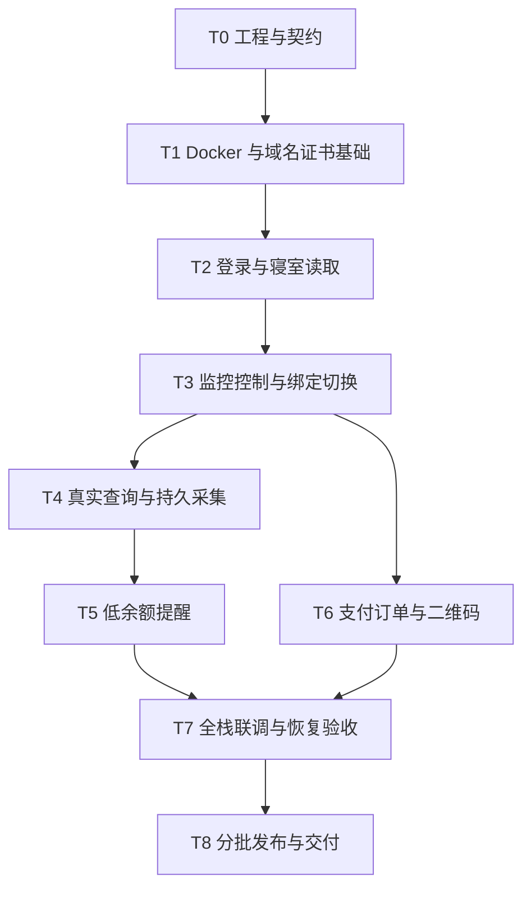

# 寝室电费系统总实施计划

版本：1.2；更新日期：2026-10-01；状态：T0–T5 与 M1/M2 技术闭环已完成，下一阶段 T6 支付。

本计划统一前端、后端、学校对接和 Docker 部署的实施顺序。目标是在仅安装 Docker Engine/Compose 的机器上，完成整个系统的构建、初始化与运行，并能配置域名、证书链和私钥文件路径。

当前 T0 工程/契约基线已完成，包含独立工程、28 个接口、DTO/状态、七域迁移与前端场景/参考截图；[验收记录](acceptance/T0验收记录.md)列出实际结果。T1 Docker/公共运行基础也已完成，[验收记录](acceptance/T1验收记录.md)列出容器、故障与前端实际结果；学校业务继续按 T2–T8 实施。

## 1. 项目约定与文档分工

### 1.1 统一目录

| 目录 | 用途 | 实施约束 |
| --- | --- | --- |
| frontend/ | 正式 React 学生端、依赖锁、测试和 Dockerfile | 独立建设，入口为 index.html + src/main.jsx |
| backend/ | 正式 Python 工程、依赖锁、services、tests 和 Dockerfile | 所有业务服务、调度及 Worker 代码位于此目录 |
| docs/ | 设计、计划、契约、验收和运维文档 | 新增项目文档归入此目录；项目总览 README.md、开发规范 AGENTS.md 与持续进度 PROJECT_PROGRESS.md 保留在仓库根目录 |
| deploy/ | Compose、Nginx 模板、数据库/队列配置、运维脚本 | 服务均由 Docker 管理，公开配置与 Secret 分开 |
| example/ | 浅蓝界面与交互参考 | 不作为正式工程、运行依赖或生产构建上下文 |

系统从空业务状态开始。用户通过学校登录建立应用账户，从学校同步绑定；监控、样本、通知和订单按真实操作产生。示例中的账号、房间、余额和历史不作为初始化数据。

### 1.2 文档职责

| 文档 | 负责内容 |
| --- | --- |
| 本总计划 | 统一里程碑、任务先后、跨领域依赖、整体联调与发布标准 |
| [后端架构详细设计](后端架构详细设计.md) | 产品规则、领域边界、数据库、API 与可靠性语义 |
| [后端实施计划](后端实施计划.md) | P0–P8 的具体开发任务、文件落点与验证 |
| [前端实施计划](前端实施计划.md) | F0–F8 的页面、组件、数据层、状态与验证 |
| [学校对接 API 文档](学校对接API文档.md) | 上游协议、来源语义、证据与未确认事项 |
| [Docker 部署配置说明](Docker部署配置说明.md) | 镜像、Compose、域名、证书、首次启动和证书更换 |

总体阶段使用 T0–T8 编号；P/F 是详细计划中的任务编号。一个总体阶段可交付某详细阶段的一部分，不将“部分接入完成”勾选为整个 P/F 阶段完成。

## 2. 最终交付目标

### 2.1 用户功能

1. 学校验证码登录、真实协议与明确后台授权，应用会话可恢复、可退出，学校认证可修复。
2. 本人绑定同步、候选搜索、新增绑定、默认寝室切换；查看其他寝室不改变默认或监控目标。
3. 总览、当前余额、学校消费趋势、日期范围、采集明细；未知、过期和部分数据如实展示。
4. 每用户一个持久监控，支持参数修改、立即采集、取消本次、关闭、进程故障恢复。
5. 低余额邮件按总次数限制发送，修改/撤回可阻断尚未取得发送授权的提醒。
6. 支付能力、幂等建单、二维码、订单状态；未知结果可定位，不自动重复建单或虚报成功。
7. 桌面和手机都可操作四个主页面、账户入口与弹窗，关键状态和错误提示始终可见。

### 2.2 工程与部署

- frontend 使用独立 package-lock；backend 使用独立 pyproject.toml/uv.lock；代码、测试与构建配置按工程归属存放。
- 前端在 Docker Node 阶段编译，Nginx 阶段提供静态站点；后端 API 与全部后台进程使用 Python 镜像。
- MySQL、Redis、RabbitMQ、Nginx、API、Scheduler、Worker、Relay、恢复器和一次性作业由同一 Compose 项目编排。
- 域名使用 ELECT_DOMAIN；证书链/私钥路径使用 ELECT_TLS_CERT_FILE、ELECT_TLS_KEY_FILE，配置于 deploy/.env 并只读挂载。
- Nginx 唯一发布 80/443，前端同源访问 `/api/v1`，后端可信 Origin 和邮件站内链接由相同域名派生。
- 首次空库初始化、证书预检、重复启动、升级、备份恢复及证书更换具有可执行的容器流程。

## 3. 总体顺序与里程碑



T4 与 T6 可以并行，T5 依赖真实采集闭环。前端从 T0/T1 开始按契约和 MSW 场景开发，后端每交付一个接口族即进行联调；移动端、可访问性、审计、指标和错误处理随阶段完成，在 T7 集中回归。

| 总体阶段 | 对应详细计划 | 主责 | 阶段结果 |
| --- | --- | --- | --- |
| T0 工程与契约 | P0、F0，F1 协议准备 | 后端/前端共同 | 目录、DTO、状态机、版本/幂等、领域表结构与配置约定确定 |
| T1 Docker 基础 | P1、F1 | 后端/运维主责，前端配合 | 前后端骨架、基础服务、TLS/域名和空库初始化可在容器中运行 |
| T2 登录与读取 | P2、P3a；F2 登录与 F3 只读部分 | Adapter/Identity/Room、前端 | 真实验证码、登录、会话和本人绑定读取可用 |
| T3 控制与绑定 | P5a、P3b；F3、F2 撤回、F5 控制部分 | Monitoring/Room/Identity、前端 | 默认切换、绑定和授权撤回具有持久屏障与操作进度 |
| T4 查询与采集 | P4、P5b；F4、F5 运行部分 | Room/Monitoring、前端 | 真实总览/历史/明细和可恢复监控可用 |
| T5 邮件提醒 | P6、F5 完整状态 | Notification/Monitoring、前端 | 低余额次数、发送授权和不确定结果闭环 |
| T6 支付 | P7、F6 | Payment/Adapter、前端 | 能力规则、订单、二维码、状态确认闭环 |
| T7 整体验收 | P8、F7/F8 验收部分 | 前后端/运维/测试共同 | 全旅程、故障、权限、容器部署与恢复通过 |
| T8 发布交付 | P8/F8 发布部分 | 项目负责人、运维 | 分批开放、记录验证结果、交付可运行镜像与文档 |

| 里程碑 | 达成条件 | 可以验收的完整能力 |
| --- | --- | --- |
| M0 工程可运行 | T0/T1 完成 | 配置域名和证书，在 Docker 环境启动前后端骨架与基础服务 |
| M1 登录与寝室闭环 | T2/T3 完成 | 登录、绑定、默认切换、退出和授权撤回 |
| M2 监控闭环 | T4/T5 完成 | 余额、历史、采集、修改/取消/恢复和低余额邮件 |
| M3 完整一期 | T6/T7/T8 完成 | 包含已验收支付能力的学生端与整套部署 |

M0–M2 是增量验收节点；对外开放前仍执行 T7/T8 中该范围的验证。若真实支付暂未验收，可交付明确标注范围的 M2 版本并由 capabilities 关闭支付，M3 继续保持未完成。

## 4. 各总体阶段的执行任务

### T0：建立工程与契约

- [x] **T0-01 建立独立工程。** 在 frontend 创建入口、依赖锁与脚本，在 backend 创建 Python 工程/锁文件/领域包；部署配置归入 deploy，文档归入 docs，构建输入不引用 example。
- [x] **T0-02 冻结接口与状态。** 将 28 个公开接口写入 docs/contracts/openapi.yaml，并定义内部命令/事件；确认金额字符串、null、上海日期、202、错误码、Idempotency-Key 和 expected_version。
- [x] **T0-03 补齐联调必需字段。** 明确 preference_version、credential_version、run.version、待完成操作摘要、订单恢复引用、邮件状态与快照失效行为，同步到后端 DTO、前端类型和场景夹具。
- [x] **T0-04 明确数据与配置。** 七个领域库独立建表/账号，确定 Secret 注入、服务身份、域名证书变量、业务能力开关，以及学校未确认项的验收方式。

**交付与通过标准：** 有可检查的工程骨架、契约、表结构草案、参考界面基线和范围清单；每个按钮、状态与异步操作都有对应后端能力。具体编码任务进入 P0/F0 清单。

**2026-10-01 实际通过：** P0/F0 清单完成，[契约](contracts/README.md)、[实施决策](decisions/T0实施决策.md)、[数据结构](database/README.md)、[需求追踪](T0需求追踪表.md)与[参考截图](acceptance/frontend/参考界面基线.md)可检查。七域初始迁移已在临时 MySQL 8.4.8 验证；正式业务和全栈 Docker 仍属后续阶段。

### T1：跑通 Docker、域名与证书基础

- [x] **T1-01 完成镜像。** frontend/Dockerfile 在 Node 中安装/编译并输出 Nginx 镜像；backend/Dockerfile 安装锁定依赖并提供 API、后台作业和预检入口。
- [x] **T1-02 完成 Compose。** 编排 MySQL、Redis、RabbitMQ、应用骨架、migrate 和 tls-check；明确卷、账号、健康检查、依赖顺序和资源限制。
- [x] **T1-03 实现可配置入口。** deploy/.env 指定域名与证书路径，Nginx 模板仅替换 ELECT_DOMAIN，TLS 预检覆盖有效期、SAN 和密钥配对，后端可信 Origin 使用同一配置。
- [x] **T1-04 建立公共运行基础。** 后端完成服务认证、Outbox/Inbox、日志与审计设施；前端完成路由、会话初始化状态、API 客户端、缓存和操作控制器。

**交付与通过标准：** 仅安装 Docker Engine/Compose 的目标环境可构建并启动本阶段服务；空库建表可重复，TLS 配置可检查，仅 Nginx 发布端口。业务 Worker 的完整运行验收在对应功能阶段完成。

**2026-10-01 实际通过：** [T1 验收](acceptance/T1验收记录.md)记录 19 个长期服务、七域迁移/权限、事件故障恢复、TLS 更换和 F1 骨架；后端 60 项、前端 15 项、浏览器 3 项通过。测试使用独立自签域名，学校业务尚未开放。

### T2：接通登录和本人寝室读取

- [x] **T2-01 实现学校认证。** Adapter 对接 A01–A04/B01，隔离用户 CAS 会话和验证码，凭据经加密暂存/激活后才签发应用会话。
- [x] **T2-02 实现登录页面。** 正式协议、明确授权、学校图片验证码、失败/过期处理、密码清理、刷新恢复及手机账户入口。
- [x] **T2-03 接入学校绑定读取。** B02/B03 同步本人绑定、读取候选、分页和搜索；列表成功为空、失败、stale 与 loading 明确区分。
- [x] **T2-04 完成只读联调。** 验证两个用户不串会话/缓存、失败登录不覆盖已验证凭据、登录成功但寝室失败不重提密码、普通退出不关闭后台授权。

**交付与通过标准：** 指定账号完成真实登录和本人绑定读取；前端已脱离随机验证码及本地模拟登录。默认初始化、真实绑定写入和撤回授权的完整完成点为 T3。

**2026-10-01 实际通过：** [T2 验收](acceptance/T2验收记录.md)记录正式后端/生产前端真实学校登录与本人读取、后台认证恢复、82 项后端/20 项前端/6 项浏览器及全新容器结果；B03 过滤精度仍为 unverified。

### T3：实现监控控制、真实绑定与默认切换

- [x] **T3-01 先实现控制屏障。** 完成 monitor 控制模型、generation/epoch、配置版本、prepare/commit-retarget、取消和凭据撤回协调；尚无 monitor 时可幂等建立 disabled 记录。
- [x] **T3-02 实现绑定台账。** 先持久受理、检查候选与归属，再一次 dispatch 学校 batchAdd，使用 B02 确认；不确定结果持久回查并阻断重复写入。
- [x] **T3-03 完成默认切换与撤回。** Room/Monitoring Saga 可恢复，切换中关闭意图被保留；Identity 撤回先阻断新工作再撤销凭据/token。
- [x] **T3-04 联调异步界面。** 绑定状态与默认状态分开显示，202/409/unknown 与刷新恢复可操作；未经终态确认不显示切换完成。

- [x] **T3-05 用户补充：删除绑定。** 学校页面解绑协议、持久单次 dispatch/结果回查、默认/监控协调和前端确认；真实删除使用用户指定的枫苑5号-402。

**交付与通过标准：** M1 闭环成立；真实绑定使用明确指定的寝室验收，响应丢失不触发第二次写入。监控控制先于默认切换交付，避免在完成页面后再补栅栏。

**2026-10-01 第一批：** P5a-01/02/03 控制模型、GET/PATCH、提交栅栏与内部 retarget 协议已交付，单次取消/凭据屏障有本域原语；见 [增量验收](acceptance/T3控制基础验收记录.md)。Identity/Adapter 凭据协调、发送许可、Room 默认/绑定 Saga 和前端仍未交付，T3-01..04 及 M1 不提前勾选。

**2026-10-01 第二批：** P5a-04/05 与 F2-06 已通过 [凭据/许可验收](acceptance/T3凭据与许可验收记录.md)，T3-01 完成。Identity 持久撤回、三域激活恢复、历史密码暂存/token 清理、迟到人工认证/缓存拦截、发送许可与账户进度已接通。T3-02/03/04、Room Saga 和 M1 保持未完成；真实绑定、采集、SMTP 与支付继续关闭。

**2026-10-01 第三批（默认部分）：** Room 默认公开 API、持久 Worker、首次成功同步的稳定默认、各阶段恢复/补偿已通过 [默认 Saga 验收](acceptance/T3默认Saga验收记录.md)。绑定台账与 F3/F5 继续实施。用户已指定真实新增目标枫苑5号-402；三级筛选只读定位成功，真实 batchAdd 尚未执行。

**2026-10-01 第三批完成：** [绑定与界面验收](acceptance/T3绑定与界面验收记录.md)包含实际 MySQL 一次写入/unknown/默认与前端回归。生产前端实际新增枫苑5号-402 成功，B02/台账确认一次 dispatch，原默认保持，写开关已关闭。用户追加 T3-05 删除，因此 T3 整体仍在进行。

**2026-10-01 T3 完成：** [删除验收](acceptance/T3删除绑定验收记录.md)包括一次学校方法覆盖、连续缺席/unknown、默认屏障/关闭/补偿和前端恢复。生产前端真实删除同一枫苑5号-402，B02 正常等待至少 30 秒两次缺席，台账一次 dispatch，绑定数 2 → 1、原默认保留，临时写开关恢复 false。T3 与 M1 完成，实际采集/邮件仍进入 T4/T5。

### T4：接通总览、历史与可靠采集

- [x] **T4-01 实现查询。** B02 余额缓存与手动刷新、C02 分段历史同步、day/week/month 聚合、总览组件状态；缺失数据不补零。
- [x] **T4-02 实现任务引擎。** MySQL 持久计划、Scheduler、Worker、短租约、续租、执行栅栏、有限重试、Outbox 唤醒与恢复器形成闭环。
- [x] **T4-03 实现真实前端数据。** 总览、同一日期范围下的图表/明细、快照分页、设置草稿、立即采集和取消；控制状态、健康状态与已保存设置分别展示。
- [x] **T4-04 验证故障和竞态。** 强杀/重启、多 Worker、重复消息、消息丢失、MySQL/Redis/MQ 故障及请求中切换/关闭，都不能产生重复样本或失效提交。

**交付与通过标准：** 可以持续采集且故障后恢复，单 run 最多一条成功样本；学校历史、余额差与电表读数来源分清；监控关闭后历史仍可读。T4 可先用 balance_only 采集，辅助读数失败不阻断余额任务。

### T5：完成低余额事件与邮件

- [x] **T5-01 完成事件语义。** 新鲜有效样本驱动 episode/slot，严格低于阈值才提醒；次数包含首封，冷却、回差和修改次数的行为一致。
- [x] **T5-02 完成投递。** Notification 持久 job、发送前授权、租约、有限重试、结果回报；正文可能已接收时保持 delivery_unknown，不盲重发。
- [x] **T5-03 完成用户状态。** 展示采集健康、邮件失败/结果未知、关闭在途边界，区分退出、关闭监控与撤回授权。
- [x] **T5-04 验收端到端提醒。** 模拟多次低余额与恢复，验证不超限和取消竞态；真实投递使用指定邮箱并记录实际结果。

**交付与通过标准：** M2 完成；同一事件不因消息重复、保存设置或 Worker 恢复而突破次数，已授权在途邮件的边界如实呈现。

### T6：完成支付订单与二维码

- [ ] **T6-01 固化能力与订单。** 金额范围/步长来自 capabilities，前后端使用十进制金额；本地订单/幂等台账先提交，学校 D01 只 dispatch 一次。
- [ ] **T6-02 实现支付链路。** Adapter 执行 E01–E04，支付会话与学校 token 隔离；二维码失败仍使用同一订单，表单未知结果不自动重发。
- [ ] **T6-03 接通支付 UI。** 金额输入、固定目标、订单进度、二维码图片、刷新/恢复和状态查询；unknown 不显示支付成功，不因关弹窗认定订单已取消。
- [ ] **T6-04 补齐真实验收。** 使用明确账号、寝室与金额验证建单、待支付/已支付映射和余额刷新；仅二维码生成成功不算付款到账。

**交付与通过标准：** 指定流程具有真实证据，状态映射可追溯；完整验收前支付 capability 保持关闭。T6 可以在 T3 之后与 T4/T5 并行，不依赖邮件开发完成。

### T7：完成全栈联调与发布演练

- [ ] **T7-01 回归用户旅程。** 联调首次登录到监控提醒、再次登录、切换寝室、授权修复和支付；执行两份详细计划中的接口/前端验收矩阵。
- [ ] **T7-02 回归手机与权限。** 页面响应式、键盘、错误可见性、图表资源释放；多账户、多标签页、会话过期、对象越权与请求乱序均有证据。
- [ ] **T7-03 演练 Docker 与证书。** 在仅安装 Docker 的目标机从零构建/启动，配置指定域名和证书，演练替换证书及更换域名，确认同源 Cookie/CSRF 与前端资源正常。
- [ ] **T7-04 演练持久恢复。** 重建容器保留数据；隔离备份恢复默认禁止真实外发，对账未知绑定/订单/邮件后恢复执行，记录实际 RPO/RTO。
- [ ] **T7-05 核对容量与运行状态。** 使用模拟学校测调度/数据库/消息吞吐，按学校实际频率限制设置并发；检查连接池、磁盘、OCR 内存、心跳、积压和证书有效期。

**交付与通过标准：** 部署与恢复不需要宿主机语言环境；无演示数据/敏感材料进入生产产物；严重功能、权限、重复副作用和恢复问题清零。

### T8：分批发布与交付

- [ ] **T8-01 固定发布版本。** 对齐前后端镜像、依赖锁、数据库版本、OpenAPI、协议模板和部署配置，形成发布清单。
- [ ] **T8-02 分批开放。** 从内部指定账号开始，再扩大到小批已授权用户；先验证正常周期和恢复，再按验收状态开放绑定、提醒和支付。
- [ ] **T8-03 观察并处理。** 检查采集新鲜度、调度延迟、unknown 操作、邮件结果、错误率及资源使用；异常按运行手册处理，不重放不确定写操作。
- [ ] **T8-04 完成交接。** docs 中交付部署、域名/证书、Secret、启停、备份、恢复、升级和故障处理说明，记录最终开放范围及验收结论。

**交付与通过标准：** M3 功能全部按范围验收，部署产物可重复运行，运维流程可复现；不能只以“页面能打开”标记项目完成。

## 5. 跨阶段协作与联调规则

### 5.1 必须提前解决的依赖

| 依赖 | 处理方式 |
| --- | --- |
| 默认寝室切换依赖监控取消屏障 | T3 先完成 P5a，再开放 P3b/F3 切换；不等待完整 Scheduler 才定义接口 |
| F2 包含授权撤回，但后端 P2 尚无屏障 | T2 完成登录部分，撤回在 T3 对接 P5a 后验收；保留 F2 未完成项 |
| 明细界面依赖真实采集 | F4 可先用合成契约场景开发，有数据验收等待 T4/P5b |
| 支付真实状态尚有待确认项 | T0 建夹具/失败状态，T6 补样本；最终开放由能力接口控制 |
| 域名与证书影响认证 | T1 就接入 HTTPS、PUBLIC_ORIGIN 与 Secure Cookie，T7 更换域名验证，不留到上线才补 |
| 前端构建只包含 frontend | OpenAPI 类型生成在开发/测试容器读取 docs/contracts，结果提交 frontend，生产构建不跨目录取 example |
| 前后端并行易产生 DTO 漂移 | 契约、实现、类型/夹具与相关验证在同一交付批次更新 |

### 5.2 单个功能的交付顺序

1. 在 docs/contracts 定义请求、响应、错误、异步状态和验收场景。
2. 后端实现所属领域与相关数据库/事务；前端依据同一契约开发页面和模拟分支。
3. 后端接口就绪后接入真实响应，验证权限、失败状态、重复提交与页面恢复。
4. 在 Compose 环境验收，记录版本与证据；完成后勾选 P/F 任务和对应 T 阶段。
5. 当前开发分支直接提交推送，无需 PR；完整功能仅在合并到 `main` 时创建 PR，通常为 `dev → main`。合并前必须等待该 PR 最新提交的 Actions 全部成功，并满足主分支严格必需检查。文档、配置与修复遵循相同规则，见 [GitHub 协作与合并流程](GitHub协作与合并流程.md)。

API 版本号、默认切换、授权撤回、订单未知和 SMTP 未知属于跨领域语义变更；修改时同步两端，不在页面里补出服务端没有确认的事实。

## 6. 排期与责任建议

按领域指定后端责任人、前端责任人和部署/验收责任人；人数少时可以由同一人兼任。现有后端计划的 57–82 人日与前端计划的 26–41 人日含重叠联调工作，总量应在 T0 去重后确定，不直接相加。

在约 2 名后端、1 名前端，并有运维/测试协作的假设下，可按以下工作周组织；这是执行顺序示例，T1 完成后用实际集成成本重新排期：

| 时间窗口 | 主线 | 可并行工作 |
| --- | --- | --- |
| 第 1–2 周 | T0/T1：契约、工程、Docker、域名/证书、基础设施 | 前端参考基线、公共组件、MSW 场景 |
| 第 3–4 周 | T2/T3：登录、绑定读取、控制屏障、真实绑定/默认 | 前端登录/寝室、账户授权与异步操作 |
| 第 5–7 周 | T4：查询/历史、持久调度、采集恢复 | T6 支付后端和前端支付页面；持续定向验证 |
| 第 8–9 周 | T5 提醒、T6 支付验收、完整页面状态 | F7 手机/键盘/图表性能回归 |
| 第 10 周 | T7 全栈、故障、权限、容量与恢复演练 | 运维文档、发布清单 |
| 第 11–12 周 | 缺陷修复缓冲及 T8 分批发布 | 真实学校待验场景和上线观察 |

真实学校写入、状态样本和指定邮箱验收的等待时间不按固定日历保证。某能力受阻时继续独立任务并如实保留未完成状态，不能通过删掉幂等、栅栏、恢复或 unknown 语义压缩工期。

## 7. 总体验收清单

| 验收项 | 必须达到的结果 | 对应阶段 |
| --- | --- | --- |
| 目录与构建边界 | 正式源码分别在 frontend/backend，文档在 docs，example 不参加构建 | T0/T1 |
| 全栈 Docker | 仅有 Docker 的目标机可构建、空库初始化和启动所有组件 | T1/T7 |
| 域名与证书 | 指定域名/PEM 路径生效；预检、证书替换、HTTPS 和 PUBLIC_ORIGIN 一致 | T1/T7 |
| 身份与凭据 | 学校验证码真实，密文落库后才登录成功，不串用户或泄露学校 token | T2 |
| 绑定/默认 | 一次学校写入、回查确认、切换 Saga 可恢复，状态不提前成功 | T3 |
| 查询与质量 | null/stale/partial 正确，日期一致，余额差不当消费，电表来源明确 | T4 |
| 监控恢复 | 多 Worker/重启/重复消息不重复样本，取消和改代阻断失效结果 | T3/T4 |
| 预警 | 总次数包含首封，发送前验授权，未知 SMTP 不盲重发 | T5 |
| 支付 | 不重复建单/表单，不以二维码或点击认定支付成功，真实映射有证据 | T6 |
| 前端与权限 | 手机、键盘、账户入口和异常状态可用；跨用户对象访问被拒绝 | T7 |
| 持久卷与备份 | 容器重建保留数据；隔离恢复不自动外发，RPO/RTO 有实测记录 | T7 |
| 最终交付 | 镜像、配置模板、契约、部署/故障手册、验收与开放范围一致 | T8 |

项目完成需要功能、前后端联调、Docker 部署和恢复四部分同时通过。文档、模拟接口、截图或容器存活本身都不能替代对应的真实验收结果。

## 8. 最终部署入口与交付物

准备完成实现阶段交付的 Dockerfile、Compose、域名/证书和 Secret 后，从仓库根执行：

```sh
docker compose --env-file deploy/.env -f deploy/compose.yaml config --quiet
docker compose --env-file deploy/.env -f deploy/compose.yaml up -d --build
docker compose --env-file deploy/.env -f deploy/compose.yaml ps -a
```

Compose 负责构建前后端镜像、启动基础服务、等待健康状态及 migrate/tls-check 作业，再启动所有应用进程。域名和证书变量、预检与更换命令详见 [Docker 部署配置说明](Docker部署配置说明.md)。以上入口已在 T1 独立测试域名/自签证书环境通过；当前启动基础骨架和真实 Relay/Audit，不代表学校业务已完成。

最终交付应包含 frontend/ 与 backend/ 正式源码及锁文件、两份 Dockerfile、完整 deploy 配置、镜像版本、docs/contracts、docs/acceptance 和 docs/runbooks。T0/T1/T2 已完成，T3 控制、凭据协调、发送许可和账户撤回已交付。下一步 P3b-04 实现 Room 持久默认切换 Saga 与首次同步初始化，再推进绑定一次 dispatch 台账和 F3/F5 界面。

**2026-10-01 T4完成：** [完整验收](acceptance/T4验收记录.md)包括真实B02/C02与一次持久balance_only采集、107项后端/33项前端/20项浏览器、全新25进程Docker及实际依赖/进程故障。M2等待T5，不宣称邮件或支付已运行。

**2026-10-02 T5/M2完成：** [T5验收](acceptance/T5验收记录.md)记录事件/投递/前端、真实本人B02新鲜样本到指定SMTP的一次发送及用户收件确认；本机TUN需临时指定端点直连，默认外发仍关闭。下一步T6-01/P7-01支付能力与幂等台账，T7完整集中回归不提前宣称完成。
